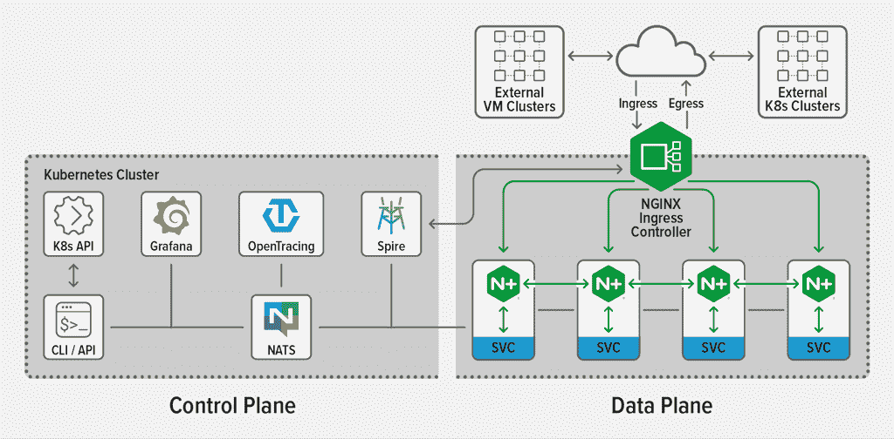

# NGINX 涉足服务网格领域，承诺提供一种更简单的替代方案

> 原文：<https://thenewstack.io/nginx-steps-into-the-service-mesh-fray-promising-a-simpler-alternative/>

本月早些时候，NGINX [推出了](https://www.nginx.com/blog/introducing-NGINX-service-mesh/)[NGINX 服务网格(NSM)](https://www.nginx.com/products/nginx-service-mesh) ，这是一个免费的开源服务网格，使用 [NGINX Plus](https://www.nginx.com/products/nginx/) ，该公司的开源代理 [NGINX](https://nginx.org/en/) 的商业版本，来驱动其数据平面。虽然许多服务网格都是完全由开源组件构建的，但 NGINX 营销副总裁 Rob Whiteley[表示，他们不想将另一个开源解决方案投入市场，而是希望专注于将 NSM 定位于当前市场中的缺失部分，他认为这是客户与 Istio 的规模和复杂性进行斗争的结果。](https://www.nginx.com/people/rob-whiteley/)

“Istio 诞生于谷歌，设计精良，可以运行数十亿个容器和数千种服务。因此，Istio 带来了一定的开销，这表明了复杂性。这也是一个非常自以为是的开发，意味着还有其他开源组件加入其中。从技术上来说，你可以把它们中的一些换出来，但它没有被设计成模块化的，”Whiteley 说。NGINX 服务网格”重量更轻，更容易安装，并且真正是为那些刚刚开始适应纯入口控制器流量模式的人而设计的。我们想去掉很多这样的组件。我们有一些组件，您可以在其他服务网格解决方案中找到，但如果您正在设计一个旨在处理一个数量级或更多复杂性的解决方案，我们不一定需要像您一样复杂的密钥管理、跟踪和可观察性。”

NSM 没有直接集成这些不同的组件，而是在它们旁边部署 sidecar 代理进行集成。发布时，这些受支持的组件包括 Grafana、Kubernetes 入口控制器、SPIRE、NATS、Open Tracing 和 Prometheus。通过使用 NGINX Plus 作为东西向流量的数据平面和南北向流量的入口控制器，用户可以获得所有标准 NGINX Plus 功能，同时还可以轻松实现接入、配置和管理。

“NGINX 已经是市场上默认的入口控制器，所以 NGINX 服务网格的真正目标是提供下一个逻辑步骤，您已经在使用 NGINX 进出集群，现在您只需要处理一些服务流量，东西而不是南北，”Whiteley 说。

NGINX Plus 为 NSM 带来的功能包括 mTLS 认证、负载平衡、高可用性、速率限制、电路中断、蓝绿和金丝雀部署以及访问控制。NGINX Plus 作为二进制文件免费包含在 NSM 中，但有一些环境限制，阻止它单独使用。随着 NGINX Plus 处理东西和南北流量，Whiteley 指出，NGINX 的 API 网关是将一切整合到单一平台所需的最终组件。

“我们的愿景是将所有这些整合到一个平台中。我们的 API 网关在技术上独立于服务网格，尽管它都是 NGINX Plus。这只是同一个基本数据平面的不同配置状态，”Whiteley 说。“我们认为，未来我们可以带来优势，确保入口、边车代理和 API 网关都是代理的超专业版本，在同一个操作平台下集成在一起，这样就不会有那么多移动部件。如果你进行政策更新，你应该能够在一个地方进行更新，并在另外两个地方兑现。”

Whiteley 说，以 NGINX 为核心，对于那些仍在寻求将其一些遗留部署与 Kubernetes 环境集成的公司来说，确实是一个优势。他说，用基于特使的 Istio 服务网来做这件事要复杂得多，而且仍在“Istio 路线图”上。通过这种方式，NSM 被定位为一种初级服务网络，Whiteley 说他们的长期目标是实现从 NSM 到 Aspen Mesh 的无缝过渡，Aspen Mesh 是一种更先进的、基于 Istio 的服务网络，由其现在的母公司 T2 F5 Networks T3 构建。

Whiteley 说，NSM 的另一个目标是引进一个更好的管理团队。目前，[服务网格接口(SMI)](https://smi-spec.io/) 得到支持，并且 [NGINX 控制器](https://www.nginx.com/products/nginx-controller/)管理平面预计将被添加，为目前主要是命令行界面的体验带来更多的可视化和 GUI。

展望 NSM 之外，Whiteley 说，他们对 NGINX 部门“引入一些稍微不同和更新颖的东西来推进行业对话”抱有一些希望

“我们认为，未来有一种选择是建立一个无边车的服务网络，在这种网络中，你不需要在每项服务中加入边车，”Whiteley 说。相反，你加载你的代码，然后执行它，执行你的代码的默认运行时环境具有处理东西向所需的所有内置代理功能。它会将两个容器的模型简化为一个容器的模型。”

<svg xmlns:xlink="http://www.w3.org/1999/xlink" viewBox="0 0 68 31" version="1.1"><title>Group</title> <desc>Created with Sketch.</desc></svg>