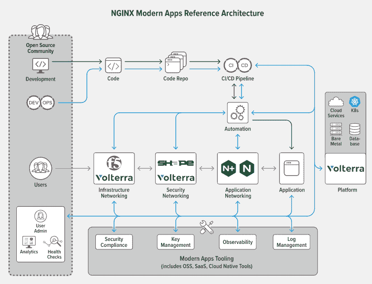

# NGINX 的 Kubernetes 微服务参考架构

> 原文：<https://thenewstack.io/nginxs-reference-architecture-for-kubernetes-microservices/>

在今年的 [NGINX Sprint 2.0](https://www.nginx.com/events/nginx-sprint-2021/) 虚拟会议上， [NGINX](https://www.nginx.com?utm_content=inline-mention) 发布了 NGINX [现代应用参考架构](https://github.com/nginxinc/kic-reference-architectures/tree/master/pulumi/aws) (MARA)，NGINX 是流行的开源 web 服务器/负载平衡器和同名反向代理背后的 [F5](https://www.f5.com/) 的分支，它在[博客文章](https://www.nginx.com/blog/nginx-sprint-2-0-clear-vision-fresh-code-new-commitments-to-open-source/)中表示，NGINX[现代应用参考架构](https://github.com/nginxinc/kic-reference-architectures/tree/master/pulumi/aws)(MARA)将帮助公司“创建一个完整的、完全可操作的基于微服务的应用，您可以在几分钟内启动并运行，托管在

“部署 Kubernetes 有许多不同的方式——联网、安全、认证，甚至像 API 网关这样的东西。F5 NGINX 产品事业部总经理 Rob Whiteley 在接受 New Stack 采访时表示:“对于大多数刚刚起步的企业来说，这有点像魔法。”。“这只是没有得到很好的理解，你可以很快让自己进入一个配置错误的状态。因此，我们开始创建一种非常自以为是的方式来降低它，它会自动将所有 NGINX 组件配置到最佳实践状态。”

他们在另一篇博客文章中写道，MARA 是“可窃取的”代码，开发者、开发人员和平台运营团队可以对其进行处理、修改和改进。它由 YAML 文件和 Python 脚本组成，将 [Pulumi](https://www.pulumi.com/) 设置为基础设施即代码实现的默认选择。作为用户，您只需运行启动脚本，Pulumi 运行一系列命令，部署 Kubernetes 环境和后续部分。

“我们刚刚开始创建一个庞大的清单，列出了在生产中运行 Kubernetes 需要做的事情，任何走这条路的企业都经历过，我们意识到，没有什么可以阻止我们将所有这些作为模板 ID 参考架构，作为真正的操作代码，”Whiteley 说。

Whiteley 还说，MARA 寻求超越一些其他固执己见的 Kubernetes 部署，通过提供这种使用单个命令部署完全形成的环境的能力，同时还保持平台不可知。Whiteley 说，虽然经过验证的设计提供了固执己见的发行版的相同概念，但它们缺乏功能，而其他发行版只能在一种环境下工作。

“问题是那些只存在于纸面上的东西。没有有效的代码。你仍然需要获得所有的组件，并按照经过验证的设计将它们连接在一起，”他说。“我们想更进一步，真正让这种工作、生活、呼吸的代码可以部署。它将经过验证的设计向前推进了一步，并实际上使其可部署，而不仅仅是可参考的。”

在发布时，MARA 预配置了许多选择，使用 [Elastic](https://www.elastic.co/log-monitoring) 进行日志管理， [Prometheus](https://prometheus.io/) 和 [Grafana](https://grafana.com/) 进行监控和仪表板，使用[Amazon Web Services](https://aws.amazon.com/?utm_content=inline-mention)'[Elastic Kubernetes Service](https://aws.amazon.com/eks/)(EKS)作为部署目标，使用 [Spinnaker](https://spinnaker.io/) 进行连续交付，使用 [cert-manager](https://cert-manager.io/docs/) 进行 TLS，以及中间层的许多 NGINX 产品。

然而，下一步的计划是鼓励其他人在堆栈的所有级别上为其他工具提供集成。

“在这一过程中，我们意识到我们可以依靠社区、我们的供应商伙伴和其他人来替换所有这些模块。因此，我们从一开始就确保你可以在 Terraform 中选择 Pulumi 和 sub，你可以在木偶或厨师中选择 Ansible 和 sub。可以抽象出细节，然后您真正需要做的就是将其他工具打包，使它们成为参考架构的一部分。我们的希望是，随着行业的发展，我们可以在此基础上继续发展。

关于这些[未来计划](https://www.nginx.com/blog/new-open-source-modern-apps-reference-architecture/#version-2)，NGINX 表示，它有许多具体的“近期改进”，如部署到数字海洋、 [Red Hat OpenShift](https://www.openshift.com/try?utm_content=inline-mention) 、Rancher、 [VMware vSphere](https://tanzu.vmware.com?utm_content=inline-mention) 和其他 Kubernetes 环境、原生 Terraform 集成以及对其他 CI/CD 平台的支持。它还为 F5 和 NGINX 工具制定了许多计划，例如与 [NGINX 控制器](https://www.nginx.com/products/nginx-controller/)集成以管理和监控 NGINX Plus 入口控制器、 [NGINX App Protect](https://www.nginx.com/products/nginx-app-protect/) 的现成配置、与 F5 产品和服务的集成，如[BIG IP](https://www.f5.com/products/big-ip-services)、[云服务](https://www.f5.com/products/ways-to-deploy/cloud-services)和 [Volterra](https://www.f5.com/solutions/multi-cloud-policy-management/volterra-multi-cloud-networking) ，以及与 [NGINX 服务网格](https://www.nginx.com/products/nginx-service-mesh/)和基于 Istio 的

“很快，作为一家企业，我的体验是，我只要从选项列表中选择‘我关心我环境中的这些工具’，它就会自动提取、组装和预集成所有脚本，”Whiteley 解释道。"然后，通过一个简单的命令，我现在可以部署."

<svg xmlns:xlink="http://www.w3.org/1999/xlink" viewBox="0 0 68 31" version="1.1"><title>Group</title> <desc>Created with Sketch.</desc></svg>