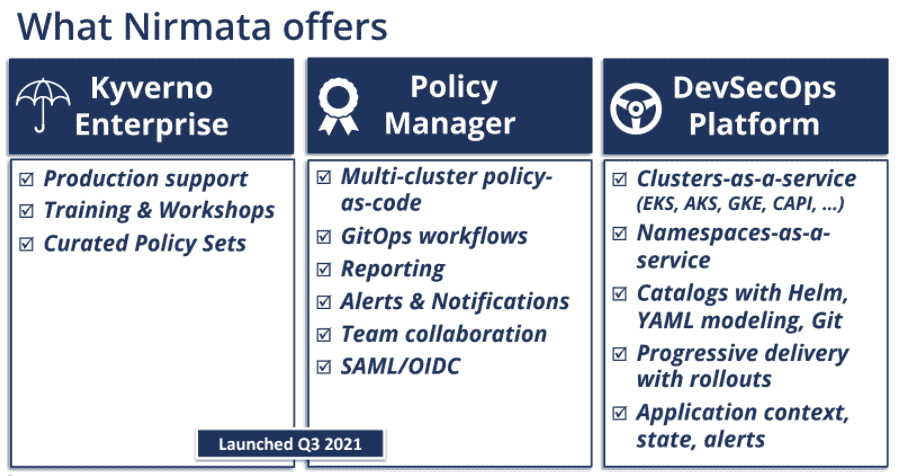

# Nirmata 将 Kyverno 政策引擎商业化

> 原文：<https://thenewstack.io/nirmata-commercializes-the-kyverno-policy-engine/>

为 [Kubernetes](https://thenewstack.io/category/kubernetes/) 集群创建了开源 [Kyverno](https://kyverno.io/) 策略引擎并于去年[将其捐赠给云计算原生计算基金会](https://thenewstack.io/kyverno-a-new-cncf-sandbox-project-offers-kubernetes-native-policy-management/) (CNCF)的 Nirmata 开始将自己树立为最有能力监管 it 商业化的公司。

Nirmata 最近开始将其更大的同名 Kubernetes DevSecOps 管理平台的一部分作为独立产品提供，企业可以将其用于任何云平台和任何 Kubernetes 发行版。此外，在本周举行的[kube con+CloudNativeCon North America](https://www.cncf.io/kubecon-cloudnativecon-events/?utm_content=inline-mention)大会上，Nirmata 宣布了一项围绕 Kyverno 的认证计划，旨在让更多 IT 和 DevOps 团队熟悉策略引擎，并熟悉如何在他们的组织中使用它。

Nirmata 的联合创始人兼产品副总裁 Ritesh Patel 告诉 New Stack 说:“尽管(Kyverno)非常简单，但学习这些概念需要一个轻微的学习曲线。“这是 Kubernetes-native，所以熟悉 Kubernetes 的人会捡起来。但之后政策变得复杂，有各种各样的条件和限制，诸如此类。”

## **最初关注容器**

自 2013 年成立以来，Nirmata 一直是容器生态系统的一部分，最初专注于蓬勃发展的 DevOps 领域的一切 Docker——从 Docker 容器到 Docker 引擎。四年后，随着 Kubernetes 的出现，创始人开始改进 Nirmata。

Nirmata 联合创始人兼产品副总裁 Ritesh Patel

“我们意识到 Kubernetes 正在成为容器的事实上的协调者，当我们与客户合作采用 Kubernetes 时，我们意识到围绕 Kubernetes 引入的所有复杂性的一些挑战，”Patel 说。

对于许多已经习惯了虚拟机的公司来说，采用 Kubernetes 需要转变思维方式。Nirmata 构建了它的平台，其中包括一个策略管理组件，该组件在 2019 年——在 Kubernetes 中引入准入控制器之后——被重写并开源到一个名为 Kyverno 的[项目中。](https://thenewstack.io/kyverno-defends-containers-against-security-configuration-errors/)

Patel 说:“Kyverno 的主要卖点之一是它是 Kubernetes-native，因此它理解 Kubernetes-native 的政策结构。“它的格式和你在 Kubernetes 上的其他应用程序一样。它使用 Kubernetes 定制的策略资源定义，Kyverno 充当准入控制器。”

## **Kyverno 和 CNCF**

他说，一年后，Nirmata 将 Kyverno 捐赠给了[云本地计算基金会](https://cncf.io/?utm_content=inline-mention)，对它的需求开始上升。在过去的九个月里，这个政策引擎已经被下载了大约 700 万次，从亚马逊网络服务公司到红帽公司都在使用它并分享他们的经验。现在，Nirmata 仍然是 Kyverno 的主要贡献者之一，它正在寻求扩大该技术的覆盖范围。

现在，该公司正在提供部分平台作为独立产品，可以独立于整个 DevSecOps 平台使用。本月早些时候，它发布了 Nirmata Cloud Native Policy Management，这是一款基于 Kyverno 的云产品[，使 it 团队能够创建公司官员所说的“智能护栏”来管理合规性和安全性。](https://thenewstack.io/kyverno-kubernetes-configuration-via-policy/)

Patel 说，该产品不仅管理跨多个集群的策略，还提供对策略的见解，包括应用程序是否可能违反这些策略。开发运维团队可以发现软件是否不合规，通过 Slack 和其他工具进行协作，然后解决问题。

## **安全性和合规性**

协作部分很重要，而且“许多安全工具都忽略了这一部分，因为这不仅仅是获得可见性和报告违规行为，还需要在早期将这一点反馈到开发周期中，而这往往是我们与策略管理器一起实现的，”他说。

借助策略管理产品，IT 团队可以管理由开发人员使用云原生微服务创建的应用程序的策略生命周期，这些开发人员并不总是关注安全性和合规性问题。Kubernetes 集群非常复杂，可能会出现不符合策略的错误配置，从而带来安全风险。

## **Kyverno 企业到达现场**

与此同时，Nirmata 推出了 Kyverno Enterprise，这是 Kyverno 的一个轻量级商业版本，由 Nirmata 测试和支持，该公司提供一套精心策划的政策、培训和研讨会。我们的目标是给那些不想管理 Kyverno 和跟上社区驱动技术的持续变化的组织一个更简单的方法来利用开源工具。

Patel 说:“某些类别的客户想要一个非常轻量级、受支持的 Kyverno 版本。“因为 Kyverno 是由社区驱动的，所以不能保证某些政策适用于某些版本的 Kubernetes。我们正在提供经过策划、测试和验证的产品，我们已经用一套策略测试了 Kyverno，并用一套 Kubernetes 版本测试了它们，让您知道哪些有效，哪些无效。”

他说，Kyverno Enterprise 没有其他产品，尽管 Nirmata 可能会在未来为其添加更多功能。

与策略管理平台一样，Kyverno Enterprise 也包含了内置于更大的 Nirmata 平台中的特性和功能。它们与云和发行版无关，因此可以与其他 Kubernetes 平台(如 Red Hat 的 OpenShift 和 Rancher)协同工作。

## **认证程序**

Kyverno 认证计划旨在通过一个关于部署和使用 Kyverno 在 Kubernetes 集群中制定政策的自定进度在线课程，为 IT 和 DevOps 团队提供继续教育和发展培训。

Nirmata 将继续为其基于 Kyverno 的产品添加功能。Kyverno 是作为开放策略代理(OPA)的替代产品而创建的，Patel 表示，OPA 不是为 Kubernetes 专门构建的，并且本身不理解 Kubernetes 的资源。他说，开发人员需要编写代码来创建一个策略，他们不必与 Kyverno 一起做，这是推动其作为一个合规性代码产品的流行的原因。

他指出，杜克能源和纽约时报是利用 Nirmata 产品的大型企业之一。该公司在两轮融资中筹集了 400 万美元，其中包括 8 月份来自 Z5 Capital、Samsung Next 和 Benhamou Global Ventures 等投资者的 360 万美元。

## **供应链安全正在酝酿中**

安全性和合规性将继续是 Nirmata 关注的焦点。Kyverno 社区对供应链安全很感兴趣，特别是在[网络安全管理软件产品袭击](https://thenewstack.io/solarwinds-the-worlds-biggest-security-failure-and-open-sources-better-answer/)之后，以及最近[今年早些时候来自联邦政府的指令](https://www.whitehouse.gov/briefing-room/presidential-actions/2021/02/24/executive-order-on-americas-supply-chains/)。

“由于 Kyverno 位于准入控制路径中，它在了解这些图像如何部署方面有着非常独特的优势，而且 Kubernetes 供应链的攻击媒介有两个，”Patel 说，特别是应用于 Kubernetes 的配置和 CI/CD 管道中构建的图像。“我们有能力确保集群中只允许站点上的签名图像。这是一个仍在发展的用例。它显然还不是产品，但我们打算这么做。这是 Kyverno 社区一直在努力的事情。”

他说，也在考虑充实其产品的功能。Kyverno 的一个关键特点是，与 OPA 不同，开发人员不必为编码而学习新的语言。然而， **"** 我们已经看到过去使用开放策略代理的用户帕特尔说。“它非常适合某些需要您编写代码的复杂用例，而 Kyverno 目前还没有这样做。我们可能会引入一些编码来处理一些更高级的用例，但是 80%到 90%的用例可以在不编写任何代码的情况下得到处理。”

Kyverno 现在是一个沙盒级别的项目，而 OPA 也是一个 CNCF 项目，已经达到了毕业级别。

<svg xmlns:xlink="http://www.w3.org/1999/xlink" viewBox="0 0 68 31" version="1.1"><title>Group</title> <desc>Created with Sketch.</desc></svg>