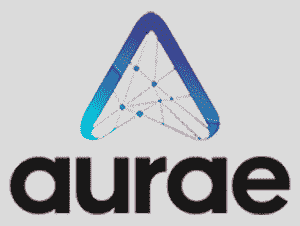

# 尼沃利基金会为开源创造者寻求更多权力

> 原文：<https://thenewstack.io/nivenly-foundation-seeks-equity-for-open-source-maintainers/>

开源维护者的独创性和辛勤工作长期以来一直推动着软件行业——想想 Linux、Kubernetes、TensorFlow、Jenkins、Python、Ruby 等等。但是项目[的维护者并没有因为他们的奉献而得到回报。许多人没有报酬，](https://thenewstack.io/state-of-open-open-source-has-won-but-is-it-sustainable/)[心力交瘁，](https://thenewstack.io/darker-side-open-source/)如果有人成功地将他们的项目货币化，他们可能会失去对项目的控制。

由 GitHub 首席工程师和乳齿象社交网络 Hachyderm.io 的创始人 Kris Nóva 联合创立的新组织 Nivenly Foundation 希望倡导独立维护者并帮助他们监督他们的项目。

根据创始人发布的一份声明，该组织于 3 月 1 日推出其网站，旨在“为下一代技术专家提供一个令人兴奋和公平的未来”。

新基金会的使命声明出现在它的网站上，阐述了它的原则，承诺它将“为全球的开源项目和社区带来可持续性、所有权和控制权。”该基金会表示，它将通过为开源项目提供治理和法律支持来做到这一点。

根据任务声明，帮助开源项目成员保持对其创作的控制是重中之重:“我们通过使用非营利协会来抵消利润驱动型经济的负面影响，该协会保护和支持技术项目的贡献者和维护者，建立对使用它们的公司的持续独立。

"尼维尼认为，一个项目的所有成员都应该拥有这个项目并分享它的成功."

## 开源中影响的新路径

在 1 月份接受 New Stack 采访时，Nóva 详细阐述了 Nivenly 的承诺，即创建其使命声明中所说的致力于开源的“成员所有、民主管理”的组织。

“现在，事情是这样的，在这些类型的非营利组织中，有一小群极具影响力的人最终做出了影响我们大多数生活的大多数决定，”她告诉 New Stack。“我们正试图找到一种平衡的方法。”

她说，大多数开源非营利组织的运营模式显示出“对企业的偏好”如果你看看，比方说， [Rust Foundation，](https://thenewstack.io/rust-foundation-focusing-on-safety-and-dev-outreach-in-2023/)或者。NET Foundation——或者任何这些家喻户晓、做着真正好事的公司——大多数都有某种类似赞助的模式，你支付一定的费用，就可以在董事会中获得一个席位。"

她补充说，这给了企业“参与游戏的机会”。“我并不是说这种模式有什么问题。我要说的是，这通常是我们停下来的地方。”

相比之下，“Nivenly 要做的与众不同的是，我们将增加第二种方式来获得同样水平的组织影响力，这只是通过成为维护者。”

## 第一批项目:Aurae，Hachyderm.io

Nivenly 旗下的第一批项目都起源于去年春天创意的迸发。

Aurae 徽标

第一个，运行时项目 [Aurae，](https://github.com/aurae-runtime)是一个远程流程执行实用程序，旨在成为一种有效的方式，在单个节点上使用公共 API 调度工作负载，如容器和虚拟机；该 API 旨在与各种编排系统和网络提供商一起工作。

诺娃[在二月份的 FOSDEM 会议上展示了 Aurae](https://fosdem.org/2023/schedule/event/rust_aurae_a_new_pid_1_for_distributed_systems/) 背后的技术。

Nivenly 将支持的第二个项目 Hachyderm.io 是一个与 Aurae 几乎同时启动的乳齿象服务器。在亿万富翁埃隆·马斯克(Elon Musk)10 月份收购 Twitter 之后，Hachyderm 迎来了大量新用户，其中许多来自科技社区。

Hachyderm.io 社交网络徽标

社交网络 Nóva 现已拥有超过 45，000 名月活跃用户。她在 12 月 22 日的 New Stack Makers 播客中说[，网站由一小群志愿者管理，维护网站及其数据中心的运营成本是非营利模式看起来是合乎逻辑的下一步的原因之一。](https://thenewstack.io/how-hashyderm-scaled-up-after-elon-musk-twitter-takeover/)

## 基金会领导和资金

尼沃利——“一个很傻的名字，就像我的一个朋友 10 年前想出来的，”诺娃在 1 月份告诉《新书库》——始于一个由 6 个人组成的领导团队。

诺瓦将担任总统。另一位联合创始人 [Quintessence Anx，](https://www.linkedin.com/in/quintessenceanx/)将作为执行董事领导集团；她之前曾在 Logz.io、AppDynamics 和 [PagerDuty 担任开发者代言人。](https://www.pagerduty.com/?utm_content=inline-mention)

其他联合创始人包括 [Dominic Hamon，](https://www.linkedin.com/in/dominic-hamon-1733302)Google Play 控制台平台团队的高级工程经理，他将担任 Nivenly 的副总裁， [Preston Doster，](https://www.linkedin.com/in/prestondoster/)Twilio 平台工程团队的架构师，他将担任基金会的秘书。

联合创始人还包括董事会成员 Molly Monroy，科技营销公司 Constantio.io 的副总裁，以及 Google Play 增长工程总监 Mekka Okereke。

现在，理事会已经开会制定了章程和治理结构，该基金会是在华盛顿州成立并注册的非营利组织，正在根据美国国内税收服务法第 501(c)3 节寻求非营利组织地位。Nivenly 已经获得了其 EIN 纳税人识别号码，使其能够接受捐款。

董事会选择了合作模式。人们可以以每月 7 美元的价格购买普通会员资格，这使他们有权在治理和组织选举中投票。公司等实体可以获得贸易会员资格，根据公司的规模按比例增减，每年从 7500 美元到 60000 美元不等。使用 join Hachyderm.io 不需要会员资格。

当开源项目被带到 Nivenly 时，项目被允许指定一组代理。基金会网站上写道:“项目代表与贸易成员在同一个参议院获得一个席位，以换取他们继续为各自的项目工作。”“获得项目代表席位的唯一途径是为一个永恒的项目做贡献。无法购买项目席位。

Anx 在回复新堆栈的电子邮件中表示，该组织的下一个重大决策涉及增加新项目的入职流程，包括选择标准。

## 未来抱负:更好的培训

在更遥远的未来，该基金会还雄心勃勃地要解决诺瓦所说的科技领域的“教育把关问题”。

“我们真的很难传递知识，”Anx 在一月份的采访中告诉 New Stack。“作为一个行业，我们有一些正在做伟大事情的新兵训练营。我们有一些订阅服务做得很好。”

但是她说，很多寻求知识的行为是“被动的”。开发人员根据工作需要学习一些东西，谷歌搜索带来的资源可以以零碎的方式传递知识，或者不针对学生当前的知识水平。

她建议借鉴老行业，提供更广泛的培训。“我们可以开始真正深入研究如何以更全面的方式进行训练，”安克斯说。

诺瓦说，Nivenly 的财务模式还没有准备好支持这些雄心。但是，“我们的希望是，我们可以想出一种方法，在知识库中给社区一些公平。”

她指出维基百科是一个开源教育资源的例子:“为维基百科做贡献的人是在为一个集体知识库做贡献，没有人真正从维基百科中致富，它只是为了存在而存在。我认为，我们的项目和整个行业的目标都是相同风格的协作知识库。”

* * *

在本期《新堆栈制造商》中，了解更多关于 Hachyderm.io 及其快速扩展的信息。

[https://www.youtube.com/embed/JfM1-AF-_9o](https://www.youtube.com/embed/JfM1-AF-_9o)

视频

<svg xmlns:xlink="http://www.w3.org/1999/xlink" viewBox="0 0 68 31" version="1.1"><title>Group</title> <desc>Created with Sketch.</desc></svg>