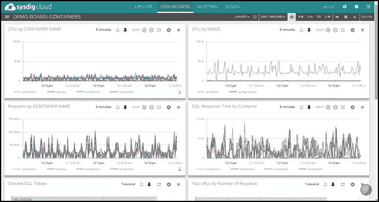
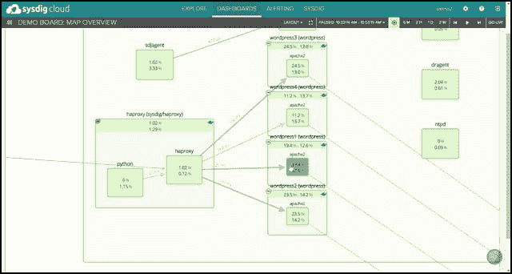

# Sysdig 说，不需要代理来监控容器，只需要 Linux 内核改变

> 原文：<https://thenewstack.io/no-agents-needed-to-monitor-containers-says-sysdig-just-linux-kernel-changes/>

容器仍然缺少的是一个向监控系统提供遥测数据的通用平台。尽管 Docker 确实提供了一种轮询容器内的 API 以检查其资源消耗的方法，但是容器没有向某些外部服务发送“心跳”或定期报告的机制。

传统虚拟机环境的拥护者将此吹捧为容器的一个主要缺点。如果是，那么虚拟机和容器都有同样的问题。虚拟组件是独立的。码头工人已经开始突破这个障碍，他们对插件生态系统的最新探索。但即便如此，这也可能强调了容器报告其运行状况的必要性，以及容器通过采用标准方法击败单个虚拟机而再次报告其运行状况的机会。

[新遗迹已经提出了挑战](https://thenewstack.io/new-relic-adds-docker-support-addresses-microservices-architectures/)具有能够映射微服务之间关系的视觉监控系统。但是它需要[安装一个应用程序性能监控代理](https://docs.newrelic.com/docs/apm/new-relic-apm/installation-configuration/installing-agent)，将健康数据中继回新遗迹的服务器。尽管很难直接测量(因为测量需要一个代理人),该死的，维尔纳·海森堡！)，代理可能会改变他们被分配监控的任何虚拟组件的行为。

## “突然间你看到了一切”

本周，一家名为 Sysdig 的公司带着一款名为 [Sysdig Cloud](https://sysdig.com/monitoring-as-a-microservice/) 的产品进入集装箱监控市场，该公司的首席执行官认为这是一款专门为集装箱而非虚拟机构建的无代理系统。

“我们试图想象一个本地的集装箱监控产品会是什么样子，”Sysdig 的首席执行官洛里斯·德吉奥安尼在接受《新堆栈》采访时说。“就技术而言，我们与其他提供容器可见性的公司之间的最大区别在于，我们有一套特定的技术，旨在以不需要任何仪器的方式观察容器内部。部署只是通过部署另一个容器来完成。我们称之为“监控即微服务”。"

说 Sysdig 不需要在容器内部注入独立的药剂，在技术上是正确的。这也可能是克林顿式句子解析的奇迹。

容器环境中确实注入了某种东西，只是不是以通常的方式，也不是在通常的地方。Sysdig 绝不是一个被动的监控系统。当被进一步追问这个话题时，Degioanni 承认 Sysdig 拥有许多正在申请专利的技术，这些技术被统称为 ContainerVision。

周二， [Digiovanni 写了一篇公司博客文章](https://sysdig.com/monitoring-as-a-microservice/)，其中包含了这样的解释:“Sysdig 的 ContainerVision 技术正在申请专利，Sysdig Cloud 可以从自己的独立容器中监控您的整个架构，无需任何配置，但仍然可以深入了解您环境中运行的所有其他服务。有了 Sysdig Cloud，你只需要多加一个容器，突然就什么都看到了。应用、服务、网络、流程、基础设施组件。”

## 感叹词

有没有可能漏掉了一步？我在这一点上向 Sysdig 施压，指出如果事情总是简单到只需在组合中添加一个额外的容器，而其他人却突然泄露了他们众所周知的秘密，那么可能存在一个安全缺陷，Solomon Hykes 和 Docker，Inc .的好人们应该知道这个缺陷。

这是一小段小字。

“我们在运行容器的 Linux 模块中安装了一个小模块，”Degioanni 告诉新的堆栈，“因为对于容器，Linux 内核有点像管理程序。当你部署容器时，我们在内核中注入一个小模块，这个模块能够从底层检查任何其他容器——查看任何交互、任何打开或关闭的文件、任何网络连接、任何正在运行的应用程序、任何进程等等。”

> 因此，通过增加机器，即运行在容器上的 Linux 内核，可以看到容器的下面，并获得这种可见性。

Degioanni 认为模块注射过程是自动的。一旦模块向其报告的 Sysdig 容器被添加到 mix 中，注入的模块将在能够运行容器的任何版本的 Linux 上工作，包括 CoreOS。他继续说，这种方法让 Sysdig 与容器无关，支持 Docker、rkt、LXC 或任何可能出现的东西，并支持任何容器运行时。

## 粒度

我们在运行 Cassandra 的实时容器环境中见证了 Sysdig 系统的工作演示，我们看到的一些特性确实令人印象深刻。内核缺陷报告能力的深度使 Sysdig 能够实时倒带和重放长时间间隔的性能历史，这是一种称为时间旅行的功能。

Sysdig 的映射能力，Degioanni 说是受谷歌地图的启发，呈现了一个惊人有效的动画，深入到正在运行的流程的拓扑结构，渲染器以流动的缩放方式产生，从云级别到网络级别到容器级别再到流程级别。

[![[SCM]actwin,0,0,0,0;Loris Degioanni's Screen atmgr 7/14/2015 , 3:20:43 PM](img/0755febd71f670641d257769933719af.png)](https://thenewstack.io/wp-content/uploads/2015/07/150717-Sysdig-01.jpg)

[![[SCM]actwin,0,0,0,0;Loris Degioanni's Screen atmgr 7/14/2015 , 3:21:08 PM](img/d067578e64a663d310ee6f186fdb6c41.png)](https://thenewstack.io/wp-content/uploads/2015/07/150717-Sysdig-02.jpg)

[![[SCM]actwin,0,0,0,0;Loris Degioanni's Screen atmgr 7/14/2015 , 3:21:33 PM](img/dad68bda4cf01a8a64f09292fbfe3d63.png)](https://thenewstack.io/wp-content/uploads/2015/07/150717-Sysdig-03.jpg)

[![[SCM]actwin,0,0,0,0;Loris Degioanni's Screen atmgr 7/14/2015 , 3:21:35 PM](img/309bb854c17cf8262d628d0e9a3a8ea4.png)](https://thenewstack.io/wp-content/uploads/2015/07/150717-Sysdig-04.jpg)

“顺便说一下，这并不像看起来那么简单，”Degioanni 说。像 Docker 这样的工具为它们的容器创建了小的子网。因此，要接触到它们并理解一台机器上的容器如何与另一台机器上的容器进行对话，这需要相当多有趣的技巧。”他描述的一个技巧是将路由表拼接在一起。

Degioanni 承认，Docker 最近针对 1.7 实验版的新插件模型进行的实验，可能会有影响 Sysdig 的监控容器在其环境中如何工作的轻微风险——这是他必须亲自看到才能确定的事情。

<svg xmlns:xlink="http://www.w3.org/1999/xlink" viewBox="0 0 68 31" version="1.1"><title>Group</title> <desc>Created with Sketch.</desc></svg>