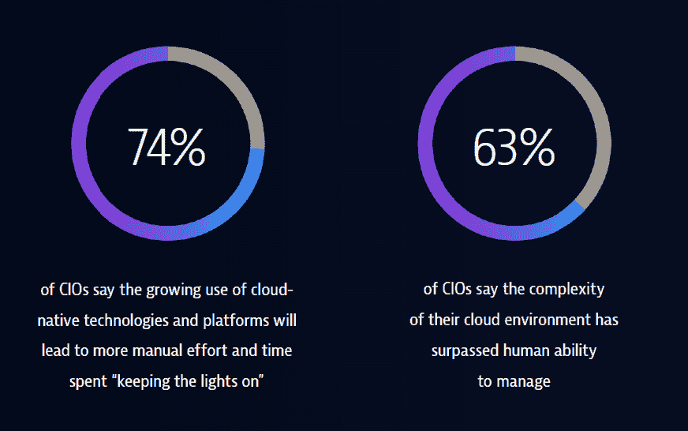

# 没有简单的解决方案:云原生技术在数字化转型中的作用

> 原文：<https://thenewstack.io/no-easy-fix-cloud-natives-role-in-digital-transformation/>

如果首席信息官们认为通过 Kubernetes 等云原生技术实现数字化转型会很容易，那他们是在自欺欺人。

Vanson Bourne 为最新 [D2iQ 电子书](https://d2iq.com/resources/report/kubernetes-in-the-enterprise-uncovering-challenges-and-opportunities)所做的调查显示，大多数人认为 Kubernetes 是他们组织数字化转型战略的核心部分。视角很重要。该研究中的 IT 决策者认为，数字化转型就是要改变 IT 的运营方式。与此同时，开发人员、架构师或 DevOps 工程师认为数字化转型更多的是一种模糊的管理策略，而不是可以完成的 IT 计划。

略多于一半(54%)的 IT 决策者认为，他们组织的长期成功取决于顺利完成最初的 Kubernetes 部署，顺利运行云原生应用。相比之下，有一半(27%)的开发人员、架构师或开发人员角色的受访者这么说，他们认为生产中的云原生应用程序要么“值得拥有”，要么“不值得头疼或浪费资源”

云原生劳动力的核心是开发人员、架构师和 DevOps 工程师，他们并不急于转型，但 93%的人认为他们的组织采用 Kubernetes 提高了他们的工作安全性。他们赞同由云原生技术驱动的数字化转型的管理愿景，因为构建这些系统的应用程序令人兴奋，并增加了他们的长期就业能力。

来源:Dynatrace 的《2020 年全球首席信息官报告》。

Dynatrace 的[《2020 年全球首席信息官报告》](https://www.dynatrace.com/cio-report-automatic-and-intelligent-observability/)体现了管理层的愿景，该报告基于 Vanson Bourne 进行的另一项调查，他是全球至少拥有 1000 名员工的企业的 700 名首席信息官之一。不出所料，89%的受访者表示他们的数字化转型在过去 12 个月中加速了，86%的受访者正在使用云原生技术和平台，如 Kubernetes、微服务和容器。与此同时，74%的人表示，云原生技术和平台的使用越来越多，这将导致更多的手动工作和时间花费在“保持正常运转”上。在另一个独立但类似的问题中，几乎同样多的首席信息官将 Kubernetes 的兴起与人工管理太难的复杂性联系起来。

现在，云原生技术已经成为主流，我们是否应该停止称之为变革，而开始关注使其工作的具体细节？

<svg xmlns:xlink="http://www.w3.org/1999/xlink" viewBox="0 0 68 31" version="1.1"><title>Group</title> <desc>Created with Sketch.</desc></svg>