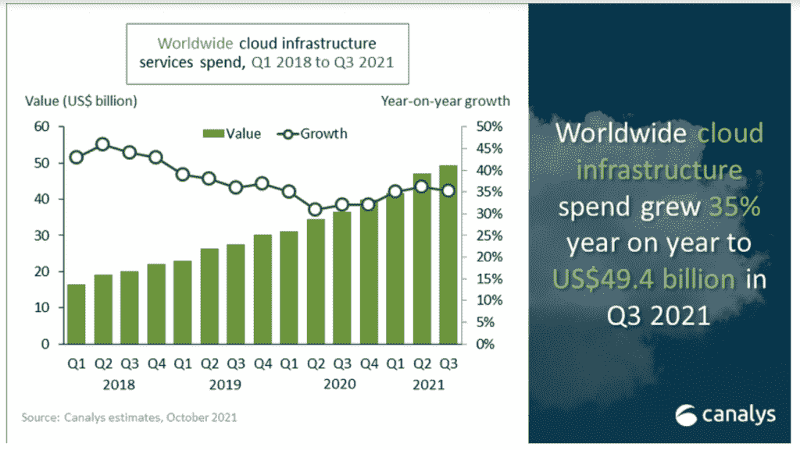

# 芯片短缺不会马上结束，但希望是长期的

> 原文：<https://thenewstack.io/no-immediate-end-to-chip-shortage-but-hope-for-the-long-run/>

根据一系列行业高管和观察人士最近的评论，没有人应该指望困扰 IT 行业并波及从游戏机、智能手机到汽车等行业的持续芯片短缺会很快结束。

半导体制造商最终将能够赶上新冠肺炎疫情开始后不久开始的不断增长的需求，但这是在明年还是在 2023 年的某个时候仍有待观察。

英特尔首席执行官帕特·基尔辛格

Nvidia 联合创始人兼首席执行官[黄仁勋](https://www.linkedin.com/in/jenhsunhuang/)，在该公司[最近的 GTC 2021](https://thenewstack.io/omniverse-nvidias-ambitious-platform-for-the-virtual-world/) 活动期间，[告诉雅虎财经](https://finance.yahoo.com/news/nvidia-ceo-we-dont-have-any-magic-bullets-to-deal-with-chip-shortage-212549454.html?guccounter=1&guce_referrer=aHR0cHM6Ly93d3cucmVkZGl0LmNvbS9yL2hhcmR3YXJlL25ldy8&guce_referrer_sig=AQAAAAO08GkuUA820cGNJzshMZlRikdCke-DZ99QPTTvTP98r_vaqeJthZDqih0NtVZU5M9LMktVzw24d1lyqUTeYidlFS84RxzxbUZaxzh9KotrNIZ8IwXMInla_mOKusZZrdJPx1VCGrmDIVxasczOuTsIdU67AVfVmyHF-FO1nMOz)至少到 2022 年，该行业将继续看到 CPU、GPU 和其他此类组件的短缺。

“我们需要一段时间才能看到供大于求的时候，”黄说。"到明年，需求将远远超过供给."

黄的评论呼应了英特尔首席执行官几周前告诉的话。今年 2 月接手芯片制造商的 Gelsinger 表示，短缺将持续到 2023 年底，并补充说“我们现在处于最糟糕的时期。明年的每个季度，我们都会逐渐变好，但在 2023 年之前，他们不会达到供需平衡。”

## **有些乐观情绪**

尽管如此，摩根大通的分析师似乎对时间表更加乐观，摩根大通亚太技术、媒体和电信研究联席主管 Gokul Hariharan 告诉美国消费者新闻与商业频道，到 2023 年，半导体行业将不再面临供应短缺。Hariharan 表示，这种情况可能会在 2022 年下半年有所改善，并指出芯片制造商和芯片代工厂将在年中带来更多的制造产能。

此时任何缓解都是受欢迎的。虽然汽车是受影响最大的行业，但芯片短缺阻碍了许多领域的生产。高盛(Goldman Sachs)美国半导体和半导体资本设备部门的研究分析师 Toshiya Hari 表示，2020 年初，半导体行业将走出供应链库存问题导致的长期低迷。

哈里[在 6 月的一次活动中说](https://www.goldmansachs.com/insights/podcasts/episodes/06-29-2021-hari-yuzawa-hall-f/transcript.pdf)当[新冠肺炎疫情](https://thenewstack.io/the-network-impact-of-the-global-covid-19-pandemic/)在那年早春来袭时，使用处理器的行业做出了“膝跳反应”来减少或取消订单，预计在公共卫生危机期间对他们产品的需求将会下降。

“COVID 出现后立即发生的事情和疫情期间发生的事情非常不同，”他说。“如果说有什么不同的话，那就是在许多应用程序中发生了完全相反的情况。我们中的许多人在家工作，在家学习，出去买电脑、游戏机、Wi-Fi 路由器之类的东西。随着人们搬到郊区，避免乘坐公共交通工具，对汽车的需求也在增加。”

## 芯片制造商面临的无数问题

对于半导体公司来说，有几个问题。当客户缩减规模或停止订单时，供应商不仅会减少产量，而且由于疫情的封锁措施，这些供应商很难对需求的意外增长做出反应并增加产量。哈里说，还有各种其他事件——如德克萨斯州的冬季风暴切断了该州的电力供应，并切断了三星芯片制造厂的电力供应——扰乱了供应链。

Pund-IT 的首席分析师[查尔斯·金](https://www.linkedin.com/in/charles-king-344a8b/)告诉《新堆栈》:“这是一个典型的例子，说明意外事件如何影响制造过程。”。“由于工人或其家人感染了新冠肺炎病毒，工厂和运输公司开始放缓生产或关闭，导致订单积压。除非或直到病毒开始减弱——通过全球疫苗接种的努力——影响将继续是麻烦的。”

金说，尽管这种短缺至少会持续到明年，“但其影响是不一致的。当短缺的可能性变得明显时，许多智能手机和个人电脑制造商囤积了芯片，因此他们的业务暂时或多或少会正常运转。然而，其他依赖半导体的行业，尤其是汽车制造业，受到了沉重打击，似乎不太可能迅速复苏。”

## **没有灵丹妙药**

英伟达首席执行官黄仁勋

英伟达的黄说，他的公司面临的压力来自对家用电脑和工作站的更大需求，现在越来越多的人远程工作或花更多的时间在他们的系统上玩游戏。

他说[英伟达](https://thenewstack.io/nvidia-gpus-nudge-hpe-supercomputer-into-the-exascale/)没有“导航供应链的任何灵丹妙药”。…我们得到了供应商的支持。我们很幸运，我们有多种来源，我们的供应链是多样化的，我们的公司相当大，所以我们周围有一个大型生态系统的支持。”

据科纳仕公司分析师称，芯片短缺也将打击云提供商。在最近的[报告](https://www.canalys.com/newsroom/global-cloud-services-q3-2021)中，市场研究公司注意到对云基础设施服务的高需求，第三季度的支出同比增长 129 亿美元，自第二季度以来增长 24 亿美元。这迫使顶级云服务提供商扩大其全球数据中心的覆盖范围，以满足需求。然而，分析师们写道，全球芯片短缺对这些公司的影响“迫在眉睫”，因为零部件制造商正面临更长的交付周期和更高的价格，其中很大一部分将转移到超大规模生产上。

“整体计算需求超出了芯片制造能力的增长，对于云服务提供商来说，基础设施的扩张可能会变得有限，”科纳仕公司研究公司分析师 [Blake Murray](https://www.linkedin.com/in/blake-murray/) 在一份声明中说。“除了尽最大能力管理供应链之外，建立优势的供应商还专注于开发其上市渠道及其产品组合，以跟上日益广泛的客户使用案例，这些案例自疫情开始以来一直在推动需求。”

## **芯片用户寻求发展供应链**

其他行业的公司也试图在汹涌的水流中找到出路。例如，主要汽车制造商福特[本月与芯片代工厂 GlobalFoundries 达成协议](https://gf.com/press-release/globalfoundries-ford-address-auto-chip-supply-and-meet-growing-demand),希望扩大其供应链。GlobalFoundries 将斥资 10 亿美元扩大产能，为福特目前的汽车产品线制造半导体，同时两家公司还将推动研发工作，以满足汽车行业对处理器日益增长的需求。

此外，像英特尔这样的公司正在[投入巨资](https://thenewstack.io/what-intels-fab-for-hire-plan-could-offer-hyperscale-cloud-platforms/)来提高他们的生产能力。以英特尔为例，它将花费高达 440 亿美元在美国、欧洲和以色列建造新的制造设施——晶圆厂，这不仅是为了满足不断增长的需求，也是为了让[在 2025 年前超过竞争对手](https://www.cnbc.com/2021/11/06/how-intel-plans-to-catch-up-to-samsung-and-tsmc-with-44-billion-of-new-global-chip-fabs.html)三星和台积电(TSMC)。也就是说，TSMC 承诺在三年内投入 1 亿美元，三星承诺在 2030 年前投入 1450 亿美元。

## **政府帮助**

与此同时，美国政府和欧盟希望花费数十亿美元来提高这些国家的芯片制造能力，减少对中国制造商的依赖。根据彭博[的报道](https://www.bloomberg.com/news/articles/2021-11-13/white-house-spurns-intel-plan-to-boost-chip-production-in-china?sref=HrWXCALa)，拜登政府本月还拒绝了英特尔利用中国芯片厂制造硅片的计划。

然而，虽然雄心勃勃，但政府的计划不会给现在挣扎的组织任何立即的缓解，Pund-IT's King 说。然而，从长远来看，好处可能是巨大的。

“开发(和)建设新的半导体晶圆厂需要时间，这使得政府支持不太可能对当前的短缺产生任何影响，”他表示。“然而，这些法案可能会恢复美国和欧盟的高科技制造业，并有助于在很大程度上减少或消除未来短缺的危险以及全球事件对高科技供应链的影响。”

<svg xmlns:xlink="http://www.w3.org/1999/xlink" viewBox="0 0 68 31" version="1.1"><title>Group</title> <desc>Created with Sketch.</desc></svg>