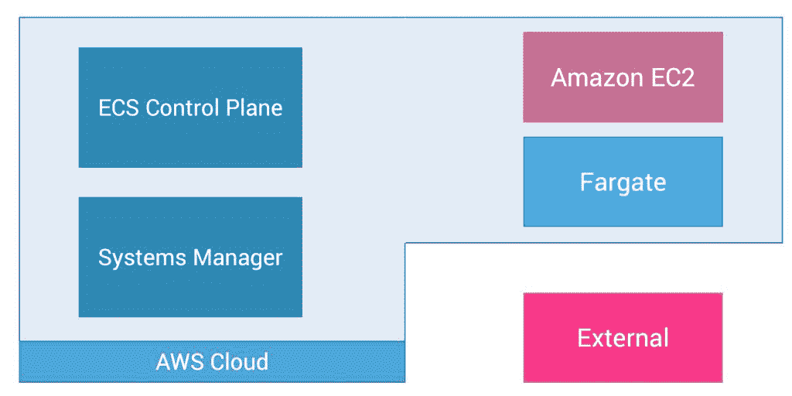
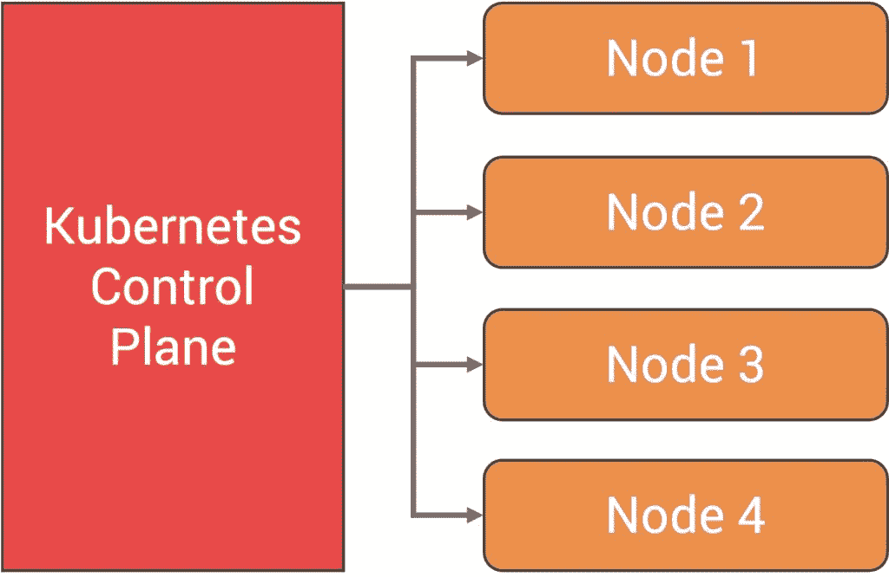
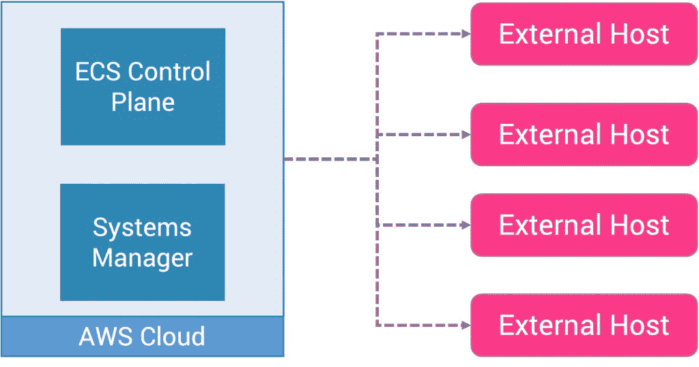
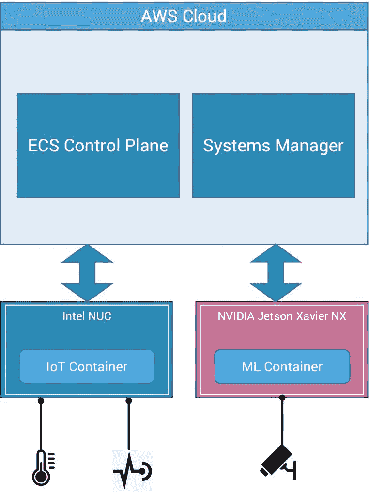

# 不需要 Kubernetes:亚马逊 ECS 无处不在

> 原文：<https://thenewstack.io/no-kubernetes-needed-amazon-ecs-anywhere/>

混合和多云市场正在升温。微软和谷歌等超大规模公司正在将其基础设施服务扩展到内部数据中心和其他公共云。平台供应商，如 [Red Hat](https://www.openshift.com/try?utm_content=inline-mention) 和 [VMware](https://tanzu.vmware.com?utm_content=inline-mention) 拥有可以在包括数据中心、私有云和公共云在内的各种环境中运行的容器管理服务。

Google Anthos、微软 Azure Arc、Red Hat OpenShift 和 Advanced Cluster Manager、VMware Tanzu 等多云平台有什么共同点？答案显而易见——是 Kubernetes。几乎所有的混合和多云平台都基于 Kubernetes。

[亚马逊网络服务](https://aws.amazon.com/?utm_content=inline-mention)，第一个也是领先的公共云提供商之一，已经采取了不同的方法来提供混合和多云平台。除了 Kubernetes，AWS 还扩展了弹性容器服务(ECS ),作为向客户提供混合云功能的工具。

## 亚马逊 ECS 快速回顾

亚马逊 ECS 于 2014 年推出，比 Kubernetes 早一年推出，作为 AWS 客户的托管容器编排平台。它是模仿 Docker Compose 的，Docker Compose 是一个工具，可以让多个容器作为一个工作负载运行。

在 ECS 中，容器被包装在任务定义中，该任务定义向控制平面注册，控制平面在集群的一个主机中调度任务。主机通常是 Amazon EC2 实例，它运行一个与控制平面通信的代理。启动任务后，它可以扩展到多个实例，从而成为一项服务。该服务确保指定数量的任务始终在运行。

对于 Kubernetes 用户来说，ECS 的架构看起来很熟悉。ECS 任务类似于 Kubernetes Pod，而 ECS 服务类似于 Kubernetes 部署。EC2 主机上运行的 ECS 代理模拟 Kubernetes 节点中 kubelet 的工作。

由于 ECS 是 AWS 管理的服务，它与各种 AWS 服务紧密集成，如 CloudWatch、ALB、VPC 等。

ECS 与 Fargate 配合得很好，Fargate 是 AWS 的无服务器容器平台。使用 Fargate，客户不需要处理 EC2 实例。在幕后，Fargate 协调负责运行 ECS 的容器化工作负载的计算层。

有关 ECS 和 Fargate 的详细讨论，请参考我的文章“[AWS Fargate Through the Lens of Kubernetes](https://thenewstack.io/aws-fargate-through-the-lens-of-kubernetes/)”

在启动 Amazon ECS 集群时，客户可以选择基于 EC2 的集群或 Fargate 集群，这为他们提供了控制和灵活性。

## 从 AWS 中分离容器工作负载

在 re:Invent 2020 上，亚马逊宣布推出 ECS Anywhere，该服务将 ECS 扩展到内部和其他云环境。这意味着 ECS 在 EC2 和 Fargate 之外获得了一个额外的执行环境。AWS 将在其云之外运行的主机称为外部实例，成为 ECS 的第三个执行环境。

ECS Anywhere 的想法很简单—运行为外部主机(如裸机服务器、虚拟机，甚至运行在其他公共云环境中的实例)中的 EC2 实例设计的相同 ECS 代理。

由于外部主机需要一个安全上下文来与 AWS 对话，ECS Anywhere 需要另一个名为 AWS 系统管理器代理(SSM 代理)的二进制文件。SSM 代理是 AWS 系统管理器的一部分，它安装并配置在 EC2 实例、本地服务器或虚拟机上，以控制主机。

SSM 代理和 ECS 代理的结合扩展了 ECS 在外部主机上运行任务的能力。

ECS 代理与 Docker 引擎通信来管理容器的生命周期。ECS 任务定义被翻译成相应的 Docker API 调用来启动、停止和终止容器。

需要注意的一个关键点是，Amazon ECS Anywhere 在云中运行控制平面。只有代理运行在与控制平面保持连接的外部主机中。

## 亚马逊 ECS Anywhere vs. Kubernetes

Kubernetes 已经成为混合、多云和边缘部署的事实上的选择。K3s 等发行版[使得在资源受限的边缘计算环境中运行 Kubernetes 成为可能。对于企业而言，有很多选择— Anthos、Azure Arc、Red Hat OpenShift、VMware Tanzu 和 Rancher。](https://thenewstack.io/ranchers-k3s-joins-cncf-sandbox-as-first-kubernetes-distribution/)

在边缘地带运行 Kubernetes 也有其自身的挑战。

首先，您至少需要三个节点来确保集群的高可用性。在处理多个集群时，您需要一个集群管理器(如 Rancher、Anthos、Azure Arc、Red Hat Advanced Cluster Manager 或 VMware Tanzu Mission Control)来管理集群。

升级运行在边缘/混合环境中的集群是一个巨大的挑战。由于每个集群都有自己的控制平面，因此在升级节点之前，需要先对其进行升级。这个过程是脆弱的，容易出错。

Kubernetes 更倾向于运行独立的 Docker，因为它的工具和与成熟的 DevOps 生态系统的集成。但是，运行一个成熟集群的成本超过了收益。

Amazon ECS Anywhere 提供了两全其美的功能—在远程环境中运行容器化的工作负载，并从云中进行集中控制。

Kubernetes 的局限性之一是控制平面不能与工作节点分离。 [Amazon ECS Anywhere](https://aws.amazon.com/ecs/anywhere/) 旨在将执行环境与控制平面隔离开来。如果运行 ECS 代理的外部主机之一失去了与控制平面的连接，它将继续运行，就像直接从 Docker CLI 启动一样。当连接恢复时，它将同步并协调到所需的状态。

在没有任何可见性或控制的情况下，将 Docker 容器映像推送到远程环境是非常危险的。借助 ECS Anywhere，您可以管理容器化的工作负载，同时全面了解执行环境。

当向 AWS SSM 注册的外部主机被提升到高级实例层时，您甚至可以从 AWS 控制台 SSH 到远程实例。这为管理员提供了管理远程主机的最终控制权。

当然，如果您需要在一个有空隙的离线环境中运行容器化的工作负载，Kubernetes 仍然是最佳选择。但是，在半连接环境中，Amazon ECS Anywhere 是一个轻量级、优雅且高效的平台。

## Amazon ECS Anywhere 的典型用例

让我们设想一个场景，一家大型零售连锁店正在经历数字化转型之旅。

这家零售连锁店的每家商店都运行一套计算机视觉人工智能模型，对摄像机画面进行实时推断。推理代码是在一台或多台主机上运行的容器化工作负载。除了推理之外，工作负载还接收来自各种传感器的遥测数据，并将其发送到云。

这家零售商正在 NVIDIA Jetson Xavier NX 设备上运行人工智能模型，以获得推理的加速性能。物联网工作负载在负责接收传感器遥测数据和控制执行器的英特尔 NUC 机器上运行。对于机器对机器的通信和设备管理，考虑 AWS 物联网 Greengrass。预计商店大部分时间都将连接到互联网。

模型和推理代码构建在云中，使用专用的 CI/CD 和 MLOps 管道来生成容器映像和最终的部署工件集。

该零售商的工程师意识到，在混合 AMD64 和 ARM64 裸机设备上运行 Kubernetes 集群是有风险的。此外，商店与云有可靠的连接，这使他们考虑在任何地方使用 Amazon ECS。

作为评估的一部分，IT 团队已经在亚马逊 SSM 注册了 Jetson Xavier NX 和英特尔 NUC 主机，以获得远程访问权限。然后，他们部署了 ECS 代理，并向多个商店专用的集群注册了主机。

基于 AWS CodeCommit、AWS CodeBuild、Amazon ECR 的 CI/CD 管道现在正在生成 ECS 任务定义，这些任务定义最终将被推送到每个商店。亚马逊 SageMaker Pipelines 和 SageMaker Neo 用于训练模型，优化模型，并将其存储在亚马逊 S3，最终由边缘运行的工作负载拉动。

容器日志被接收到 CloudWatch 中，他们还计划使用容器洞察来获得额外的可见性。

retain 链能够实现在边缘运行容器化工作负载的目标，而无需运行成熟的 Kubernetes 集群，同时获得对部署的完全控制。

### 何时在任何地方使用亚马逊 ECS

以下是选择 Amazon ECS Anywhere 时需要考虑的清单:

*   *   您在 AWS 上的投资需要延伸到边缘
    *   目标是以最少的工作量在边缘运行容器化的工作负载
    *   运行 ECS 代理的每台主机大部分时间都连接到互联网
    *   您不需要额外的功能，如服务网格和 GitOps
    *   您希望从 AWS 控制台 SSH 到远程主机

在接下来的文章中，我将演示如何部署在由 Amazon ECS Anywhere 管理的 NVIDIA Jetson 设备上运行的容器化 ML 推理代码。敬请期待！

<svg xmlns:xlink="http://www.w3.org/1999/xlink" viewBox="0 0 68 31" version="1.1"><title>Group</title> <desc>Created with Sketch.</desc></svg>