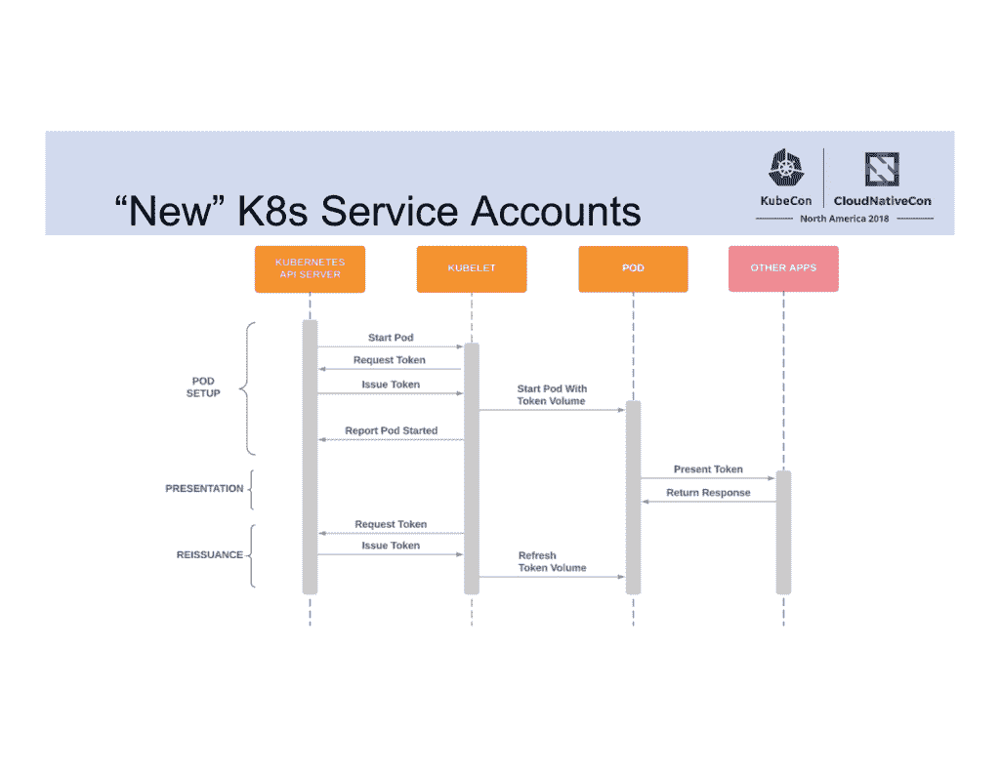

# 不再有永久令牌:Kubernetes 身份管理的变化

> 原文：<https://thenewstack.io/no-more-forever-tokens-changes-in-identity-management-for-kubernetes/>

运行在 Kubernetes 上的工作负载需要一个身份来连接外部服务和 API，以及集群中的其他服务或不同集群中的工作负载。身份允许 CI/CD 系统连接到集群中，并用于秘密管理。这些都是通过[服务账户](https://kubernetes.io/docs/reference/access-authn-authz/service-accounts-admin/#service-account-automation)完成的，但是这些账户目前获取身份令牌的方式存在一些安全性和可伸缩性问题。

为提高安全性和可管理性而进行的更改对许多应用程序应该是透明的。我们的目标是创建一个工作负载身份系统，该系统可以为应用程序提供身份，只需很少的开发人员工作，同时最大限度地减少任何凭据泄露的影响，这样攻击者即使获得了令牌，也无法广泛访问系统。它也是其他身份管理工具和项目的基础。

但是，由于这种新方法将首先成为默认选项，然后成为未来版本中的唯一选项，因此值得在 alpha 版本中进行测试，以了解您是否需要更新权限、更改集群规范或对流程进行更重大的更改。

## 不再有永远的代币

当一个 Kubelet 启动一个作为服务帐户运行的 pod 时，它从 Kubernetes **apiserver** 请求一个 JSON Web 令牌。目前，这些 jwt 是“永远”的令牌；只要服务帐户存在，它们就不会过期并且有效。这意味着如果凭据泄漏，替换令牌意味着创建一个新的服务帐户并删除旧服务帐户的所有机密。服务帐户签名密钥轮换是可能的，但它不被 client-go 支持或被控制平面自动化，所以它没有被广泛使用。

当发现 Calico Container Networking Interface(CNI)插件[将凭证泄露到日志](https://cloud.google.com/kubernetes-engine/docs/security-bulletins#november-13-2018)中时，通过替换服务帐户来转移到新凭证甚至对于有经验的 Kubernetes 操作员来说都是痛苦的。

令牌也作为秘密存储(这意味着每个服务帐户都需要一个 Kubernetes 秘密),并且由于 Kubernetes 管理秘密的方式，任何有权查看服务帐户秘密之一的组件都可以看到所有秘密。出口控制器需要读取 TLS 机密，但这意味着它还可以读取集群中每个应用程序的服务帐户凭证。新令牌由一个投影卷处理。

Kubernetes 服务帐户令牌的新供应流程

与现有的令牌不同，[新的令牌](https://github.com/kubernetes/community/blob/master/contributors/design-proposals/auth/bound-service-account-tokens.md)不依赖于秘密，它们是与 **apiserver** 绑定的受众，因此您可以设置一个特定的令牌来与 Hashicorp Vault(它使用令牌来与 Kubernetes 集成)等秘密管理工具进行通信，并确信没有其他任何东西可以使用该令牌。

另一个重大变化是令牌现在将自动过期:应用程序开发人员和 pod 规范作者可以设置令牌过期生命周期，但集群管理员可以为整个集群的令牌设置最长生命周期。

这些寿命预计不会很长；几小时而不是几天或几年。Kubelet 处理刷新令牌；它有一个令牌管理器，知道每个令牌的生命周期，并在令牌超过其生存时间的 50%时(或超过 24 小时)开始从 **apiserver** 请求新令牌。

一旦为其提供令牌的 pod 不再运行，令牌也将失效，因此不等待令牌过期就撤销或轮换令牌意味着通过重新部署应用程序或触发滚动更新来重新启动 pod。

在未来，令牌还可以通过绑定到存储在可信平台模块(TPM)中的密钥来加强，这样攻击者就很难获得它们。

仍然有一些领域需要在认证方面做更多的工作，比如 Kubernetes 的身份和访问控制依赖于附加组件和第三方工具的领域。Kubernetes 数据库使用 etcd 作为集群数据的持久存储，并将机密存储为 base64 编码的明文；尽管 etcd 从 2.1 版开始就有了一个身份验证机制，但为了向后兼容，它在默认情况下是关闭的。

Kubernetes 的最新版本[版本 1.13](https://sysdig.com/blog/whats-new-in-kubernetes-1-13/) ，增加了在 etcd 键值存储中[加密 API 数据的选项(Kubernetes 使用它来跟踪 pod 信息)，但是您必须启用它。“默认情况下，Kubernetes 中的秘密是不加密的，”](https://kubernetes.io/docs/tasks/administer-cluster/encrypt-data/) [HashiCorp](https://www.hashicorp.com/) 创始人 [Mitchell Hashimoto](https://twitter.com/mitchellh) 告诉我们，并指出该公司的 [Vault](https://www.hashicorp.com/products/vault/) 产品因此而受欢迎。“我们收到许多组织询问我们如何让我们的开发人员构建的应用程序在默认情况下更加安全。他们希望改变开发人员不知道是否应该加密而只是默认加密的行为。”

针对集群工作负载的服务器认证也由 Istio 和 [SPIRE](https://spiffe.io/spire/) 等项目处理，这些项目使用 [SPIFFE](https://github.com/spiffe/spiffe) 框架和 API 来执行节点和工作负载认证，但目前还没有一种本地方式来完成这项工作。期望看到基于新令牌的节点范围的授权，以及 SPIRE 和 Istio 可以挂钩的扩展，以利用新的令牌流。

“我们希望在 Kubernetes 的基础上支持安全、功能丰富的身份解决方案申请人，这些申请人可以利用 Kubernetes 建立的信任链来供应工作负载，”Kubernetes Auth 特别兴趣小组(SIG)主席 [Mike Danese](https://github.com/mikedanese) 在去年的 Kubecon+CloudNativeCon 2018 活动上表示。

## 检查兼容性

更改身份和认证选项会给现有部署带来问题，所以这个特性正在逐步引入。在 Kubernetes 13.1 中，它是一个用于测试的 alpha 特性，但默认情况下它是关闭的，有一个集群级别的标志可以选择加入(除非您已经选择了所有的 alpha 特性)。在 Kubernetes 1.15 中，它可能会处于测试阶段，默认情况下是开启的，当它正式发布时(目前计划用于 Kubernetes 1.16)，您将不再能够选择退出—因此现在是开始测试这些新服务帐户将对您的集群产生什么影响的好时机。

服务帐户卷位置和文件结构不会随着新令牌系统而改变，但**boundserviceaccountokenvolume**功能门会将其迁移到投影卷，因此如果群集的 **PodSecurityPolicies** 仅允许秘密卷，您将需要允许新 pods 的投影卷。令牌的权限也更宽松，从给予所有用户广泛访问权限的 **0644** 变为 **0600** 。如果你以 root 以外的用户身份运行应用程序，你可能会看到文件权限错误；使用 **fsGroup** 功能添加一个补充组，为应用程序提供读取权限。这只会将文件权限更改为**0640**；作为非特权用户运行的单个应用程序仍然可以访问凭据，但节点上的其他应用程序无法读取令牌。

令牌需要定期重新读取；Kubernetes 客户端库处理令牌的重新读取，作为核心 Kubernetes 的一部分维护的 Go、Java 和 Python 客户端库将支持这一点，只需更新即可，但群集中任何不重新加载服务帐户令牌的 apiserver 客户端将在部署后一小时开始出现故障。一旦你选择加入，旧的客户端库将会有问题，1.11 之前的 Kubelets 将不会运行新的 pods 来装载服务帐户卷。

新的令牌流不支持将秘密注入环境变量以将凭证传递给应用程序，因为这些环境变量很可能会出现在日志中，从而可能会泄漏凭证。

通过标记需要使用传统令牌配置的服务帐户，可能有命名空间和服务级别选择退出来帮助迁移到新系统，例如，当您从服务帐户导出密钥以在 CI/CD 系统中使用时。但是不要依赖于选择退出已经存在很长时间了；您需要及时迁移到新的令牌系统。

<svg xmlns:xlink="http://www.w3.org/1999/xlink" viewBox="0 0 68 31" version="1.1"><title>Group</title> <desc>Created with Sketch.</desc></svg>