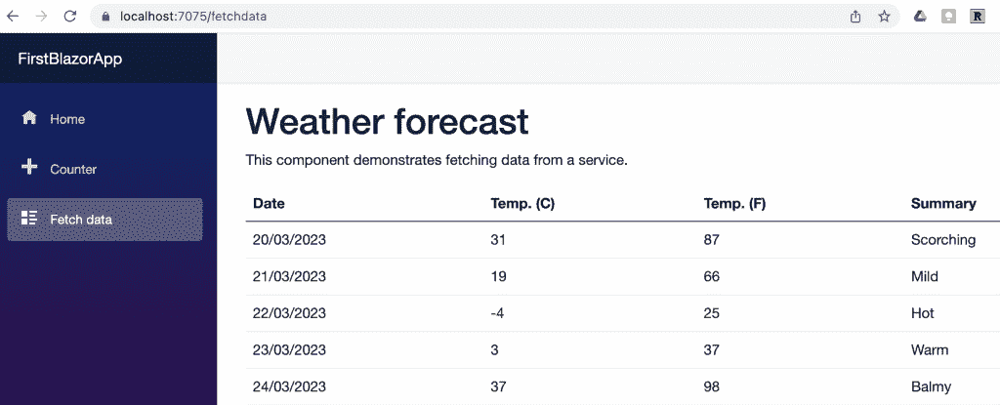

# 不再使用 JavaScript:微软 Blazor 如何使用 WebAssembly

> 原文：<https://thenewstack.io/no-more-javascript-how-microsoft-blazor-uses-webassembly/>

上周[我向你介绍了 Blazor](https://thenewstack.io/web-app-development-sans-javascript-with-microsoft-blazor/) ，微软的 web 栈，它避开了 JavaScript，允许开发者在客户端使用 WebAssembly。我们在模板和可靠的组件系统上看到了相当令人满意的 HTML/代码分离。

现在是时候进一步探索紫色人的领域了(在[解说视频](https://dotnet.microsoft.com/en-us/apps/aspnet/web-apps/blazor)中的主持人杰夫·弗里茨穿着一件非常迷人的紫色外套)。

您会记得之前您可以在页面上标记多条路线。我们可以在这个例子中看到一个有趣的变体*计数器。剃刀:*

```

@page  "/counter"

<PageTitle>Counter</PageTitle>

<h1>Counter</h1>

<p  role="status">Current count:  @currentCount</p>

<button class="btn btn-primary"  @onclick="IncrementCount">Click  me</button>

@code  {
    private int currentCount  =  0;

    private void IncrementCount()
    {
        currentCount++;
    }
}

```

我们可以在这条路线上添加另一条路线，这条路线带有一个与 StartingValue 绑定的参数。你可以看到这是多么具有可读性:

```

@page  "/counter"
@page  "/counter/{startingValue:int}

<PageTitle>Counter</PageTitle>

<h1>Counter</h1>

<p role="status">Current count: @currentCount</p>

<button class="btn btn-primary" @onclick="IncrementCount">Click  me</button>

@code  {
    private int currentCount  =  0;

    [Parameter]
    public  int  StartingValue  {  get;  set;  }

    protected override void OnParametersSet()    
    {
        currentCount  =  StartingValue;
        base.OnParametersSet();
    }

        private void IncrementCount()
    {
        currentCount++;
    }
}

```

它从 URL 中获取一个参数，并使用一个覆盖将它直接放入代码中(考虑到大小写差异)。显然，我们正在拾取一个 OnParameterSet 事件。如果没有参数，代码会像以前一样工作。如果我有一个参数匹配 int 类型，我们得到:


这为我们将不同类型的 HTML UI 元素绑定到 C#代码设置了更棘手的问题。

但是现在，我们将把紫色人的视频课程留给一个更紧迫的问题。这是我们想要谈论房间里的(紫色)大象的地方。

## 我们只是在创建服务器端的应用程序吗？

答案是否定的，微软的业务是创建一个统一的开发环境，模糊服务器端和客户端的界限。但是他们明确表示它们是不同的项目:


然而，在对上述两种选择的解释中，有一些闪亮但令人困惑的小玩意。WebAssembly 直接支持。NET 在浏览器上，从而给你离线行为。在服务器应用程序中，根本没有 C#进入客户端。SignalR 听起来像牙膏，但它只是客户端/服务器连接的异步通信助手代码。

你可能也注意到了两个描述中的最后一句是一样的。微软正试图在保护其平台遗产的同时，用支持现代技术的方法来平衡其旧系统。

## 服务器和 Wasm 应用程序之间的差异

我想通过查看一个示例组件来比较服务器和基于 WebAssembly 的应用程序之间的方法差异。

那么有什么区别呢？我一直在使用的演示项目是一个 Blazer 服务器。因此，让我们看看简单的 FetchData 示例。它显示了一些假天气:



在后端这是一个简单的纯 C#的假服务:

```
public  class  WeatherForecastService
{
    private static readonly string[]  Summaries  =  new[]
    {
        "Freezing",  "Bracing",  "Chilly",  "Cool",  "Mild",  "Warm",  "Balmy",  "Hot",  "Sweltering",  "Scorching"
    };

    public Task<WeatherForecast[]>  GetForecastAsync(DateOnly startDate)
    {
        return Task.FromResult(Enumerable.Range(1,  5).Select(index  =>  new  WeatherForecast
        {
            Date  =  startDate.AddDays(index),
            TemperatureC  =  Random.Shared.Next(-20,  55),
            Summary  =  Summaries[Random.Shared.Next(Summaries.Length)]
        }).ToArray());
    }
}

```

如你所料，注意随机生成结果的使用。每次刷新，我都会得到一些不同的虚假数据。

自然，页面有一个 *FetchData.razor* ，它有两个有趣的部分:

```

@page  "/fetchdata"
@using FirstBlazorApp.Data
@inject WeatherForecastService ForecastService
...

```

inject 指令是依赖注入的一种形式；Blazor 利用这一点，使组件能够以独立的方式使用可用的服务——实际的服务不会是调用程序的一部分。

下面是 FetchData.razor 底部对应的代码:

```

...
@code  {
 private WeatherForecast[]?  forecasts;

 protected override async Task OnInitializedAsync()
 {
      forecasts  =  await ForecastService.GetForecastAsync(DateOnly.FromDateTime(DateTime.Now));
 }
}

```

我们知道页面上的其余代码将遍历 WeatherForecast 数组并显示它。

所以我们只是缺少“注册”这个服务的代码。添加到 *Program.cs* :
的样板文件中

```

...
var builder  =  WebApplication.CreateBuilder(args);

// Add services to the container.
builder.Services.AddRazorPages();
builder.Services.AddServerSideBlazor();
builder.Services.AddSingleton<WeatherForecastService>();
...

```

设计似乎将页面本身视为独立的服务。所有需要单一服务的组件都接收相同的服务实例。

总之，我们为我们的服务器制作一个假服务，注册它，然后将它“注入”到应用程序的页面中。客户端唯一的责任是显示信息——这在 *FetchData.razor* 的其余部分由一些简单的 HTML 完成。

这不可能是 WebAssembly 客户端的模型。因此，让我们引入演示项目的 WebAssembly 等价物，并比较它们之间的差异。是的，这个项目中也有一个 FetchData 示例。它的运行方式与服务器版本相同，只是需要等待几秒钟。NET 加载到浏览器中。数据在刷新后不会改变(我们很快会看到原因)。只要页面能在一段时间内引起用户的兴趣，这种等待是可以接受的。我们可以想象这也会随着时间的推移而改善。

让我们从 FetchData.razor 的顶部开始:

```

@page  "/fetchdata"
@inject HttpClient Http
...

```

啊——所以我们没有注入一些后台假服务。因为，当然，没有后台。在演示中，使用的方法是一个 HttpClient，因此您可以在一个很好的 REST 服务中吸取一些数据。

这将如何应用？

```

@code  {
    private WeatherForecast[]?  forecasts;

    protected override async Task OnInitializedAsync()
    {
        forecasts  =  await Http.GetFromJsonAsync<WeatherForecast[]>("sample-data/weather.json");
    }
    ...
}

```

啊，所以这个服务现在是对一些可信的假 JSON 的 HTTP 调用。

静态 JSON 文件位于项目的 wwwroot 目录中，因此当应用程序运行时数据不会刷新:

```
[
  {
    "date":  "2022-01-06",
    "temperatureC":  1,
    "summary":  "Freezing"
  },
  {
    "date":  "2022-01-07",
    "temperatureC":  14,
    "summary":  "Bracing"
  },
  {
    "date":  "2022-01-08",
    "temperatureC":  -13,
    "summary":  "Freezing"
  },
  {
    "date":  "2022-01-09",
    "temperatureC":  -16,
    "summary":  "Balmy"
  },
  {
    "date":  "2022-01-10",
    "temperatureC":  -2,
    "summary":  "Chilly"
  }
]

```

我们仍然需要弄清楚我们是如何注册这个服务的，还要弄清楚为什么 HTTP 开始在我们的 wwwroot 中查找。答案恰好在同一行:

```
...
var builder  =  WebAssemblyHostBuilder.CreateDefault(args);
builder.RootComponents.Add<App>("#app");
builder.RootComponents.Add<HeadOutlet>("head::after");

builder.Services.AddScoped(sp  =>  new  HttpClient  {  BaseAddress  =  new Uri(builder.HostEnvironment.BaseAddress)  });

```

因此，我们添加了 HttpClient 服务，在本例中，基址被设置为主机环境。作用域服务与 HTTP 连接的生存期紧密相关。

虽然支持方法上的细微差别，但这两个项目在很大程度上是相同的。我希望这份关于微软如何为 WebAssembly 铺平道路的快速浏览能够吸引你放下 JavaScript，穿上彩色夹克。

<svg xmlns:xlink="http://www.w3.org/1999/xlink" viewBox="0 0 68 31" version="1.1"><title>Group</title> <desc>Created with Sketch.</desc></svg>