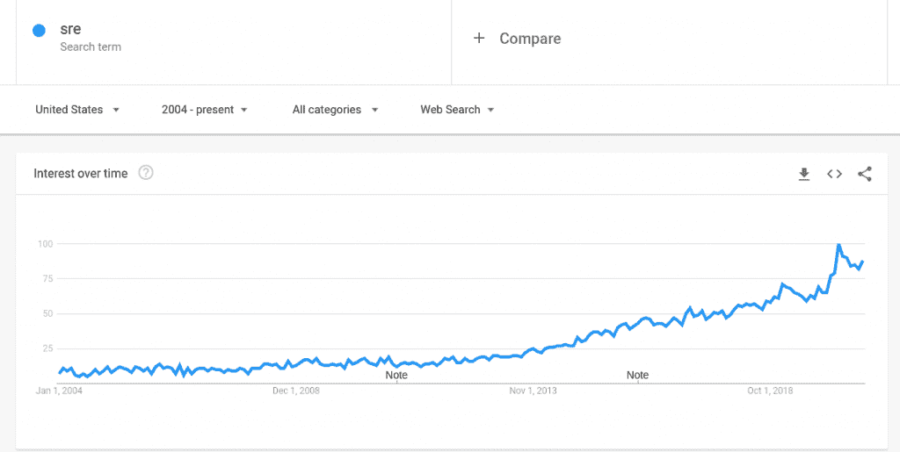
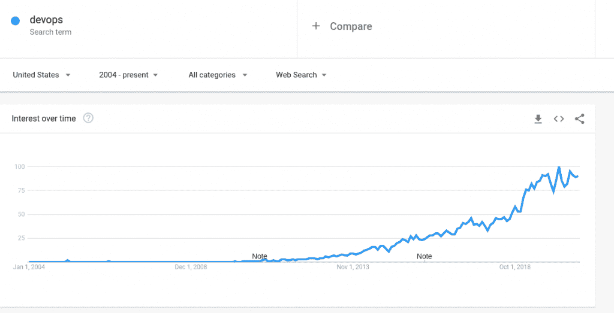

# 不，SRE 不是新的德沃普斯——除非它是

> 原文：<https://thenewstack.io/no-sre-is-not-the-new-devops-unless-it-is/>

 [克里斯托兹

克里斯托兹曾做过记者和 Linux 系统管理员。他对开源、敏捷基础设施和网络有着特别的兴趣。他是 Fixate IO 的内容高级编辑和 DevOps 分析师。](http://christozzi.com/) 

如果你开始在搜索引擎中输入“德沃普斯诉 SRE”，你可能会看到“德沃普斯诉”是人们搜索的热门查询之一。但是像“SRE 是德沃普斯吗？”

如果 Google autocomplete 是可信的，那么，关于 SRE 的角色与 DevOps 到底有什么关系，还有相当多的不确定性。一些人认为 SRE 和德沃普斯是截然不同的概念，而另一些人显然认为他们的意思或多或少是一样的。

理解 SRE 与 DevOps 的关系，以及这两个概念的不同程度，对于思考我们今天管理软件生命周期的方式是很重要的。本文提供了对这两个问题的看法。

## **什么是 SRE？**

SRE，代表站点可靠性工程(或者，有时，站点可靠性工程师)，是一种 IT 运营的方法，它优先考虑软件开发常用的工具和方法。

换句话说，不是使用传统的 IT 策略(如手动部署)来处理 IT 任务(如应用程序部署和监控)，而是使用基于代码的自动化工具(如基础设施即代码解决方案)，这对软件工程师来说更“自然”。

## **什么是 DevOps？**

与此同时，DevOps 可以用不同的方式定义，但是大多数定义都可以归结为一种理念，即 DevOps 是一种促进开发人员和 IT 团队之间协作的理念。

DevOps 还与某些方法(如持续部署/持续交付)密切相关，而这些方法与 SRE 的关系并不密切。

## **比较 SRE 和德沃普斯**

在高层次上，SRE 和 DevOps 都强调(至少部分强调)核心思想，即开发人员应该在 IT 运营工作中扮演更重要的角色。然而，当你更仔细地观察这两个概念时，就会发现某些不同之处。

### **SRE 和德沃普斯的历史**

其中一个区别是这两个概念的历史演变。

从概念上讲，SRE 是一个更老的想法。它起源于 2003 年的谷歌内部，谷歌认为这个想法如此强大，以至于它创建了一个专门介绍 SRE 的迷你网站(T3)，里面有几本 T4 的完整版 SRE 书籍(T5)。

DevOps 更新一点。它可以追溯到 2008 年左右(确切的时间表有点模糊)，几年后才开始成为主流。此外，与 SRE 不同，DevOps 概念背后没有谷歌的支持。

这些谷歌趋势图反映了 DevOps 概念扎根的缓慢步伐:

SRE 和德沃普斯截然不同的历史渊源和叙述反映了他们是不同的概念。从历史的角度来看，认为 SRE 只是 DevOps 的延伸或“下一阶段”是非常错误的。

### **持续和责任**

SRE 和德沃普斯的另一个区别是“连续性”在每个概念中扮演的角色。

流程(无论是应用程序开发、测试、部署还是监控)应该是连续的，这一理念是 DevOps 的重要组成部分。诚然，大多数 DevOps 过程并不完全是连续的，但是 DevOps 的中心目标是使过程尽可能一致和稳定。

SRE 的概念当然没有否认连续的过程；事实上，它在大多数方面都在暗中鼓励他们。但是持续性不是一个明确的目标。

听起来好像 DevOps 只是把“持续”变成了一个时髦词，而 SRE 没有，但这里不仅仅是语义上的问题。术语上的差异很重要，因为在 DevOps 中，有许多特定的工具伴随着连续的过程。为了“完成”DevOps，您将依赖于持续集成服务器、测试自动化、发布自动化套件等等。相比之下，与 SRE 相关的工作流不一定需要支持 DevOps 的那种持续自动化工具集——尽管它们完全与之兼容。

### **开发与运营**

最后，也许 SRE 和 DevOps 之间最大的不同是，在 SRE，开发者的观点是最重要的。总的来说，SRE 就是把对开发者有意义的工具和概念应用到 IT 运营中。

相比之下，DevOps 通常试图使开发人员和 IT 运营人员的关系更像是双向的。它不是将开发人员的工具和思维方式强加给 It 工程师，而是确保两个团队理解彼此的问题和方法，以便他们能够更有效地相互支持。

事实上，一些开发人员会让您相信 DevOps 通过将他们置于 IT 运营角色，使用 IT 运营工具和方法来“杀死开发人员”。我还没有看到关于 SRE 伤害开发者的类似抱怨，可能是因为 SRE 比 DevOps 更重视开发者的思维方式。

## **为什么这些都不重要(但有点重要)**

总之，很难证明 SRE 代表了 DevOps 的下一个阶段，或者这两个概念的意思完全相同。它们没有，也从来没有，因为它们起源于不同的历史背景。

另一方面，SRE 和德沃普斯之间几乎没有什么显著的不同。每个想法背后的思想，以及与之相关的术语和工具(在较小的程度上)可能有一些细微差别。但是除了他们对待开发者的方式有些不同之外，很难说有基本的概念上的区别。

也就是说，可能不值得过于担心 SRE 和德沃普斯之间的差异。两者都是可塑的概念，其意义很大程度上取决于旁观者的看法。

尽管如此，*值得担心的是确保接受德沃普斯和 SRE 背后的现代化理念。无论您选择相信一个比另一个更好，还是两者都同样有价值，理解并按照它们鼓励的自动化和最佳实践行动才是真正重要的。*

<svg xmlns:xlink="http://www.w3.org/1999/xlink" viewBox="0 0 68 31" version="1.1"><title>Group</title> <desc>Created with Sketch.</desc></svg>