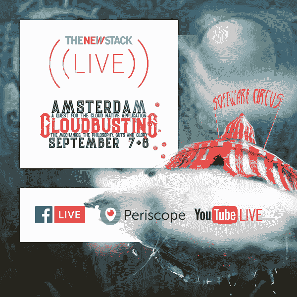

# 没有测试，没有文档，没有问题？

> 原文：<https://thenewstack.io/no-testing-no-documentation-no-problem/>

最近,“没有测试”和“没有文档”的想法在关注敏捷的开发社区中再次出现。

这些趋势到底是什么？毫不夸张地说，它们是没有测试或文档的软件开发。但是这是一个有意的决定，而不是像通常那样，你会耗尽时间和/或预算来进行适当的测试或编写好的文档。

对于支持者来说，没有测试和没有文档就意味着让开发团队承担创建更简单、更完美的代码的责任——阻止错误的发生 。他们认为测试和文档花费了太多的金钱和时间，这当然会花费更多的金钱。

> “当我是顾客时，我知道我不想仅仅为了一件像宣传的那样有效的产品而支付额外的费用。推而广之，我不想为测试付费。我想要一款‘好用’的产品。”——鲍勃·马歇尔， [无测试，无文档爱好者](https://flowchainsensei.wordpress.com/2014/11/07/no-testing/) 。

当然，软件世界一直在努力追求更快、更好和更低的成本，但是一个没有文档和测试的世界可能吗？这是否意味着更好的软件？今天，我们讨论#NoDocs 和#NoTesting 运动的含义，并就这是否能够或应该成为现实展开辩论。

## 文档和测试的不足之处在哪里？

毫无疑问，漏洞会从裂缝中漏掉，不完美的软件会在没有适当测试的情况下发布。当然，不合标准的文档总是会被发布。这两个部门通常是代码的接收者，这些代码被写出来，然后被扔过那堵无形的墙。他们通常没有时间正确地完成工作，因为时间和预算似乎总是不够用。

但是，似乎并不是这两项任务中任何一项的质量让人们试图消除它们。

https://Twitter . com/flowschainsensei/status/888312455218302976

用户讨厌文档。NoDocs 的支持者 Bob Marshall 最近告诉 The New Stack，“它从来没有足够好的组织，足够容易获得，足够全面，足够敏感，以满足他们的各种需求。“也不是，真的，因为这个原因，它可能永远不够好。设计师喜欢文档，因为它将他们从深入理解用户需求和根据这些需求进行设计的痛苦工作中解放出来。经理们往往喜欢文档，因为这让他们看起来像在做自己的工作。”

本质上，他和这个运动的其他支持者认为文档和测试是从一开始就没有对代码质量投入足够的借口。

当被问及文档是否曾经有过一席之地，比如在应用编程接口(API)领域，用户认为它是他们的头号决策因素时，Marshall 回答说“从来没有必要”。除非产品设计师不想被打扰，没有时间，没有能力，或者避免认真考虑如何使他们的产品直观。那么用户可能需要一个拐杖。”

Marshall 认为，如果没有将精力投入到质量代码中，测试和文档就是“必要的浪费”。

但是这种近乎完美的代码有什么资格呢？正如 Slack 的开发者关系经理 Taylor Singletary 告诉我们的那样:“你必须非常自信，你的软件、API、服务所提供的内在价值和易用性是惊人的，足够直观，开发者会忽略所有这些。”

## 如何开发出无缺陷的产品？

那么，团队如何为一个不需要这副拐杖的世界做准备呢？

马歇尔说:“考虑用户的旅程。这些旅程包括产品发现、探索、理解等等。我很少——几乎从来没有——看到产品设计师关注这类需求，自然而然地认为事后会提供一些文档、用户手册或诸如此类的东西。”

Marshall 确实说过可以有丰富的代码示例，只是没有文档。他说没有测试是关于从不同的角度接近产品质量——缺陷预防和他所谓的“真正的”软件质量保证。

“这需要开发人员能够有效地生产无缺陷产品——至少，一个经济的、指定的、认可的缺陷密度，”Marshall 说。

他接着说，像教练和质量保证团队这样的人可以支持开发人员朝着完美的方向努力。

https://twitter.com/Maj_variola/status/888134753425137664

软件质量分析师[Augusto Evangelisti](https://mysoftwarequality.wordpress.com/2016/10/17/ultimate-guide-to-reducing-the-amount-of-defects-and-other-waste-in-your-product/)为如何创建无缺陷代码提供了一些建议，首先将缺陷定义为“任何威胁产品价值的东西”他将此作为快速交付特性的一种替代方案，他说这种方式会产生一种“虚假经济”，需要昂贵的返工。

## 关注缺陷预防

但是你如何防止缺陷呢？Evangelisti 提供了这些实践，其中大部分需要沟通和协作的文化:

*   **测试优先的软件方法**，如**行为驱动开发(BDD)** 通过共享的沟通过程提前协作，以及**验收测试驱动开发(ATDD)** 整个团队从一开始就用示例讨论验收标准。
*   ****快速反馈循环**所以缺陷被发现— 往往通过自动化测试— 而迅速消除。**
***   ****业务和交付团队之间的紧密协作**因此真正的业务价值更经常地被交付。*****   ****降低复杂性**通过用简单的解决方案把事情分解成简单的问题。*****   **设置编码标准**，像限制可以编写的代码行数，设置命名标准。*   ****代码评审和结对编程*******   **重构重构重构**********

 ******> “因为你最好的代码是你不需要写的。”—软件质量分析师 [奥古斯托·伊万杰斯蒂](https://mysoftwarequality.wordpress.com/2016/10/17/ultimate-guide-to-reducing-the-amount-of-defects-and-other-waste-in-your-product/)

## 及时修复 bug

Evangelisti 建议烧掉所有的缺陷管理工具，声称我们花了太多时间对错误进行分类和排序，而不是仅仅修复它们。

对于一个开发人员来说，当他发现他正在编写的代码中的一个缺陷时，不需要记录就可以修复它，这是很正常的，但是当这个缺陷被另一个人(例如一个测试人员)发现时，我们显然需要开始一个严格的记录过程。为什么？”Evangelisti 写道。

他说，无论是谁发现了这个漏洞，都应该走过去和负责这段代码的开发人员谈谈。这个对话应该决定:

*   马上修复那个 bug。
*   还是永远作罢。

当然，为了实现这一点，Evangelisti 指出，这应该是最近编写的代码，否则开发人员可能甚至不会记得她当初为什么要编写它。

他的结论是，当发现并修复了那个缺陷时，应该创建一个缺陷测试，这样下次就可以自动发现它。

## 快乐的媒介在哪里？

文档和测试通常与旧的瀑布项目管理过程相关联。瀑布模型是一个连续的、非迭代的设计过程，带领团队自上而下地构思、开始、分析、设计、构建、测试、实施和记录。另一方面，敏捷充满了迭代和实验。敏捷，就其与瀑布的天然对立而言，经常与类似瀑布的特征挂钩，比如文档。

正如敏捷论者符晓薇·霍华德写道:“敏捷意味着更多的谈论和更少的文档，不是吗？”

当然，这是她如何打开一篇文章的，这篇文章长篇大论地把没有文档作为敏捷最大的误解之一。她说反对文档是敏捷新手的工作，他们认为敏捷的速度不能包括文档。

这并不意味着你也需要过度地记录或测试。

马丁·福勒，现代微服务的创始人， [在 2005 年](https://www.martinfowler.com/bliki/CodeAsDocumentation.html) 写道**代码是文档**，“如果不是软件系统的主要文档，就把代码归类为主要文档。”

福勒写道:“代码作为文档的主要来源的基本原理是，它是唯一一个足够详细和精确的代码，可以充当这个角色。”。“程序员努力确保代码清晰易读，这一点很重要。”

然而，他警告说，代码作为文档并不能保证代码或文档的任何质量。

Fowler 认为，如果你的代码足够好、足够清晰，你可以继续使用代码作为你的文档，但前提是它要经过审查。可能需要重构来使代码更加清晰。

他写道:“记住，一个代码库主要是由一个团队拥有的，”因此，当你编码时——即使是在我们更加个性化的容器和微服务开发世界里——你必须以一种与代码交互的每个人都能理解的方式编码。

最后，我们倾向于同意#NoDocs 和#NoTesting 运动的部分观点:当然，开发者应该更加认真地对待他们正在构建的东西，尤其是在整个过程中倾听用户的需求。但这并不意味着我们要加入#NoDocs 和#NoTesting 的潮流。

<svg xmlns:xlink="http://www.w3.org/1999/xlink" viewBox="0 0 68 31" version="1.1"><title>Group</title> <desc>Created with Sketch.</desc></svg>******