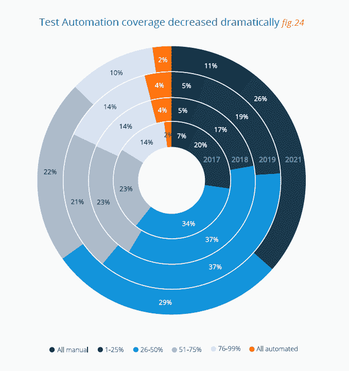
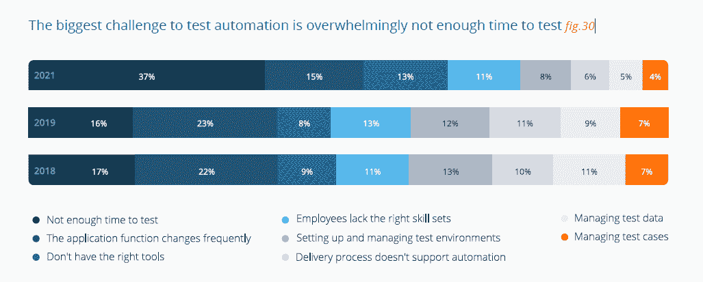
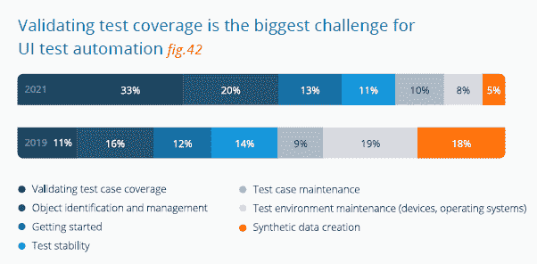
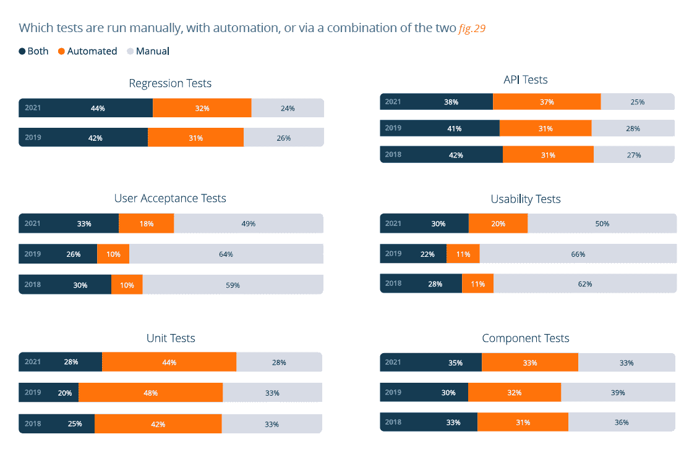

# 软件开发的测试自动化

> 原文：<https://thenewstack.io/no-time-for-test-automation/>

在[软件开发](https://thenewstack.io/category/development/)中自动化软件和安全测试是一个持续的过程，然而真正达到完全自动化可能永远不会发生。在 SmartBear Software 的[“2021 年软件质量状况|测试”](https://smartbear.com/resources/ebooks/state-of-quality-testing/)中，手动进行所有测试的组织比例从 2019 年的 5%上升到 2021 年的 11%。这并不意味着自动化没有发生。相反，手动和自动测试都在进行。

测试自动化的最大挑战不再是处理变化的功能，而是没有足够的时间来创建和进行测试。测试人员没有被更频繁地部署的需求所挑战，而是在更多的环境中更频繁地测试。用户界面层的测试更加普遍，为了解决这一问题，目前有 50%的人进行了一些自动化可用性测试，而 2019 年只有 34%。

本文的剩余部分提供了关于这份报告和另外两份强调 DevSecOps 度量和实践的报告的额外重点。实际执行策略即代码实现中声明的安全策略的能力不仅是自动识别问题的关键，也是解决问题的关键。

### SmartBear Software 的“ 2021 年软件质量状态|测试”

*   **测试自动化覆盖率下降:**更少的组织可以声称已经自动化了超过四分之三的应用程序和 API 测试。那些手动完成不到 75%测试的人从 2019 年的 24%上升到 2021 年的 37%。通常，自动化一个测试会为手动测试其他东西提供更多的时间。
*   **缺乏时间是测试自动化的一大挑战:**超过两倍的受访者表示，缺乏时间是测试自动化的最大挑战，高于 2019 年研究中的 17%。测试人员并不是因为应用程序被更频繁地部署而受到挑战，而是因为他们被要求在更多的环境中更频繁地进行测试。2021 年，API 和 web 服务、UI 层和数据库的性能测试将变得更加普遍。
*   **可用性测试得到重视:**目前，29%的人正在进行 UI 层的性能测试，而 2019 年只有 9%。可用性测试的自动化在今天更加普遍，50%的人做一些自动化测试，相比之下，2021 年只有 34%。可用性日益突出是由两个因素驱动的。首先，SREs 更加关注最终用户。第二，在为测试环境提供合成数据方面的改进。创建合成数据曾经是自动化 UI 测试的最大挑战(从 2019 年的 18%下降到 2021 年的 5%)，但验证合适的用例正在被测试是目前为止最大的挑战(从 11%下降到 33%)。
*   **我们正在谨慎地分析数据:**2092 名受访者中有 81%参与了测试，高于 2019 年研究中的 66%。自上次调查以来，来自北美(41%至 25%)、互联网和网络服务行业(39%至 26%)以及拥有 1，000 名或更多员工的公司(36%至 27%)的参与者比例均大幅下降。我们没有写这些变化可能产生巨大影响的问题。此外，我们不会报告一些图表，因为我们发现当前报告的数据与 2019 年版本的数据存在差异。
*   **新堆栈前情提要**

来源:“SmartBear 的 2021 年软件质量状态|测试”

来源:“SmartBear 的 2021 年软件质量状态|测试”

来源:“SmartBear 的 2021 年软件质量状态|测试”

### 云安全联盟的“云安全风险、合规性和错误配置状况”

*   **实施过程中需要团队协调:** 30%的组织拥有 IT 运营、开发和安全团队，他们在安全策略以及如何使用 DevSecOps 实施这些策略方面保持一致。您可以将这一群体称为“精英”，因为他们中的 56%在一天内出现配置错误，54%可以在一天内修复错误。大部分云安全受访者(49%)表示，他们对安全策略有共识，但对如何实施这些策略却没有共识。在这一组中，能够在一天内发现错误的人更少(41%)，能够补救的人更少(24%)。对于其余的，数字进一步下降。
*   60%的人利用培训和教育来提高错误配置的解决方案。40%的人还说他们利用**安全验证的基础设施即代码模板**，但可能仅用于有限的用例。
*   VMware 的 [CloudHealth](https://www.cloudhealthtech.com/blog) 资助了这项 1000 多人的调查和[报告](https://cloudsecurityalliance.org/artifacts/state-of-cloud-security-risk-compliance/)。
*   **新堆栈前情提要**

### Sleuth 和 LaunchDarkly 的“超光速引擎:持续交付报告”

*   Sleuth 是谷歌上周发布的 DevOps 报告中跟踪 DORA 指标的几家公司之一。谷歌"[加速开发状态](https://cloud.google.com/devops/state-of-devops/)"报告的核心，所以它与[一起发布自己的](https://launchdarkly.com/the-definitive-guide-to-feature-management/#four-pillars-of-feature-management:-build,-operate,-learn,-empower)[报告](https://www.sleuth.io/continuous-delivery)可能不是巧合，该报告基于对 200 多名软件开发人员的调查。这些发现与我们在最近几份报告中读到的一致。
*   **团队流程没有成为替罪羊:**超过 60%没有使用特性标志的受访者表示，当部署落后于计划时，团队流程会受到指责，但在其他人中，这一比例下降到不到 20%。相反，责任落到了高管身上，超过 70%的开发人员指责他们落后。

<svg xmlns:xlink="http://www.w3.org/1999/xlink" viewBox="0 0 68 31" version="1.1"><title>Group</title> <desc>Created with Sketch.</desc></svg>