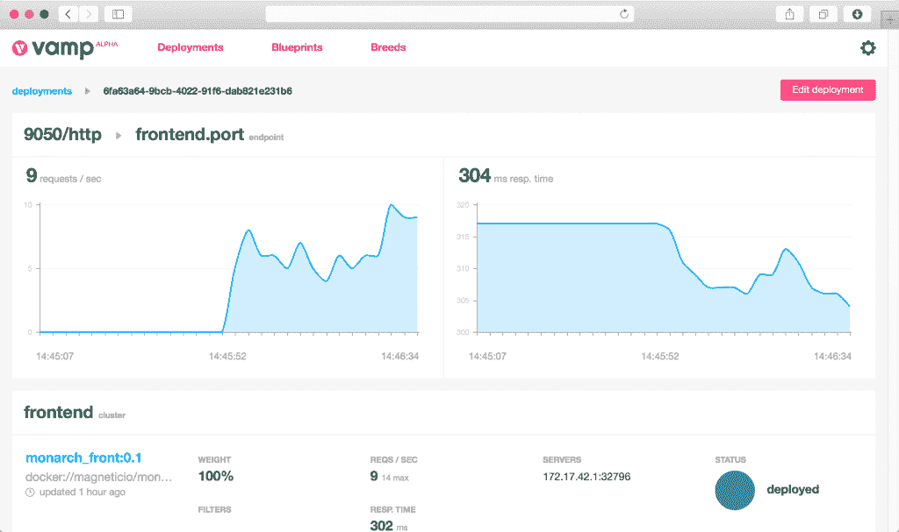

# 不再有伏都教测试:VAMP 为容器编排带来金丝雀版本

> 原文：<https://thenewstack.io/no-voodoo-testing-vamp-brings-canary-releases-container-orchestration/>

随着容器、微服务和弹性工程实践的兴起，组织渴望享受持续部署的好处。

经常释放的前提虽然很吸引人，但却是一个艰难的挑战。除了持续集成、部署和发布变更的能力之外，还必须实现将这些变更推出到生产环境中，并实现自动化扩展和最小的中断。

有一种实践可以帮助简化部署过程，并在需要时提供一种拉回错误变更的方法，称为 Canary release。

“Canary release 是一种降低在生产中引入新软件版本的风险的技术，它通过在向整个基础设施推广并向每个人提供之前，慢慢地向一小部分用户推广这种变化，”[解释道](http://martinfowler.com/bliki/CanaryRelease.html)顾问[达尼洛·佐藤](https://www.linkedin.com/in/danilosato)。

金丝雀测试的名字来源于短语“[煤矿中的金丝雀](http://www.wisegeek.org/what-does-it-mean-to-be-a-canary-in-a-coal-mine.htm#didyouknowout)”，指的是矿工过去如何将金丝雀带入矿井，作为致命甲烷的早期预警探测器，假设如果无味的气体在空气中，金丝雀就会死亡，警告矿工这种危险。

Canary 版本为 DevOps 团队提供了类似的角色。它允许他们实现最后一英里的交付，并降低了恼人的变化带来的风险。因此，对于持续交付的工程团队来说，这是一项重要的资产。

Canary 发布要求控制部署过程，并访问指示新发布的服务的健康状态的指标。如果新服务失败或不足以满足业务需求，那么旧服务可以在对最终用户的中断最小的情况下恢复。这种灵活性和客户透明性是正确实施 Canary 发布实践的关键。

## 对你来说是巫术

Canary release，正如现在所实践的，通常是一堆伏都教，一个可以使用各种参数(包括目标人口统计数据和使用服务的设备)修改负载平衡器配置的混合脚本。

现在，一个开源项目， [VAMP](http://vamp.io/) (非常棒的微服务平台)，旨在为容器部署过程带来一些严谨性和自动化。VAMP [提供](http://vamp.io/documentation/)平台无关的微服务领域特定语言(DSL)、A-B 测试、自动缩放、集成指标和金丝雀测试。

VAMP 背后的公司 [Magnetic.io](http://magnetic.io/) 最近获得了来自 Volta Ventures 的 55 万美元投资，这表明这项技术将在企业市场中具有潜在价值。新的投资将推动 VAMP 企业级功能的开发，发展开源社区和合作伙伴网络，并促进国际扩张。

VAMP 可以独立工作，也可以与 Docker、中间层数据中心操作系统(DC/OS)、Azure Container Service、Rancher 和(即将推出的)Kubernetes 等容器系统集成。它甚至可以在没有任何容器的情况下进行金丝雀路由，尽管它不提供自动缩放功能。

像 Cloud Foundry 这样固执己见的平台也提供了更简单的 Canary 测试版本，通常作为滚动升级功能，但这些都与各自的实现深度集成。VAMP 提供了一个厂商中立的包，可以为开发人员提供保护，使他们的部署和发布配置独立于底层平台。

VAMP 为容器平台提供了对现有部署配置的抽象。这种抽象是一种声明性的形式，说明在为现有应用程序发布新的容器实例时，如何配置负载平衡器。VAMP 将这个声明与在容器平台上运行的实际部署配置联系起来。

VAMP 还集成了像 HAProxy 这样的负载平衡器，允许通过声明式格式轻松地转发路由决策和更改。在架构的意义上，VAMP 目前仍然是 DC/OS 等现有平台上的一个附加组件，并为开发者提供了一个独立于容器平台的接口。VAMP UI 提供了创建和修改发布配置的可访问性，允许对发布过程进行直观的控制。

[Cloud Foundry](https://www.cloudfoundry.org/) 、 [Docker](https://www.mirantis.com/software/docker/kubernetes/) 和 [Mesosphere](https://d2iq.com/) 是新堆栈的赞助商。

专题图片:特里萨·金的纽约街头艺术。

<svg xmlns:xlink="http://www.w3.org/1999/xlink" viewBox="0 0 68 31" version="1.1"><title>Group</title> <desc>Created with Sketch.</desc></svg>