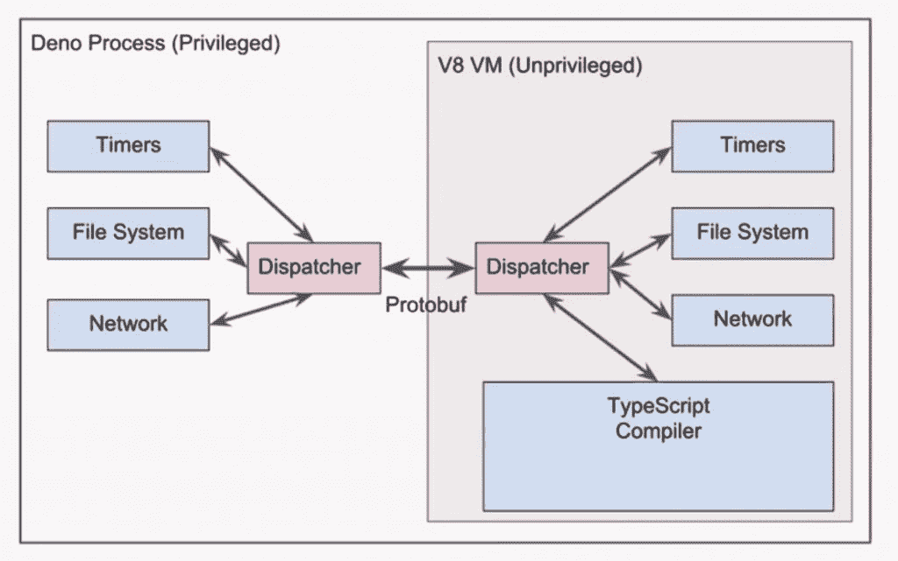

# Node.js Creator 爆炸 Node.js，提供了一个安全的基于类型脚本的替代方案

> 原文：<https://thenewstack.io/node-js-creator-blasts-node-js-offers-a-secure-typescript-based-alternative/>

就像弗兰肯斯坦博士被他创造的怪物吓呆了一样，Node.js 创建者[瑞安·达尔](https://github.com/ry)在 [JSConf 上表达了一些](https://2018.jsconf.eu/)[对他的服务器端 JavaScript 运行时引擎的深深疑虑](https://www.youtube.com/watch?v=M3BM9TB-8yA&amp;list=WL)。欧盟会议本周早些时候在德国举行。

达尔创建了 Node 来改善服务器和浏览器之间的事件驱动 JavaScript I/O，在这方面，它工作得很好，达尔谈到他的[流行开源软件](https://thenewstack.io/week-numbers-node-js-infiltrates-backend/)。但他承认，该架构的许多部分都受到了他的一些幼稚决策的影响，包括安全性和如何管理模块。

“使用 Node 对我来说就像是在黑板上钉钉子，”Dahl 说。“我看到了我介绍的错误，这些错误在这一点上并不是真正的错误，它们只是它的工作方式，但它们是错误，并且存在设计错误，现在无法纠正，因为有太多的软件在使用它。”

但是，正如任何优秀的工程师一样，达尔不会简单地抱怨一些事情而不提供某种解决方案。他引入了一个名为 [Deno](https://github.com/ry/deno) 的新软件项目，这是一个基于 V8 JavaScript 引擎的安全 TypeScript 运行时，旨在纠正 Node.js 中的一些设计缺陷

大约在 2012 年，Dahl 离开了 Node 工作，当时它似乎正处于一个成熟的好时机。他当时正在开发快速服务器软件，并且正在使用 Go，因为“对于快速服务器来说，Go 是一种更好的语言，所以我没有理由使用 Node，”他说。他只是在最近六个月才回到那里，并很快对自己的经历感到羞愧。

“这冒犯了我的感情。它本来可以更好，”他说。

虽然他总体上喜欢 Node 的 I/O 方式，并喜欢其类似“Unix-y”的语法，但他有其他严重的疑虑，特别是关于如何处理模块，他承认这是“事后想起的”

他最大的遗憾是没有使用 promises，这是一种处理异步或并行计算任务的抽象。承诺实际上包含在该语言的早期版本中，但很快就被删除了，把无数的开发者丢进了[回调地狱](http://callbackhell.com/)。

“我常常希望我把这个留在里面，”他承认道。"这是一个草率的决定。"

达尔的另一个遗憾是没有更多地考虑安全性。JavaScript 提供了一个非常安全的沙盒环境，尽管 Dahl 错过了一些实现服务器端保证的机会。但是在某些情况下，您希望在浏览器之外运行一些东西，但是不访问本地磁盘。例如，代码棉绒。

然而，Dahl 最大的遗憾是模块的构建系统。“这是一个非常时髦的界面。它就像一个 JSON 文件，但它是用 Python 编写的。非常可怕。这里有太多不必要的复杂性，”他说，承认这是一个很难解决的问题。”他还后悔强迫每个人编译他们的模块，而不顾 Joyent 首席技术官[布莱恩·坎特里尔](https://twitter.com/bcantrill)等人的建议。

他还坦率地谈到了其他问题。在单个项目目录中安装节点模块？那是达尔的主意。他后悔了。解析模块名的算法？“这非常复杂，”Dahl 承认，并指出 Python 和其他人采用的环境变量方法会工作得很好。

他说:“这与浏览器的操作方式大相径庭，这是我的错，我非常抱歉，不幸的是，现在无法挽回。”。

达尔的新作品，Deno，是用他从 Node 学到的所有经验建造的。他承认 Deno 仍处于早期原型模式，还不应该用于实际工作。

像 Node 一样，Deno 也进行事件 I/O。默认情况下，它不允许任何网络或磁盘访问，尽管用户可以选择这些选项。但是与 Node 不同，所有的系统调用都是通过消息传递来完成的。进出虚拟机只有一个入口点，这使得跟踪正在发生的事情变得容易得多。与 Node 相比，模块系统已经大大简化。

在 Dahl 看来，最棒的是，它运行了微软用于静态类型检查的 JavaScript 超集 [TypeScript](https://thenewstack.io/typescript-getting-popular/) 。“我喜欢打字稿。这是最好的事情。它非常务实，做得很好，平易近人，”他说，并指出它可以从随意的项目到高度结构化的项目。

“所以是啊，检查一下，也许，”他说的德诺。“我想我对此还算满意。”

[https://www.youtube.com/embed/M3BM9TB-8yA?feature=oembed](https://www.youtube.com/embed/M3BM9TB-8yA?feature=oembed)

视频

[JSConfEU](https://2019.jsconf.eu/) 将于 2019 年 6 月 1 日至 2 日重返柏林。

<svg xmlns:xlink="http://www.w3.org/1999/xlink" viewBox="0 0 68 31" version="1.1"><title>Group</title> <desc>Created with Sketch.</desc></svg>