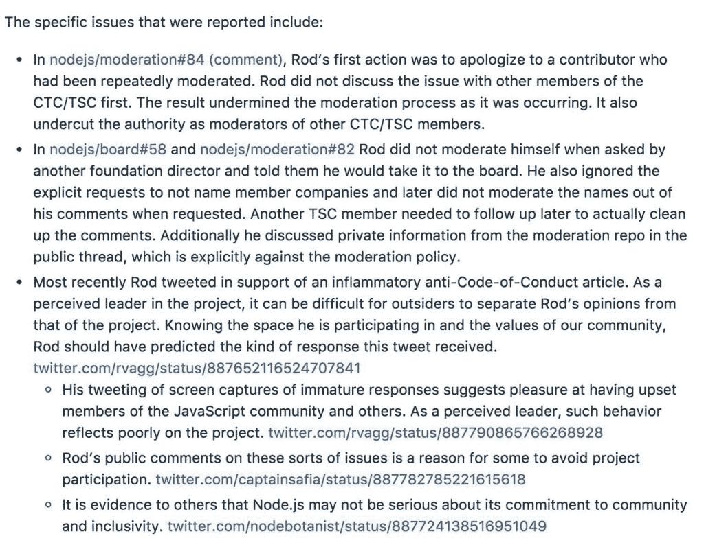

# Node.js 再次抱怨领导层反应迟钝

> 原文：<https://thenewstack.io/node-js-forked-complaints-repeated-harassment/>

流行的 Node.js JavaScript 运行时的代码库再次被分叉——这是不到三年内的第二次——越来越多的贡献者指责[技术指导委员会](https://nodejs.org/en/foundation/tsc/) (TSC)领导层忽视了对项目行为准则的反复违反。

这个名为 Ayo，[的新项目已经建立在 GitHub](https://github.com/ayojs/ayo) 上，并将在一个开放的治理模式下进行管理。

投诉集中在 [NodeSource](https://nodesource.com) 工程总监和 Node.js TSC 成员 [Rod Vagg](https://nodesource.com/blog/author/rvagg) 正在进行的行为上。TSC 收到了 Node.js 成员的多份投诉，内容是关于 Vagg 的一条推文(Tweet)宣传了一篇带有偏见的男性权利活动家文章(文章)。在那条推文中，Vagg 评论道:“如果你从未考虑过行为准则的潜在负面影响，这里是一个很好的开始。”

Node.js 技术指导委员会总结的 Node.js 贡献者对 Rod Vagg 的投诉。

在一条[后续推文中](https://twitter.com/ag_dubs/status/887781671319334912) , [npm Inc.](https://www.npmjs.com/) 运营工程师[阿什莉·威廉姆斯](https://twitter.com/ag_dubs)评论道，“罗德和他对 node 的社会政策不断的、无益的批评是我大幅减少参与该项目的原因。”她还提到“我很确定他的行为也影响了许多其他贡献者的参与，并且会成为贡献者。”

总的来说，Williams 指责 Vagg 在董事会的存在表明该组织没有认真对待促进社区内的包容性，这是她已经表达了一年多的挫折感。

8 月 21 日，TSC [投票决定是否将 Vagg 从其队伍中除名。在参加投票的 10 名 TSC 成员中，60%的人投票反对将 Rod 从 TSC 中除名，60%的人投票反对要求 Rod 主动辞职。](https://github.com/nodejs/TSC/issues/310)

TSC 投票决定让 Vagg 留在委员会，这激怒了项目中的其他人。一名委员会成员[迈尔斯·博林斯](https://twitter.com/mylesborins?lang=en)辞职以示抗议。保留 Vagg 的决定“破坏了我们的行为准则，赶走了潜在的贡献者，在我看来，破坏了委员会的治理能力，”他[在一篇博文中写道。](https://medium.com/@mylesborins/effective-immediately-i-am-stepping-down-from-the-nodejs-tsc-3df37c6ccbae)

在一篇进一步解释分叉 Ayo 项目的必要性的帖子中，开发人员 Rudolf Olah 解释说，“在开源世界中，赶走贡献者可能是致命的，在这个世界中，大多数开发人员基本上是利用他们的空闲时间和自愿贡献。吸引较小项目和较大项目(如 Node.js)的贡献者已经足够困难，需要小心翼翼地让所有贡献者感到受欢迎。”

NodeSource 首席执行官 Joe McCann 没有回复置评请求。Node.js 基金会没有立即对此事做出回应。Node.js 基金会由新堆栈的赞助商 Linux 基金会管理。

Node.js 项目已经不是第一次分叉了。2015 年，Node 的许多关键开发人员[分叉代码库](https://thenewstack.io/tns-analysts-show-32-the-node-js-foundation-io-js-and-the-new-world-of-open-source-governance/)创建 io.js，理由是对当时由 Joyent 管理的 Node 的领导层不满。一年后，在一个独立的管理机构 Node.js 基金会成立后，这些努力又重新开始了。

<svg xmlns:xlink="http://www.w3.org/1999/xlink" viewBox="0 0 68 31" version="1.1"><title>Group</title> <desc>Created with Sketch.</desc></svg>