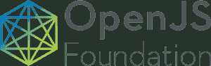

# 第一个 OpenJS 基金会孵化项目采用了节点版本管理器

> 原文：<https://thenewstack.io/node-version-manager-adopted-as-the-first-openjs-foundation-incubation-project/>

OpenJS 基金会已经接受了孵化过程的第一个项目，T2 节点版本管理器。

NVM 是一个方便的 bash 脚本，允许您管理 Node.js 的多个版本，node . js 是一个开放源代码、跨平台的 JavaScript 运行时环境，可以在单个系统上的浏览器之外执行 JavaScript 代码。借助 NVM，您可以更好地在不同版本的软件下测试自己开发的应用程序。

“nvm 是 Node.js 和 JavaScript 生态系统中重要且广泛使用的一部分，通过作为托管项目加入，NVM 正在确保其未来的发展和影响，”IBM Node.js 社区负责人和 node . js 董事会代表 Michael Dawsin 在一份声明中说。

根据 OpenJS Foundation 的说法，NVM 不仅是管理 Node.js 多个版本的最广泛使用的方法，也是“安装 Node.js 的最常见和最广泛使用的方法”。NVM 为开发人员提供了许多好处:

*   能够在每个 shell 的节点版本之间轻松切换，以便更容易地测试库的向后兼容性和更平滑的节点升级。
*   消除了通过 npm 安装 sudo 的需要。
*   简化了不包含预构建二进制文件的系统上的大量安装
*   提供了包管理器的简易性和便利性(无需首先从非官方的发布渠道获得节点)。这可以大大缩短新发布的节点版本可安装之前的延迟。

通过加入 OpenJS 基金会，NVM 将通过组织和基础设施获得更好的支持，这将帮助用户(当前和未来)确保 [nvm.sh 域名和相关 GitHub 回购始终可用](https://github.com/nvm-sh/nvm/blob/master/README.md)。除了享受基金会基础设施的高可用性，NVM 还将受益于 OpenJS 基金会的治理和行为准则的实施。如果有任何人员变动，这些改进将有助于 NVM 继续成为一个稳定的项目。最后，NVM 将能够更好地(更快地)发展，并获得更大的贡献者基础。

NVM 的项目冠军是 [Jory Burson](https://twitter.com/jorydotcom) 和 [Jordan Harband](https://github.com/ljharb) 。

OpenJS 于 3 月推出，作为两个现有的面向 JavaScript 的基础的组合。该组织的目标是推动 JavaScript 和相关技术的广泛采用和持续发展。OpenJS 基金会的目标包括:

*   促进 JavaScript 开发社区内的协作。
*   为开源项目创造一个重心。
*   提供托管 JavaScript 开源项目的基础设施。
*   (通过推进项目和伙伴关系)建立一个开放和无障碍的网络。

九月， OpenJS 基金会任命[罗宾·银](https://twitter.com/rginn206)为其执行董事。

## OpenJS 基础项目的类型

OpenJS 基金会项目有四个类别:

*   影响阶段:对于大型的、成熟的项目。
*   成长阶段:对于受到积极指导并打算进入影响阶段的项目。
*   网络普通用户阶段:针对具有最低需求的新的稳定项目
*   退休阶段:用于退休项目。

目前，NVM 被认为是一个孵化项目，这意味着它正在加入 OpenJS 基金会。一旦加入完成，它将进入网络普通用户类别。有关向 OpenJS 基金会提交项目的更多信息，请查看[提交指南](https://github.com/openjs-foundation/cross-project-council/blob/master/PROJECT_PROGRESSION.md)。

来自 Pixabay 的 Dimitris Vetsikas 的特写图片。

<svg xmlns:xlink="http://www.w3.org/1999/xlink" viewBox="0 0 68 31" version="1.1"><title>Group</title> <desc>Created with Sketch.</desc></svg>