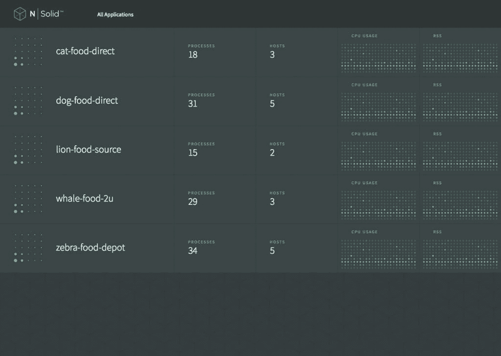
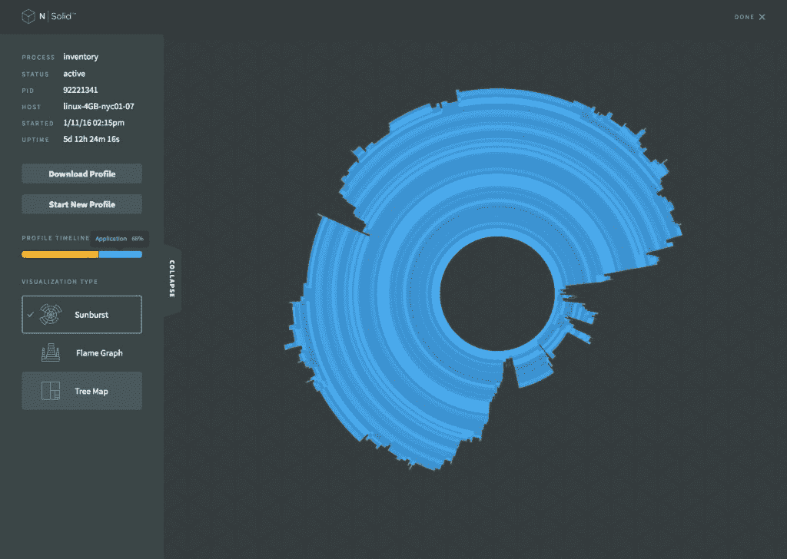
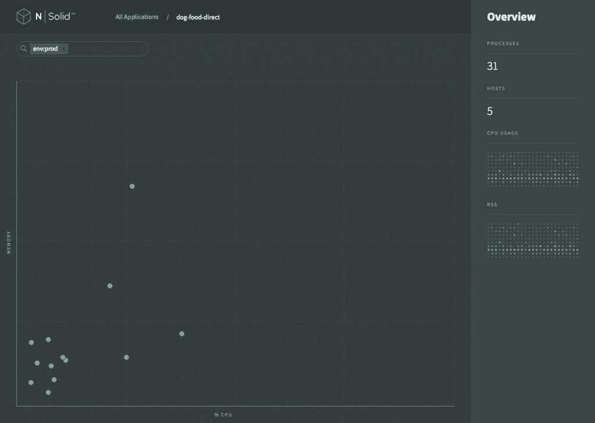

# NodeSource 的 N|Solid 为 Node.js 带来了企业级的监控

> 原文：<https://thenewstack.io/nodesource-introduces-nsolid-enterprise-level-node-js-application-monitoring/>

关于开源服务器端 Javascript 运行时 [Node.js](https://nodejs.org/en/) 最令人惊讶的事情之一是[如何迅速地被企业采用](https://thenewstack.io/node-js-long-term-support-ready-enterprise/)。

为了更好地简化用户体验，网飞和 PayPal 只是目前将 Node.js 推向极限的两家公司。网飞依靠 Node.js 来简化其用户界面，PayPal 也是如此。尽管网飞设计了自己的 Node.js 副本，但 PayPal [将](https://www.paypal-engineering.com/2013/11/22/node-js-at-paypal/)转变为 [NodeSource](https://nodesource.com/) 用于专用的企业级 Node.js 监控解决方案。

当在企业级使用 Node.js 时，开发人员和 DevOps 团队经常会面临较小团队可能没有的问题。其中包括不要局限于一种特定的方法，以及在部署或依赖性问题破坏了他们的代码的情况下，最大限度地减少重新装备应用程序所花费的时间。

NodeSource 的目标是通过商业支持的完全兼容的 Node.js v4.x 运行时来解决这些问题。

使用 N|Solid 时，开发人员还可以更深入地了解他们的 Node.js 应用程序集群的性能。它与应用性能监控平台(如 [Dynatrace](http://www.dynatrace.com/en/index.html) )相吻合，使开发团队能够查看整个基础设施中的事务。此外，N|Solid 的最新版本提供了与 DataDog 的数据收集框架 [StatsD](https://www.datadoghq.com/blog/statsd/) 的原生集成。

NodeSource 产品副总裁 Chip Ray 表示:“简化的应用程序分析支持在不修改代码的情况下对生产中的性能问题进行分类，从而大大减少了开发和运营团队的故障排除时间。

## 大规模监控 Node.js 应用程序

NSolid 应用程序列表

大规模运营的开发人员面临的另一个问题是在产品中测试、部署和实现新代码。如果一个问题出现在生产环境中，开发人员必须能够检查并有效地解决它，不管应用程序在开发管道中处于什么位置。

“在 NASA，关键任务代码是规则，而不是例外。我们的宇航员在每次任务中都把他们的生命交到了我们软件的手中。N|Solid 的功能，如运行时自省和从 N|Solid 管理控制台内协调多个实例的能力，使我们能够比以往任何时候都更有效地开发、测试和部署我们的代码，”软件工程总监 Collin Estes 在声明中说，他是 NASA 的承包商，首席架构师 MRI 技术公司。

n |可靠的应用程序性能监控视图

NodeSource 已经确保 N|Solid 不仅为大规模生产中使用 Node.js 的开发人员提供了至关重要的功能，而且其平台有能力处理任何事情。N|Solid 不仅解决了在 Node.js 中工作的开发人员的需求，平台本身也运行在 Node 上。

在 Node.js 长期支持( [LTS](https://nodejs.org/en/blog/release/v4.2.0/) )版本的基础上，NodeSource 随后增加了 Node.js，“增加了调优和管理功能，提供了增强的节点堆转储、 [v8 分析器](https://github.com/node-inspector/v8-profiler)，以及对您的节点应用程序和服务的更好的洞察和理解，”Ray 说。

n |实体应用程序集群视图

N|Solid 的构建意图是尽可能少地影响开发人员的系统。当大规模操作时，开发人员不希望看到他们的系统被那些声称能帮助他们简化工作流程的工具所拖累。

通过消除对外部轮询的需求，N|Solid 在该领域的其他监控产品中脱颖而出，为用户的 Node.js 应用程序提供了低影响的监控解决方案。

如果一个组织已经在其堆栈上运行 Node.js，那么 N|Solid 安装只会添加企业所需的附加功能。

“这些设计和构建是为了满足不属于核心的企业需求，包括分析、检查和调试以及一些附加的安全功能，”Ray 说。如果您的团队正在寻找一个全面服务的 Node.js 应用程序监控解决方案，N|Solid 目前可以在[免费下载](https://downloads.nodesource.com/)用于开发。

为了更好地满足在基于容器的工作流中操作的用户的需求，NodeSource 最近在其 Docker 容器上删除了[自动构建状态](https://docs.docker.com/docker-hub/builds/)。这允许 NodeSource 更好地控制测试、别名和对其图像的控制。

NodeSource 的工程师 William Blankenship 说:“这种新的运送方法生成了详细的日志，提高了测试能力，并生成了更具确定性的映像。开始向用户直接发送映像的决定预示着将来会向 NodeSource Docker 存储库中添加 N|Solid 映像。虽然 N|Solid 目前没有 Docker 映像，但它为使用 Node.js 为企业开发应用程序的开发人员提供了一个全面的服务监控解决方案，旨在解决他们面临的许多常见问题。

Docker 是新堆栈的赞助商。

专题图片:通过 NodeSource 校友[休·甘乃迪](https://twitter.com/hughskennedy)看到的 NPM

<svg xmlns:xlink="http://www.w3.org/1999/xlink" viewBox="0 0 68 31" version="1.1"><title>Group</title> <desc>Created with Sketch.</desc></svg>