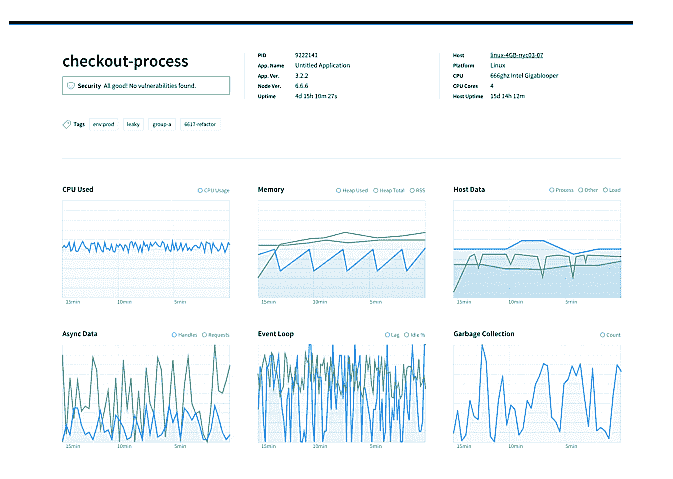
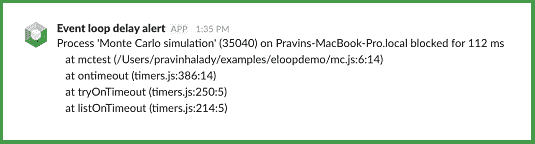

# NodeSource N|Solid 2.3 获得事件循环延迟通知和增强的指标

> 原文：<https://thenewstack.io/nodesource-nsolid-2-3-gets-event-loop-delay-notifications-enhanced-metrics/>

[Node source](https://nodesource.com/),[Node . js](https://nodejs.org/)应用平台 [N|Solid](https://nodesource.com/products/nsolid) 的开发者，刚刚发布了 N|Solid 2.3，向仪表板添加了指标可视化，并引入了事件循环延迟通知——这是其他节点平台目前都不提供的功能。

用户还可以享受一个新的 webhooks 支持的通知系统，通过他们最喜欢的通信渠道发送即时问题警报。

## 更好的可视化和实时松弛信道警报

以前，当围绕阈值或漏洞问题出现潜在问题时，N|Solid 会提供基于电子邮件的警报。此次更新增加了可定制的基于 webhooks 的通知功能。webhook 是一个 HTTP 回调，本质上是一个简单的事件通知，当触发事件发生时，通过 HTTP POST 发送到一个 URL。

N|Solid 2.3 现在可以配置为向 Slack 等流行的通信系统或任何其他首选通道实时发送警报，如 CPU 或堆阈值通知或安全漏洞警告。

将基于 webhooks 的警报集成到组合中是 NodeSource 扩展(然后利用)平台的指标可视化特性的目标的一部分。该公司创始人兼首席执行官 [Joe McCann](https://www.linkedin.com/in/josephisaac) 表示:“通过清晰展示更深入的流程级指标，团队可以真正改善他们的平均解决时间(MTTR)指标，并加快问题解决时间。

他解释说，N|Solid 的仪表板得到了增强，可以显示在应用程序中收集的更大范围的流程级指标。事件循环和垃圾收集行为的实时视图让您可以直接了解应用程序性能，新的 webhooks 警报功能允许团队在出现问题时更快地做出响应。

## 解锁事件循环

v2.3 中新提供的通知之一是事件循环延迟警报，这对任何从事 Node.js 应用程序工作的工程师来说都是一个福音。事件循环问题是真实的，人们:在节点运行时，任何阻塞事件循环的长期同步活动都可能阻止其他传入请求到达服务器，这可能导致整个应用程序死锁。

“N|Solid 是唯一一款提供实时事件循环延迟警报的商用产品，它可以立即识别和暴露问题，否则这些问题可能很微妙，极难检测到，”McCann 说。他继续说，这些警报会在 Node.js 事件循环被“阻塞”时通知用户，并提供详细的堆栈跟踪，使用户能够向下钻取，查明延迟的确切原因，并解决问题的根源。

具体来说，新指标(在流程详细信息仪表板中显示)包括事件循环空闲百分比和事件循环延迟。根据 McCann 的说法，这些表明了事件循环的健康状况。“事件循环空闲百分比的低值和事件循环延迟的同时高值是服务器过载的症状，这可能需要性能调整和/或扩展服务器实例，”他解释道。

## 收集垃圾

N|Solid 最新更新中的另一个新指标是垃圾收集。垃圾收集计数表示 Node.js 垃圾收集器在一段时间内运行的次数。当应用程序开始使用更多的对象时，内存使用将会增加，垃圾收集器将会更频繁地运行，”McCann 说。"因此，这个度量对于监视和识别潜在的内存泄漏是有用的."

所有这些新的度量特性汇聚成一个解决 Node.js 开发人员经常面临的问题的解决方案:当你的应用在测试环境中运行良好，但在生产环境中却表现不佳。“当问题发生时，标准的监控工具可能会提醒开发者，但不是为什么会发生，”McCann 说。例如:您看到 web 响应时间很慢，但只是在某些路由上。为什么会减速，为什么会有这些特殊的路线？

开发人员可以在将 Node.js 应用部署到生产环境之前测试它们时使用指标，质量保证(QA)团队可以在负载和压力测试期间使用这些指标来测试 Node.js 应用的性能，DevOps 团队则可以使用指标可视化和 webhooks 通知功能来主动监控生产环境中的 Node.js 应用。

使用这些新功能的 N|Solid v2.3 工作流示例:检测到缓慢的 web 响应时间—在节点应用程序中，这可能是由于阻塞的事件循环，而这又可能是由长时间运行的同步操作引起的。一个可能的事件序列可能如下所示:

1.  因为此流程的事件循环延迟已经超过了用户定义的阈值，所以会在 Slack 中的#engineering-alerts 通道中发布一个通知，立即提醒团队存在问题。
2.  工程团队的成员可以深入查看特定于流程的指标，查看最近使用的堆、垃圾收集和事件循环延迟的历史记录，以查明时间线(流程首次出现问题的时间)并了解可能的原因。
3.  通过查看 N|Solid 提供的详细堆栈跟踪，工程师可以深入识别问题的确切位置(文件中的函数)。这防止了不必要的努力和延迟，否则会花费在试图在测试环境中重现问题上。
4.  有了这些关于事件环路堵塞来源的详细信息，工程团队现在可以就如何补救做出明智的决策，并迅速采取措施解决问题。

“开发人员经常试图在他们的测试环境中重现一个生产问题，这是一项艰苦的工作，而且常常不成功，”他说。“N|Solid 2.3 的新特性旨在使团队能够主动监控 Node.js 应用程序中的性能问题，以便在生产中出现问题时快速识别和解决问题。"

"市场上没有其他解决方案能提供这种事件循环延迟报警功能."

通过 Pixabay 的特征图像。

<svg xmlns:xlink="http://www.w3.org/1999/xlink" viewBox="0 0 68 31" version="1.1"><title>Group</title> <desc>Created with Sketch.</desc></svg>