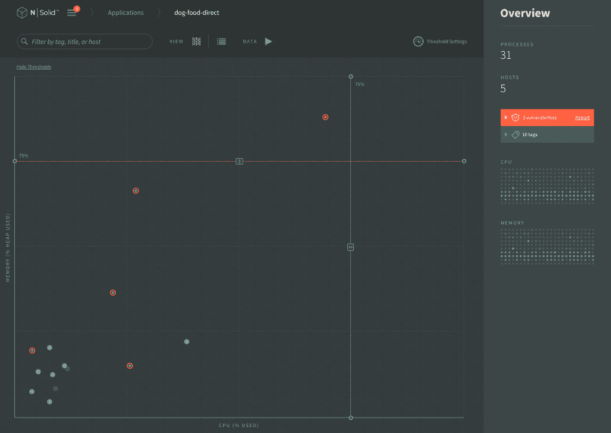
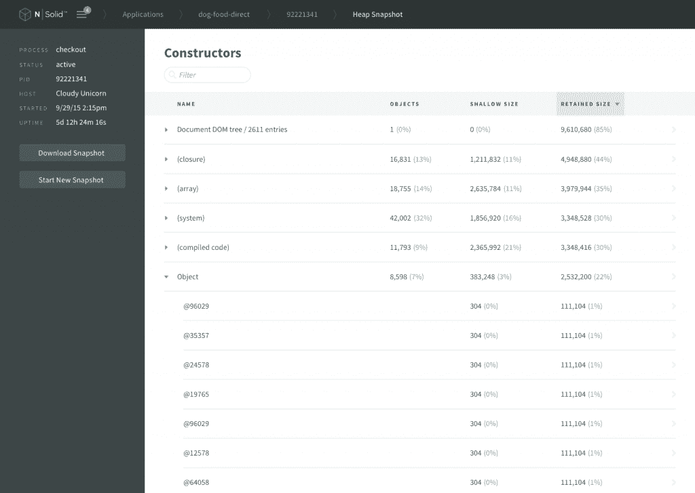

# NodeSource N|Solid v2.2 通过 StatsD 集成提供了更简单的 Node.js 监控

> 原文：<https://thenewstack.io/nodesource-nsolid-v2-2-provides-easier-node-js-monitoring-statsd-integration/>

人们期望开发人员编写出高效的代码，既能很好地测试，又能在可变负载条件下在生产中执行——而且要快。常见的挑战包括在生产中部署代码之前识别和解决性能瓶颈

不幸的是，Node.js 开发人员目前可用的工具只能部分解决这些问题。它们通常会带来额外的缺点，比如要求开发人员要么直接插装他们的代码，要么尝试“猴子修补”(工具自动插装代码)。更糟糕的是，存在显著的性能开销，这使得这些工具在大规模生产中的使用存在问题，并且可视化通常不是不直观的，甚至完全缺乏。

[NodeSource 的](https://nodesource.com/)版本 N|Solid v2.2 旨在通过克服冗长的调试周期和后期制作性能问题来加快开发周期和克服这些挑战。NodeSource 创始人兼首席执行官[乔·麦肯](https://www.linkedin.com/in/josephisaac)表示:“通过使直接向符合 statsd 的系统发送数据变得简单而经济，我们帮助 Node.js 团队获得深入而可行的见解，在确保安全性的同时增加价值实现时间。

N|Solid 运行时作为开源 Node 的替代产品，能够捕获非常详细的性能数据，包括一些无法通过原始 Node.js 运行时获得的指标。

在 N|Solid 现有的基础上——通过包监控、策略和 24 小时安全响应强化 Node . js——N | Solid 的新版本增加了与符合 [statsd 的](https://github.com/etsy/statsd)系统的简化集成，提供了一种集成特定于节点的指标的简单方法。

“如果您正在使用符合 StatsD 的指标分析/可视化工具，如 Graphite、DataDog 和 Grafana，现在很容易配置 N|Solid 以将指标分派到您现有的工具中，”NodeSource 产品经理 Pravin Halady 在关于新版本的博客文章[中解释道。](https://nodesource.com/blog/n-solid-2-2-lands-with-more-metrics-and-effortless-statsd-integration)

早期版本可以配置为分派指标，但需要手动和相对复杂的设置。开发 v2.2 背后的驱动力是简化这一过程，允许用户立即开始查看和使用应用程序数据。

N|Solid v2.2 Cluster View

“目前运行 Node 的组织可以在 N|Solid v2.2 运行时进行交换，并访问他们无法获得或尚未拥有的数据，而无需漫长的实施周期或对现有应用程序代码的更改，”McCann 说。团队现在可以无中断地维护现有的工作流和监控/报告基础设施，轻松地与流行的 statsd 兼容云平台集成，如 AWS 的 [CloudWatch](https://aws.amazon.com/cloudwatch/) ，或谷歌的 [Stackdriver](https://cloud.google.com/stackdriver/) 。

N|Solid v2.2 shows clearly and intuitively where new memory is being allocated in your JS heap

NodeSource 的客户名单包括进步的 Node.js 采用者，如 PayPal、优步和 NASA——他们的工程团队提供了对 N|Solid 的支持:

*“在美国宇航局，关键任务代码是规则，而不是例外。我们的宇航员在每次任务中都把他们的生命交到了我们软件的手中。当我们从传统环境过渡到基于节点的现代架构时，N|Solid 以及 NodeSource 的支持证明了它的宝贵价值，它允许我们快速扩展，同时专注于我们的核心任务。”*

完全兼容的 Node.js 运行时可以免费试用。

功能图像:N |实心 v2.2 CPU 配置文件(N |实心)

<svg xmlns:xlink="http://www.w3.org/1999/xlink" viewBox="0 0 68 31" version="1.1"><title>Group</title> <desc>Created with Sketch.</desc></svg>