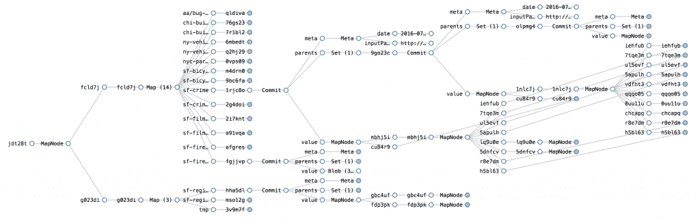

# Noms 数据库旨在成为共享数据的 Git

> 原文：<https://thenewstack.io/noms-database-aims-become-git-shared-data/>

一个名为 Noms 的新开源数据库旨在为发布的数据做与 Git T1 为源代码所做的一样的事情。

它来自前谷歌工程师[亚伦·布德曼](http://www.aaronboodman.com/)和[拉斐尔·温斯坦](https://www.linkedin.com/in/rafael-weinstein-21718?authType=NAME_SEARCH&authToken=0m7L&locale=en_US&trk=tyah&trkInfo=clickedVertical%3Amynetwork%2CclickedEntityId%3A34867%2CauthType%3ANAME_SEARCH%2Cidx%3A1-1-1%2CtarId%3A1470047040046%2Ctas%3ARafael%20Weins)，他们组建了公司[阁楼实验室](http://attic.io/)。他们着手构建一个以版本控制、重复数据删除和同步为核心的数据库。测试版已经出来了。

“我们真正喜欢 Git 并从中受到启发的一件事是，它解决了这个一直很难解决的同步问题——它只被解决了几次，而且只有很大的努力，只有像微软这样的数百人参与其中——并以这种非常优雅、简单的方式解决了它，”Boodman 说。

他解释说，当其他数据库专注于存储和处理大量数据时，用 [Go](/tag/golang/) 编写的专注于在人和组织之间移动数据，并在这些数据上进行协作，今天这些数据依赖于他称为“完全过时的”系统

他指出，所有公开发布的数据，如来自新闻机构、政府、体育联盟和科学界的数据，以及需要私下分享的企业报告。

“这通常通过两种方式中的一种来完成:静态快照、静态 CSV 文件或 JSON 文件，这对于发布者来说非常容易，但对于消费者来说却非常困难。或者你通过 API 发布数据，这对于消费者来说更容易使用，但是对于提供者来说非常非常困难。提供商必须构建[API]，保护它，维护它。如果你看看公开分享的数据，它充满了错误。真的很乱。有格式错误，事实错误，拼写错误，”他说。

他在[博客文章](https://medium.com/@aboodman/98b7f0c3566#.niu12s520)中写道:如果不把一个 CSV 文件放到另一个系统中，你就无法查询它的子集。

“因为有如此多的错误，你会看到不同格式的激增，同一数据集的不同版本只是略有不同。如果要用这个公开的数据，真的很难知道哪个才是正确的。为什么会发生这种变化？谁改的？他们什么时候改的？

“我们研究了这个问题，发现它与软件工程师遇到的问题非常相似，我们认为 Git 是研究这个问题的一种非常优雅的方式。我们认为解决源代码的同样的想法可以用于数据，”他说。

## **了解发生了什么变化**

Attic Labs 刚刚在一轮 A 轮融资中获得了 810 万美元，由 Greylock Partners 牵头来解决这个问题。

Noms 不会取代企业使用的单一 MySQL、Mongo 或其他数据库，但会让编写软件来消费和理解数据以及数据是如何变化的变得更加容易。

“这将更有效率，所以你不必一遍又一遍地下载数据，”他说。

“它具有原子提交功能，您可以对 API 进行编程，因此您可以将它用作应用程序数据库。我们现在还没有一种复杂的查询语言，但是它的设计支持一种查询语言，如果你有一种查询语言，你可以用一种结构化的方式来探索数据，”他说。

“你可以看看历史。当您提交 Noms 时，您不是在覆盖数据，而是在添加数据。随着时间的推移，数据库会发生变化。您可以计算详细的差异，并了解数据是如何变化的。如果数据集非常大，您可以计算差异的汇总。就像 Git 一样，您可以高效地进行同步，因此您可以将数据从一个数据库实例移动到另一个实例。数据库的任何实例都可以在与另一个实例断开连接的情况下工作，建立自己的更改历史，然后它们可以走到一起并合并这些更改。”

Noms 建立在结构化数据库的基本属性上，如高效的查询、更新和范围扫描，以及 Git 的概念，以创建基于以下概念的分散数据库:

*   任何对等体的状态都和其他状态一样有效。
*   数据库的所有提交都将保留，并随时可用。
*   任何对等体都可以独立于任何其他对等体的通信而自由前进，同时保留在未来某个时间点协调变化的能力。

Noms 将数据建模为节点的[有向无环图](https://en.wikipedia.org/wiki/Directed_acyclic_graph)，或者更具体地说，一个大的 [Merkle DAG](https://github.com/jbenet/random-ideas/issues/20) 。Noms 建立在以前系统的思想之上，以协调差异、同步状态，并在大规模结构化数据上建立索引。

Noms 是一个类型化的系统，它将巨大的 blobs、集合、列表和映射“分块”成可工作大小的部分，以便存储、搜索和更新。

Noms 的一个关键不变量是相同的值将由相同的图表示，具有相同的块边界，而不管过去的逻辑突变序列导致了该值。这是内容寻址的本质，也是使重复数据删除、高效同步、索引和 Noms 的其他功能成为可能的原因。

它没有使用 B 树，而是引入了所谓的“Prolly 树”，其中每个节点中存储的值的数量由概率平均值而不是强制的上限和下限来确定，每个节点中的值集由值的滚动哈希函数的输出来确定。

Prolly 树是按类型或按散列排序的，从而产生有效的索引。有序搜索树也使得在其上有效地实现集合运算成为可能，比如 union 和 intersect。该团队计划将这些功能构建到一个通用查询系统中。

## **改善同步**

在阐述版本控制和协作的用例时，Boodman 这样描述同步:

“现在的做法是，发布一大块静态的 CSC 文件或 JSON 文件。开发者消耗这些数据是极其费力的。他们必须编写一个解析器，数据是无类型的——它没有说它是一个日期或流或任何东西——你只需要从一些外部通信中知道数据应该是什么。所以你做所有这些工作来解析数据，并将其导入到你的系统中，这一切都是为了你的数据的一个快照。

“但是，通常情况下，它是在变化的。然后你得重新下载所有的数据。你必须看着它说，‘好吧，有什么变化？’“博德曼继续说道。开发人员花费大量时间抱怨编写这种代码，他们团队中没有人愿意这样做。所以源代码变得非常过时，因为他们不断推迟重新导入数据的不可避免的成本。"

Noms 有两种方法可以处理这种情况:用户可以在第一周将该快照放入 Noms，然后在第二周获取下一个快照。Noms 只会告诉你它们之间的区别，不管它们有多大或者有多复杂。

“如果数据的上游生产者也使用 Noms，他们可以以 Noms 格式发布数据，”Boodman 说。“那么当下游消费者只需要做一次提交时:Noms pull。它提取数据的最新版本。它只会拉动变化。什么变了？什么时候变的？这是一份非常详细的报告，所以你可以利用这些差异并加以应用。”

<svg xmlns:xlink="http://www.w3.org/1999/xlink" viewBox="0 0 68 31" version="1.1"><title>Group</title> <desc>Created with Sketch.</desc></svg>