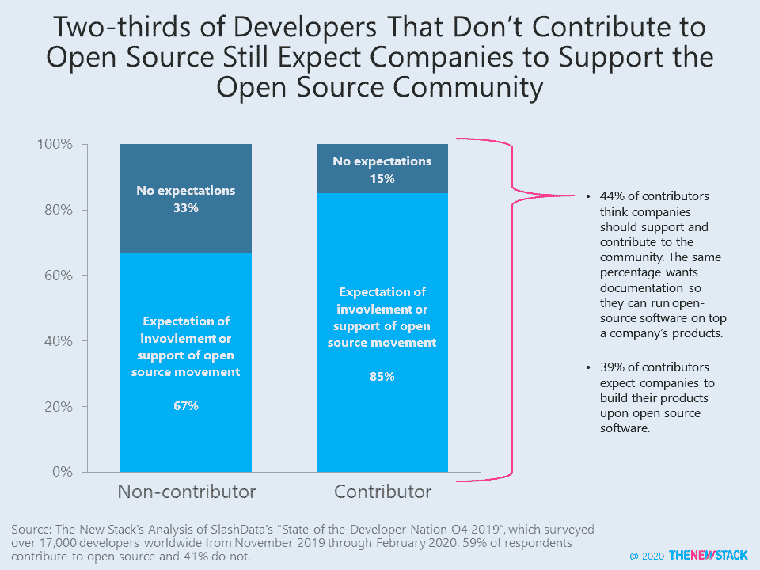
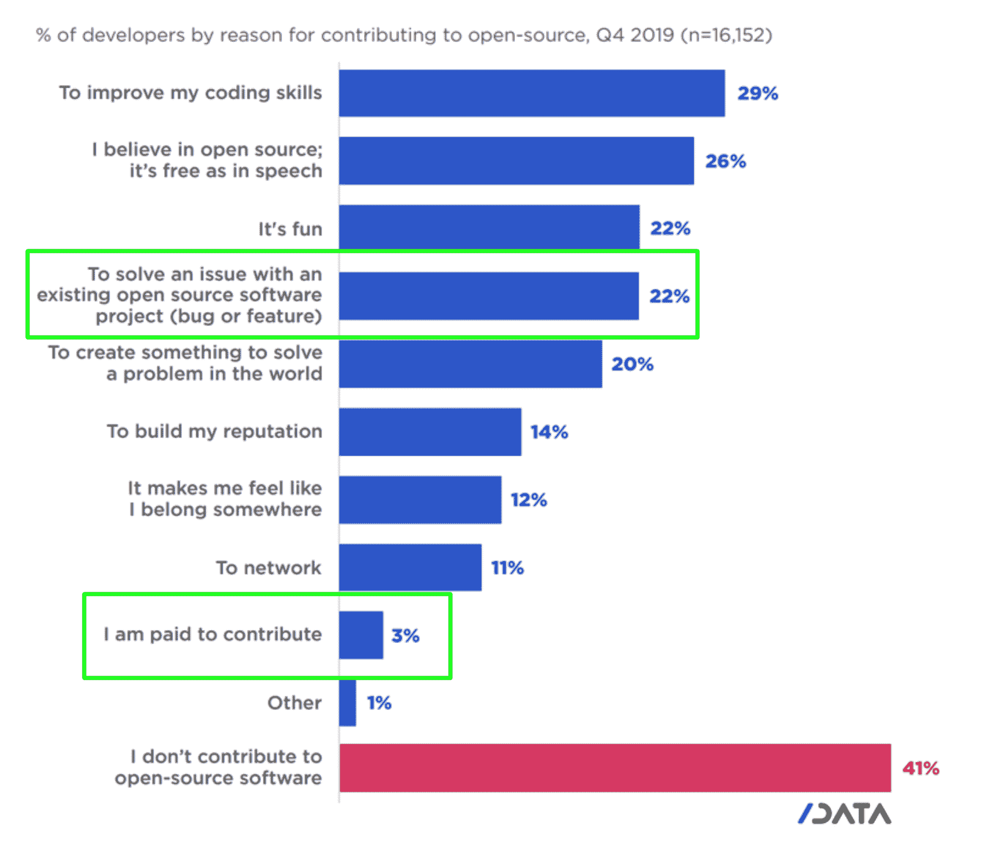

# 非贡献开发者期望公司支持开源

> 原文：<https://thenewstack.io/non-contributing-developers-expect-companies-to-support-open-source/>

根据 SlashData 的“2019 年第四季度开发者国家状况”，85%的开源贡献者预计公司将参与开源运动但是，当被问及具体细节时，只有 44%的贡献者认为公司应该为开源社区做出贡献并提供支持。

这是否意味着公司应该资助独立开发者或者让他们自己的员工参与社区项目？开源商业模式的信徒迫切希望前者是真的。然而，对于公司来说，更现实的目标是鼓励他们的开发人员花一部分时间为开源做贡献，不管项目是否由公司自己内部管理。

在接受调查的 17，000 名开发者中，59%为开源软件做出了贡献，41%没有。值得注意的是，三分之二的非贡献开发者仍然期望公司在某种程度上支持开源运动。这提醒我们，许多开发人员消耗开源软件，却没有实际回报。

如果您对良好的开源企业公民的构成有什么看法，请[参加我们关于企业开源的调查](https://www.surveymonkey.com/r/todo2020?ospo=slashdataarticle)。第三次年度调查与 Linux 基金会的 TODO Group 合作，并由 VMware 共同赞助，目前已开始接受反馈，旨在调查开放源代码计划办公室(OSPOs)和管理开放软件开发的政策的有效性。

当被问及开发人员为什么做出贡献时，他们给出了各种各样的理由，从技能发展到解决 bug 或在现有项目上构建新功能。只有 3%的人说他们实际上是有偿贡献的，尽管最大的云原生项目的大部分贡献来自科技公司的员工。

来源:SlashData 的《2019 年第四季度开发者国家状况》。

专题图片是喜剧演员特里·托马斯和红骷髅 via Pixabay 的照片。

<svg xmlns:xlink="http://www.w3.org/1999/xlink" viewBox="0 0 68 31" version="1.1"><title>Group</title> <desc>Created with Sketch.</desc></svg>