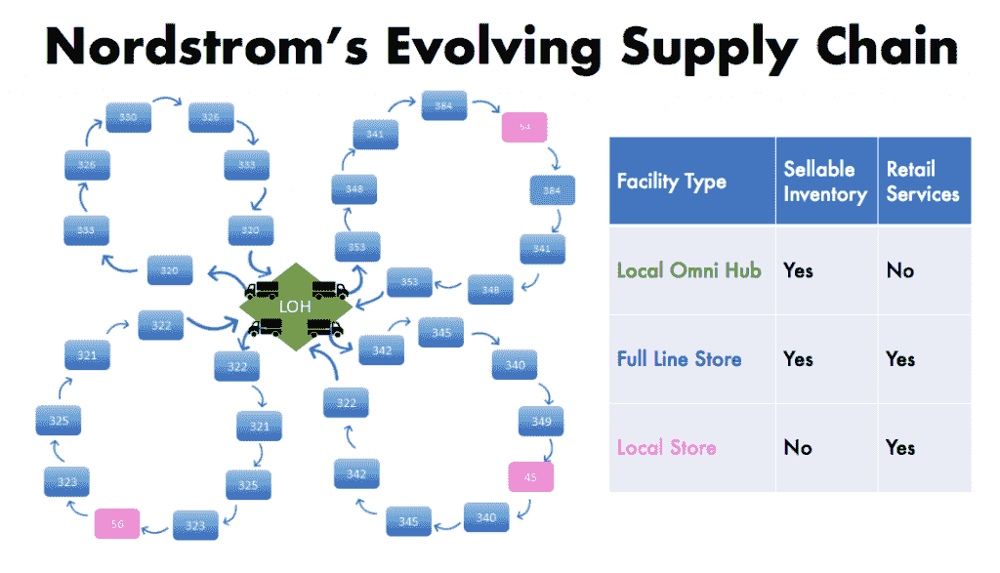
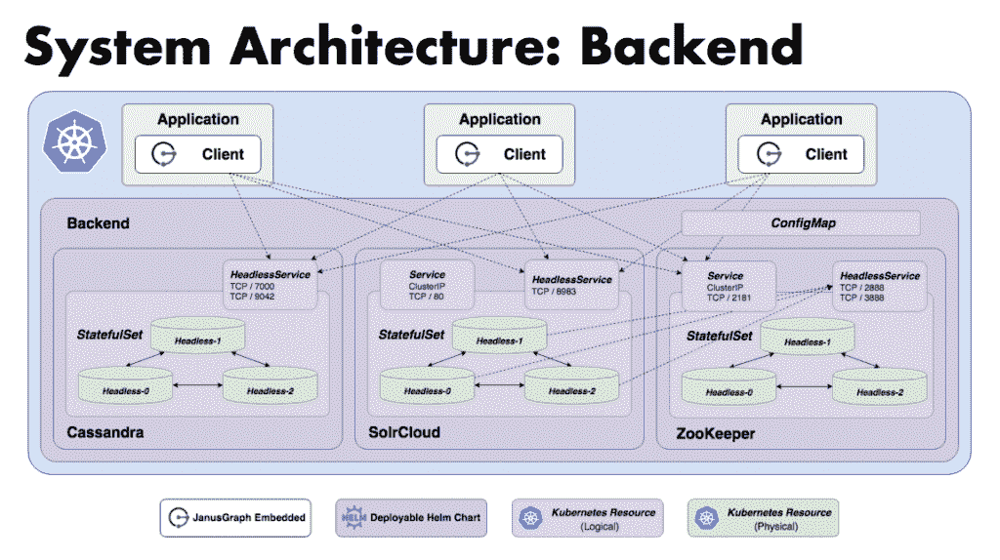

# Nordstrom 使用 Kubernetes、Spark 和 JanusGraph 构建灵活的后端运营

> 原文：<https://thenewstack.io/nordstrom-builds-flexible-backend-ops-with-kubernetes-spark-and-janusgraph/>

随着客户开始期望购物方式更加灵活，Nordstrom 一直在尝试优化其供应链的方法。

这家总部位于西雅图的零售商自 1998 年就已经上线，如今经营着 115 家百货商店和它所谓的 Omni hubs，后者储存库存但不提供零售服务；它称之为本地商店，这种商店没有库存，但提供一系列零售服务。例如，你可以在那里给一条裤子缝边。然后还有“垂直优化履行中心”，处理库存的子集，如小的美容产品——例如一管口红——并以不同的方式处理。

“我们的客户期望更大的灵活性。他们想知道什么时候能买到东西，在哪里能买到，价格是多少。因此，这就是我们在当今环境下所做的工作，”高级软件工程师 [Jeff Callahan](https://github.com/callajd) 说，他最近在 [ApacheCon North America](https://www.apachecon.com/acna19/) 上谈到 Nordstrom 如何在后端操作中使用 [JanusGraph](https://janusgraph.org/) 开源图形数据库、 [Cassandra](http://cassandra.apache.org/) 和 [Spark](https://spark.apache.org/) 。

“Kubernetes 是我们 Nordstrom 工作的重要组成部分。”——杰夫·卡拉汉。

该公司最近正在研究的一个想法叫做基于成本的路由。作为一个例子，他展示了一张幻灯片，展示了洛杉矶地区的 Nordstrom 商店排列成三叶草图案，尽管它们在地图上实际上并不是这样。如果一个顾客订购袜子、鞋子和夹克，而每一件商品都位于立体式的不同圆圈中的商店，但是想要在第四个圆圈中的商店中挑选这些商品，这个想法就是如何最有效地提供这些商品，以及以什么样的成本。

> 

“只要你看看整个国家的情况，……就会很快变得非常复杂，”他说。“库存在不断出售、移动。所以我们必须知道库存在哪里，以及多快可以得到。人员配置显然会影响这些事情。因此，如果一家商店没有足够的员工去商店，把商品运到船上，那么就很难把商品装上卡车。…当然，在洛杉矶，交通绝对是一个重要因素。”

它支持新的履行选项，包括店内提货、次日提货和来自 150 个站点的快递交付，这些站点有各种承运商和服务级别。满足客户期望是其首要任务，其次是降低公司成本。

该技术还必须服务于设施经理，如果设施经理不堪重负，可能需要让它离线，以免接收更多订单。

### 搭配数据科学

该技术必须足够灵活，以支持新概念，如基于成本的路由，或其他业务可能会出现的概念。而且它必须符合诺德斯特龙公司的现有技术。它是与数据科学团队合作开发的。

“Kubernetes 是我们 Nordstrom 工作的重要组成部分，”他说。

JanusGraph”用一组可插入的后端组件很好地处理了这个问题。它协调客户端与这些后端组件之间的交互。”Nordstrom 使用 [Solrcloud](https://lucene.apache.org/solr/guide/6_6/solrcloud.html) 作为索引系统，使用 [Cassandra](http://cassandra.apache.org/) 作为数据层。JanusGraph 使用[动物园管理员](https://zookeeper.apache.org/)作为协调者。

JanusGraph 数据模型将设施点存储为顶点，将运输选项存储为边，将实时遥测数据存储为属性。该系统包括 Nordstrom 创建的图形后端和图形客户端。它为图形客户端采用了“嵌入式 JanusGraph”模式，该模式包括 JanusGraph 库，并与应用程序运行在同一个 JVM 中。数据管道定义了支持客户端服务的后端数据的流动。

“后端实际上就是我们所说的解决方案，”他说。

Cassandra 和 SolrCloud 都是单舵图。

“您只需一个命令就可以部署它，它已经在 Kubernetes 上运行了。动物园管理员也是如此。你可以表达依赖和界限。但它真正抽象了部署和配置的细节，因此封装得非常好，”他说。

所有这些都整合到一个掌舵图中，因此团队可以使用它部署整个后端，大约 10 分钟后回来，就可以在 Kubernetes 中运行了。

“所有这些部分都已经在最后配置好了；他们相互影响。它留下了一个配置映射，这基本上是一组属性，客户端可以使用它们来连接到后端，”他说。

### 管理关系

今天，完全填充的图形有大约 100 万个顶点和 1 亿条边，其中包括 SKUs 单个商品编号]以及所有不同的运输选项。

他说:“存在这样的关系，一旦你有了数百万个顶点，仅仅是得到这些连接，我们就有了大约 1000 亿条边。”

他说，今天，它每天通过后端处理 1 亿个事件，预计负载将增加一到两个数量级。

JanusGraph 遇到的唯一真正的问题是，它用 CQL 后端阻止了 SparkGraphComputer，该团队通过编写定制的 Spark 作业来解决这个问题。

他说，该公司发现，与 DynamoDB 相比，我们的实际支出减少了约 10 倍，但尚未确定总拥有成本。

与图形进行 [OLAP](https://olap.com/olap-definition/) 【分析】- [OLTP](https://database.guide/what-is-oltp/) 【交易】式的交互。该系统执行 20 到 100 多个与图形的并发交互。

吸取的经验教训包括:

*   **复杂是真实的。**“对于这样的系统，当你试图在生产中操作时，你不能太天真。你只要承认这一点，并为此做好计划，”他说。
*   DevOps 中的纪律是一把巨大的钥匙。“我们不得不一致同意这是我们的当务之急，”他说。
*   JAR 依赖有时会变得令人困惑，尤其是涉及 Spark 的时候。随着几个不同的、复杂的项目聚集在这个后端，jar 冲突有时会产生难以解决的奇怪问题。
*   舵图是“一个巨大的胜利”“我向 Kubernetes 用户强烈推荐它，”他说。“这真的是配置即代码，所以我们得到了源代码控制和跟踪。当所有这些复杂的系统都难以单独管理时，有掌舵图来帮助你真的会轻松得多。”

通过 Pixabay 的特征图像。

<svg xmlns:xlink="http://www.w3.org/1999/xlink" viewBox="0 0 68 31" version="1.1"><title>Group</title> <desc>Created with Sketch.</desc></svg>