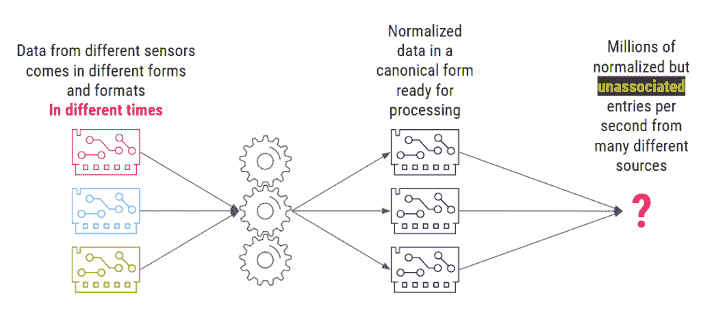
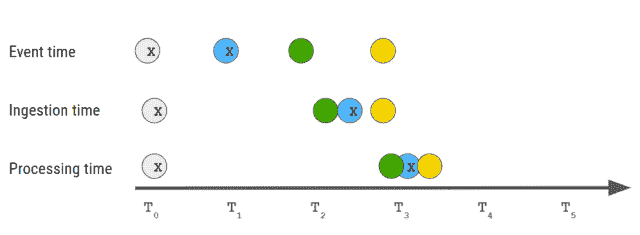

# NoSQL，NoMQ:帕洛阿尔托网络公司的新事件流模式

> 原文：<https://thenewstack.io/nosql-nomq-palo-alto-networks-new-event-streaming-paradigm/>

全球安全提供商 Palo Alto Networks 每天处理数 TB 的网络安全事件。它每秒钟分析、关联和响应数百万个事件——许多不同类型的事件，使用许多不同的模式，由许多不同的传感器和数据源报告。它的众多挑战之一是理解哪些事件实际上从不同的角度描述了同一个网络“故事”。

 [辛西娅·邓洛普

Cynthia 写软件开发和测试的时间比她愿意承认的要长得多。她目前是 ScyllaDB 的内容战略高级主管。](https://www.linkedin.com/in/cynthiadunlop/) 

要实现这一点，传统上既需要一个数据库来存储事件，也需要一个消息队列来通知用户系统中有新的事件。但是为了降低在其系统中部署另一个有状态组件的成本和运营开销，Palo Alto Networks 的工程团队决定采用不同的方法。

本文解释了 Palo Alto Networks 为什么以及如何在一个近乎实时地关联事件的项目中完全消除 MQ 层。它没有使用 Kafka，而是决定使用现有的低延迟分布式数据库作为事件数据存储和消息队列。这是基于[帕洛阿尔托网络](https://www.paloaltonetworks.com/cloud-security?utm_content=inline-mention)的首席软件工程师 [Daniel Belenky](https://www.linkedin.com/in/daniel-belenky/) 最近在 [ScyllaDB 峰会](https://www.scylladb.com/scylla-summit-2022/presentations/)上分享的信息。

## 背景:事件，事件无处不在

Belenky 的团队开发了初始数据管道，从端点接收数据，清理数据，处理数据，并为系统其他部分的进一步分析做准备。他们的首要任务之一是构建准确的故事。

正如 Belenky 所解释的，“我们从多个不同的数据源接收多种事件类型。这些数据源中的每一个都可能描述相同的网络会话，但是来自网络上的不同点。我们需要知道多个事件(比如一个来自防火墙的事件、一个来自终端的事件和一个来自云提供商的事件)是否从不同的角度讲述了同一个故事。”他们的最终目标是产生一个包含所有相关事件及其关键细节的核心丰富事件。

例如，假设路由器的传感器生成一条消息(这里是两个 DNS 查询)。一秒钟后，一个定制系统发送一条消息，表明有人进行了登录，有人进行了注册。8 分钟后，第三个传感器发送另一个事件:一些 HTTP 日志。所有这些在不同时间到达的事件可能实际上描述了相同的会话和相同的网络活动。

不同的事件可能以不同的方式描述相同的网络活动。

该系统吸收不同设备在不同时间报告的数据，并将其规范化为系统其余部分可以处理的规范形式。但是有一个问题:这导致了数百万个规范化但不相关的条目。离散事件中有大量数据，但(还)没有任何关于网络上真正发生了什么以及哪些事件值得关注的清晰见解。

Palo Alto Networks 需要一种方法来将不相关的事件组织成关于网络活动的有意义的故事。

## 从事件发展到故事

为什么很难将描述同一个网络会话的离散条目联系起来？

*   **不同传感器之间的时钟偏差:**传感器可能位于不同的数据中心、计算机和网络中，因此它们的时钟可能不会同步到毫秒级。

*   **需要管理数千个部署:**鉴于其业务性质，Palo Alto Networks 为每个客户提供了独特的部署。这意味着该解决方案必须针对从每秒处理字节数的小型部署到每秒处理千兆字节数的大型部署进行优化。

*   **传感器对会话的观点:**不同的传感器对同一会话有不同的观点。一个传感器的消息可能报告从 A 点到 B 点的事务，另一个可能报告相反方向的相同事务。

*   **对数据丢失的零容忍:**对于网络安全解决方案来说，数据丢失可能意味着未被发现的威胁。这根本不是帕洛阿尔托网络公司的选项。
*   **连续无序流:**传感器在不同的时间发送数据，事件时间(事件发生的时间)不一定与摄取时间(事件发送到系统的时间)或处理时间(能够开始处理该事件的时间)相同。

灰色事件与一个故事相关，蓝色事件与另一个故事相关。请注意，灰色的是按顺序接收的，蓝色的不是。

从应用程序的角度来看，将数百万个离散事件转化为清晰的故事以帮助 Palo Alto Networks 保护其客户需要什么？从技术角度来看，该系统需要:

1.  接收一连串事件。
2.  等待一段时间，让相关事件到达。
3.  决定哪些事件彼此相关。
4.  公布结果。

此外，还有两个关键的业务需求需要解决。Belenky 解释说:“我们需要为每个客户端提供单租户部署，以实现完全隔离。我们需要以合理的成本支持从每小时几 KB 到每秒几 GB 的部署。”

Belenky 及其团队实施并评估了四种不同的架构方法来应对这一挑战:

*   关系数据库
*   NoSQL +消息队列
*   NoSQL +云管理的消息队列
*   NoSQL，没有消息队列

让我们依次看看每个实现。

## 实现 1:关系数据库

使用关系数据库是最简单的解决方案，也是最容易实现的。在这里，规范化的数据存储在关系数据库中，一些周期性的任务运行复杂的查询来确定哪些事件是同一个故事的一部分。然后，它发布产生的故事，以便系统的其他部分可以根据需要做出响应。

实现 1:关系数据库

**优点**

*   实现相对简单。Palo Alto Network stream 部署了一个数据库并编写了一些查询，但不需要实现复杂的逻辑来关联故事。

**缺点**

*   由于这种方法要求他们部署、维护和操作另一个数据库，这将导致相当大的操作开销。随着时间的推移，这将增加。
*   性能受到限制，因为关系数据库查询比 ScyllaDB 等低延迟 NoSQL 数据库上的查询慢。
*   它们会导致更高的操作成本，因为复杂的查询需要更多的 CPU，因此更昂贵。

## 实现 2: NoSQL +消息队列

接下来，他们实现了一个解决方案，将 ScyllaDB 作为 NoSQL 数据存储，将 Kafka 作为消息队列。像第一个解决方案一样，规范化数据存储在数据库中——但是在这个实现中，它是一个 NoSQL 数据库，而不是关系数据库。与此同时，它们发布密钥，这些密钥将允许它们从数据库中获取这些事件记录。每行代表不同来源的一个事件。

实现 2: NoSQL +消息队列

多个消费者从一个 Kafka 主题中读取数据。同样，这些数据只包含键——足够让这些消费者从数据库中获取这些记录的数据。然后，这些消费者从数据库中获取实际记录，通过确定这些事件之间的关系来构建故事，并发布这些故事，以便其他系统组件可以使用它们。

为什么不把记录储存起来，直接在卡夫卡上发布记录呢？Belenky 解释说，“问题是这些记录可能很大，有几兆字节的大小。由于性能影响，我们不能通过 Kafka 运行这个。为了满足我们的性能预期，卡夫卡必须凭记忆工作，而我们没有太多的记忆可以给它。”

**优点**

*   与具有批处理查询的关系数据库相比，吞吐量非常高。
*   少维护一个数据库(ScyllaDB 已经在 Palo Alto Networks 中使用)。

**缺点**

*   需要实现复杂的逻辑来识别相关性和构建故事。
*   复杂的架构和部署，数据并行发送到 Kafka 和数据库。
*   为每个客户端提供一个独立的部署意味着维护数千个 Kafka 部署。即使是最小的客户也需要两三个卡夫卡实例。

## 实现 3: NoSQL +云管理的消息队列

这个实现与前一个基本相同。唯一的例外是，他们用云管理的队列取代了 Kafka。

实现 3: NoSQL +云管理的消息队列

**优点**

*   与具有批处理查询的关系数据库相比，吞吐量非常高。
*   少维护一个数据库(ScyllaDB 已经在 Palo Alto Networks 中使用)。
*   无需维护 Kafka 部署。

**缺点**

*   需要实现复杂的逻辑来识别相关性和构建故事。
*   与卡夫卡相比，性能要慢得多。

他们很快放弃了这种方法，因为它本质上是两个世界中最糟糕的:缓慢的性能和高度的复杂性。

## 实现 4: NoSQL (ScyllaDB)，没有消息队列

最终，最适合他们的解决方案是没有消息队列的 ScyllaDB NoSQL **。**

实现 4: NoSQL，没有消息队列

像所有以前的解决方案一样，它从准备处理的规范形式的规范化数据开始，然后将数据分成数百个片段。然而，现在记录只发送到一个地方:ScyllaDB。分区键是`shard-number`，允许不同的工作者并行处理不同的碎片。`insert_time`是一个具有特定分辨率的时间戳，比如说，最高 1 秒。集群键是`event id`，稍后用于获取专用事件。

Belenky 扩展道:“我们有多个消费者从 ScyllaDB 获取记录。他们运行一个查询，告诉 ScyllaDB，‘给我这个分区、这个碎片的所有数据，以及给定的时间戳。’ScyllaDB 将所有记录返回给他们，他们计算故事，然后发布故事供系统中的其他部分或其他组件使用。"

**优点**

*   由于 ScyllaDB 已经在他们的组织中部署，他们不需要向他们的生态系统添加任何新技术。
*   与关系数据库方法相比，吞吐量更高。
*   与 Kafka 解决方案相当的性能。
*   无需添加或维护 Kafka 部署。

**缺点**

*   他们的代码变得更加复杂。
*   生产者和消费者必须有同步的时钟(达到一定的分辨率)。

最后，让我们更深入地了解一下这个解决方案是如何工作的。此图的右侧显示了 Palo Alto Networks 构建故事的内部“工作人员”组件。当 worker 组件启动时，它们查询 ScyllaDB。有一个特殊的表，叫做`read_offsets`，每个 worker 组件在这里存储它的最后一个偏移量(它的读数到达的最后一个时间戳)。ScyllaDB 然后返回每个碎片的最后状态。例如，对于碎片 1，`read_offset`是 1000。碎片 2 和碎片 3 具有不同的偏移。

然后，事件生产者运行一个查询，将数据(包括事件 id 和实际负载)插入到 ScyllaDB 上适当的碎片中。

接下来，工作人员(在无限循环中持续运行)从 ScyllaDB 中获取数据，计算故事，并将故事提供给消费者。

当每个工人完成一个故事的计算后，它将最后一个`read_offset`提交给 ScyllaDB。

当下一个事件到来时，它被添加到一个 ScyllaDB 碎片中，并由工人处理…然后循环继续。

## 决赛成绩

他们的最终结果是什么？Belenky 总结道:“实际上，我们已经能够大幅降低运营成本。我们降低了操作复杂性，因为我们没有添加另一个系统——我们实际上从部署中**移除了**一个系统【Kafka】。我们已经能够提高我们的性能，这转化为运营成本的降低。”

<svg xmlns:xlink="http://www.w3.org/1999/xlink" viewBox="0 0 68 31" version="1.1"><title>Group</title> <desc>Created with Sketch.</desc></svg>