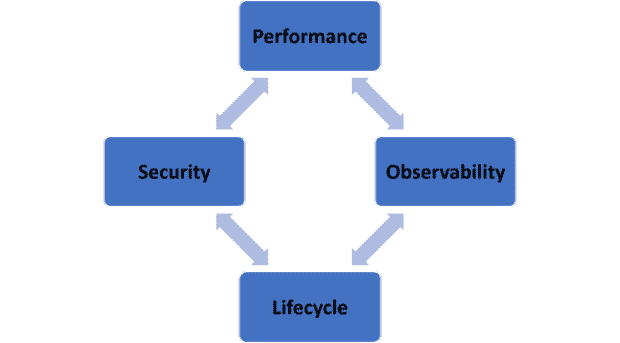

# 不是所有的超级英雄都监控 API。以下是他们应该这么做的原因

> 原文：<https://thenewstack.io/not-all-superheroes-monitor-apis-here-is-why-they-should/>

如果架构是设计和构建的艺术和技术，那么 API 架构就类似于构建一个数字结构，将最终用户和应用服务连接在一起，为生活带来数字体验。这是信息高速公路的蓝图，由入口匝道组成，用户进入互联的收费公路进行服务对服务的通信。

这种高水平的连接带来了固有的复杂性，使管理和监控成为一项挑战，并可能增加安全性受损的风险。好消息是，在您最终运行基于 API 的系统之前，有一些成熟的构建模块可以帮助您爬行和行走:即容器和事实上的容器编排平台 Kubernetes，它们将跨混合和多云基础架构的微服务信息高速公路带入了生活——只需超级英雄工具带的一点帮助。

管理和监控基于 API 的系统的关键架构考虑包括性能、可观察性、API 生命周期和安全性。这些因素往往交织在一起；例如，糟糕的性能会导致糟糕的客户转化，而宽松的 API 生命周期策略可能会增加利用身份验证弱点的安全事件的风险。幸运的是，在设计和维护期间可以跟踪关键指标和采用最佳实践，以确保性能、可观察性、可见性和安全性符合要求。

## 

## **你的 API 超级英雄工具箱里装了什么？**

现在回到超级英雄工具带。API 生命周期非常重要，因为发展成基于 API 的系统并不随着设计和部署而结束。建筑是一个持续的旅程。特别是，API 架构是分散的，因此确保每一步的互操作性至关重要，从在代码级别配置和启用新功能到监控指标以确认满足性能和可靠性 SLA。

流量管理对于管理和监控 API 也至关重要，并为使用流量路由对发布进行建模提供了机会。这包括控制来自最终用户的外部流量和来自需要在系统中代理的服务的内部流量。

这些不同的流量模式被描述为南北(入口流)和东西(服务到服务流)。还记得信息高速公路吗？

用于管理和监控这些流量的方法和工具各不相同，其中的权衡和考虑因素会影响绿地和重新平台化应用的架构决策。幸运的是，在管理和监测南北和东西交通流量的正确工具方面有着广泛的共识。如下表所述，您决定使用哪种工具通常是基于复杂性和业务价值之间的权衡。

**接下来是什么？**

在基于 API 的系统的各个方面，可观察性与安全性密切相关。

部署正确的工具来管理和监控 API 后，必须保护它们，以便可以成功地为云平台重新部署传统应用，同时控制风险。由于安全性归结于风险，我们鼓励您探索威胁建模案例研究，并在免费 O'Reilly 电子书第六章“[掌握 API 架构](https://www.nginx.com/resources/library/mastering-api-architecture/)”中阅读更多关于不保护外部 API 的风险

<svg xmlns:xlink="http://www.w3.org/1999/xlink" viewBox="0 0 68 31" version="1.1"><title>Group</title> <desc>Created with Sketch.</desc></svg>