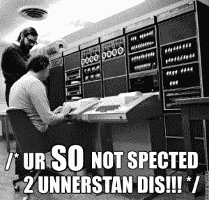
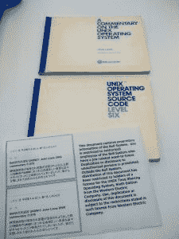
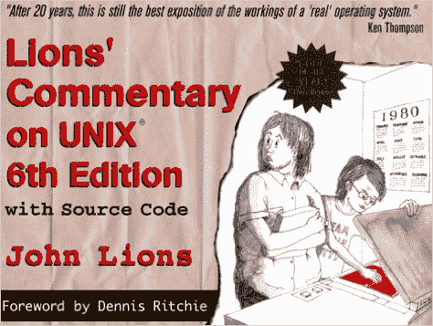
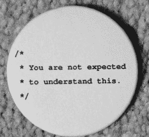

# “不期望你理解这个”:Unix 最臭名昭著的代码注释

> 原文：<https://thenewstack.io/not-expected-understand-explainer/>

“不指望你理解这个”这句话可能是 Unix 历史上最著名的评论。

上个月，在三藩市举行的“我们热爱的系统”会议上，系统研究员 [Arun Thomas](https://twitter.com/arunthomas) 向观众解释了他们不应该理解的东西。

听众中的计算机科学教师[奥赞·欧奈](https://twitter.com/ozanonay)称之为“我今天最喜欢的演讲之一”，在他的博客上写道[“没有什么应该是黑箱，即使丹尼斯·里奇说没问题！”](https://blog.bradfieldcs.com/all-the-talks-from-systems-we-love-debcd9cffca#.nmdb2ipsv)

托马斯以“我热爱系统，尤其是操作系统”开始了他的演讲但是，即使是他也不得不对这个 42 岁的 Unix 源代码评论的流行程度感到惊讶:“你开始看到人们穿着运动衫、t 恤衫和婴儿连体衣，上面写着‘你不应该理解这个。’它在黑客社区开始流行。“从开始，极客们就一直在重复[。](http://alex-holden.livejournal.com/66433.html)



代码注释最初出现在第六版 Unix 操作系统中，描述了上下文切换——或者，正如托马斯所说，“允许分时和多任务的机制……本质上是如何允许多个并发用户和并发应用程序共享一台计算机。”

基本上，上下文是堆栈指针和寄存器的混合，允许 Unix 进程暂停和恢复。“这是一个巧妙的技巧，Unix 的分时支持是它成功的一个重要原因。这是可用性的一大飞跃，”托马斯指出。"这些年来，有些事情发生了变化，但总体方案基本保持不变。"

托马斯提醒观众 Unix 的共同创造者[丹尼斯·里奇](https://www.bell-labs.com/usr/dmr/www/)自己的[关于评论](http://web.archive.org/web/20040206202840/http://cm.bell-labs.com/cm/cs/who/dmr/odd.html)网页上关于这个主题的评论:

*“在贝尔实验室发布的 Unix 研究报告中，它经常被引用来诋毁评论的数量或质量。一般来说，我担心这不是一个不公平的观察，但在这种情况下是不合理的…我们试图解释发生了什么。“不指望你能理解这个”，这句话是出于“这不会出现在考试中”的精神，而不是一种无礼的挑战。*

里奇认为这只是另一个有趣的极客历史。(在同一页上，他还解释了为什么`mv`命令有时会给出诊断信息“β的值将导致 dom！”)但是里奇意识到他 1975 年的评论已经吸引了一批追随者:

“我甚至收到了两件引用这句话的运动衫，”他写道。



托马斯从那里继续这个故事。“Ritchie 分享的另一个有趣的地方是，代码实际上是错误的，Unix 作者也没有完全理解它。”

“所以这个故事的寓意是，即使对于 Unix 的创造者来说，上下文切换也可能是棘手的。”

Unix v6 发布于 1975 年。“它大约有 9000 行代码，”托马斯指出，“小到可以在大学课程中学习。”他记得 1979 年美国电话电报公司是如何改变 Unix 的许可条款，只允许官方许可者研究代码的。

但是第 6 版的全部源代码已经由新南威尔士大学教授 John Lions 出版了，并附有他的评论，这使得这本书异常受欢迎。“人们在复印复印件，”托马斯告诉观众——注意到这种现象最终甚至在书的封面上得到纪念:



这本书的维基百科条目写道“它被普遍认为是计算机科学领域被复制最多的书”

“我在《我们热爱波士顿》的报纸上做了这个演讲的早期版本，一个与会者带着他未经授权的《狮子》出现了。他还留着它，真的很珍惜它，这很酷。”

但这本书的受欢迎程度也有助于宣传里奇的抛弃式评论。

[](https://kayotickonfessions.wordpress.com/2010/12/27/pet-peeve-i-understand/) 那么源代码到底是什么，没指望我们理解？Thomas 很快深入研究了 Unix 如何定义一个进程——用一个虚拟处理器及其相关的内存地址空间——并向听众解释了所涉及的硬件。CPU 为进程隔离内存，同时跟踪特权操作是否被允许，并支持中断和异常。

这不可避免地导致每当进程切换时都需要保存 CPU 上下文(以便以后恢复)。“这种情况不断发生。托马斯对听众说:“流程会被上下文切换出去，然后又被上下文切换回来。”。当一个 CPU 时间片用完时，或者当有中断信号、页面错误或系统调用时，上下文就会被切换。“流程一直在变戏法，”托马斯说。

“你可以把操作系统想象成 CPU 俱乐部的保镖:如果你太粗暴，就会被踢出去。如果一位贵宾买下了这个地方，你也会被踢出去，但第二天你可能还会回来。”

这一切是如何发生的有点棘手:CPU 和内核将第一个进程的上下文保存在一个数据结构中，识别下一个最高优先级的进程以做出调度决定，然后为下一个进程恢复上下文。

但是为了充分理解 Ritchie 的评论，Thomas 为他的听众提供了实际 Unix 源代码的片段，让他们得以穿越时空，一窥 1975 年的情况。

在那里，他们看到了一个 **`swtch()`** 例程如何调用一个上下文保存 **`savu()`** 子例程，该子例程的职责是在一个名为 **`u_rsav()`** 的内核数据结构中保存您的上下文。更多的上下文保存在其他地方。然后一个 **`retu()`** 子程序恢复一些下一个上下文，而 **`sureg()`** 子程序帮助准备它的虚拟地址空间。“全部细节都在《狮子》中——实际上相当复杂——但读起来很有趣。”

不过请记住，我们并不指望你能理解它。

用于 **swtch()** 的最初的 Unix V6 代码还有一些其他更直接的注释:

```
<tt>/*  Remember stack of caller</tt>
/*  Search for highest-priority runnable process
/*  Switch to stack of the new process and
/*  set up his segmentation registers.

```

但是，遗憾的是，当 1979 年为 Unix v7 重写上下文切换代码时，这一最受欢迎的注释在短短几年内就消失了。但是快进到今天，你仍然会在 [FreeBSD](https://www.freebsd.org/) 中找到一个切换子例程，Thomas 解释道——尽管它被称为 **cpu_switch()** ，因为它现在是特定于 cpu 的——并且调度代码已经被移到 **sched_switch()** ，这是独立于机器的。

https://www.youtube.com/watch?v = TPE 6 uxmdmmgm & feature = youtu . be & t = 7h 25m 3s

所以最终，我们都是在前人的工作基础上建立起来的。托马斯提醒观众，现代的 Unix，像今天的 FreeBSD，更加复杂——例如，有线程和动态链接——但是“过程抽象基本上是相同的。”自 PDP-11 时代以来，调度算法也变得更加先进，硬件环境也发生了明显的变化。但最终，“现代操作系统基本上以同样的方式进行分时操作，通过使用进程抽象和上下文切换。”

托马斯的讲话让我对 1975 年完成的所有繁重工作产生了新的敬意，他似乎也认识到了这一点。“分时度假并不容易开始——硬件很复杂——我希望我让你感受到了这种复杂性，”他告诉旧金山的观众，并补充了他自己的最后一个上下文切换。

“即使我在这项任务中失败了，我没有理解过程抽象和上下文切换的重要性，你现在至少可以理解我的 t 恤了。”


## WebReduce

<svg xmlns:xlink="http://www.w3.org/1999/xlink" viewBox="0 0 68 31" version="1.1"><title>Group</title> <desc>Created with Sketch.</desc></svg>