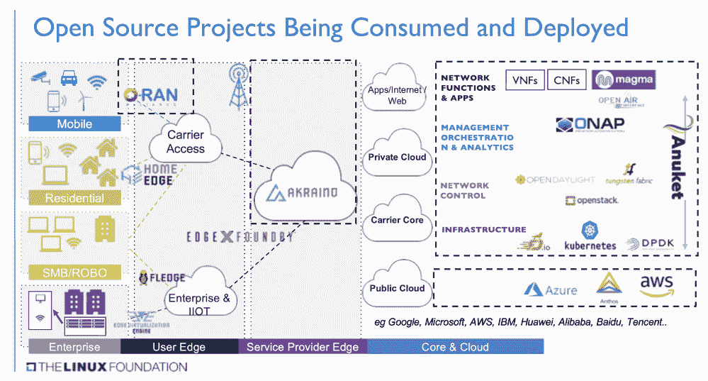
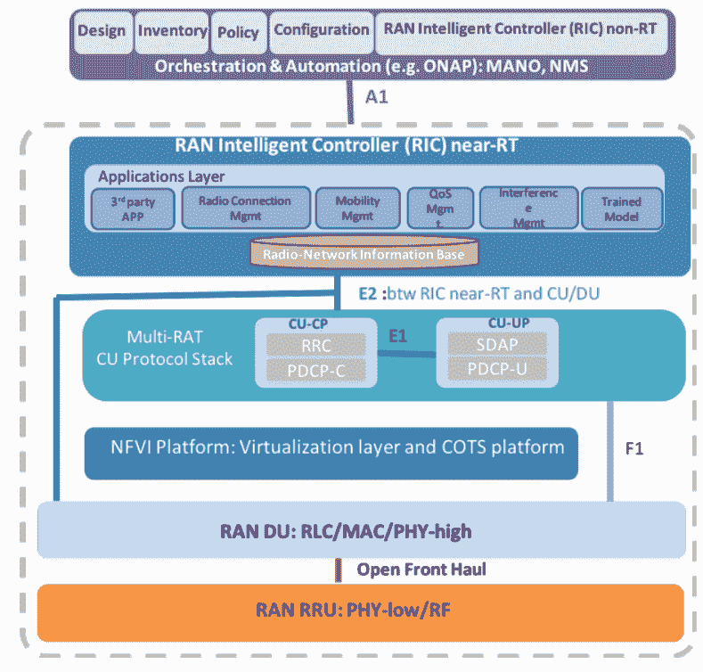
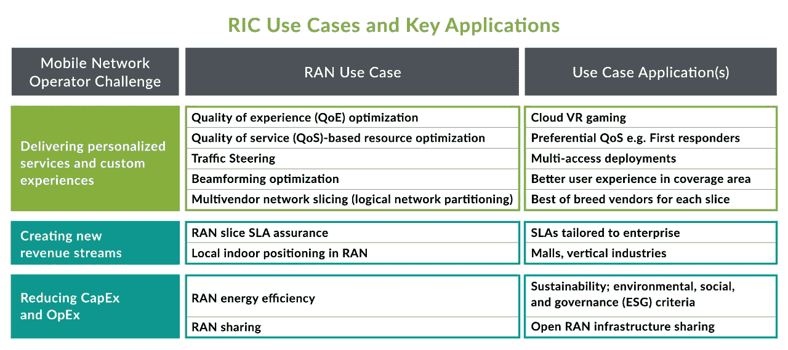

# 不仅仅是电信公司:Open RAN 向开发人员和企业开放 5G 网络

> 原文：<https://thenewstack.io/not-just-for-telcos-open-ran-opens-5g-networks-to-devs-enterprises/>

移动连接推动了智能手机上的应用革命，并为消费者和行业带来了物联网，但提供这种连接的移动网络是复杂的专有遗留系统，开发和更新缓慢。

对于移动运营商和电信网络来说，通过新兴的 5G 移动网络开放无线电接入网络，是一个利用成本节约、虚拟化、自动化和互操作性的机会，存储、网络和计算堆栈已经通过使用现成的商业服务器从单片专有硬件转向模块化、软件驱动的方法实现了这一点。

从根本上说，Open RAN 是一个巨大的进步。它使用一种开放的、软件驱动的架构，将通用计算层纳入专用电信堆栈，这意味着运营商将能够更容易地自动化和升级网络，更快地推出新技术，并提供使 5G 不仅仅是更快的移动电话网络的服务。

## **直截了当说出名字**

Open RAN 的理念是将移动基站分成一些定义明确的部分，通过开放、定义明确的接口进行通信，而不是将所有东西都塞进蜂窝塔或基站可用的有限空间和电源中。

这意味着，您可以将移动基站拆成只接收和发射无线电信号的天线(外加一个电源)，用计算机在现成的硬件上处理这些无线电信号，甚至可以在附近的数据中心或云中处理。

这使得硬件更容易维护和管理，并在流量增加时进行扩展。当一个通常几乎空无一人的位置突然有成千上万的用户和设备观看视频和上传图像时，运营商可以分配更多的处理能力，而不是用卡车运送临时基站来架设节日和体育赛事。

随着空间和能力的增加，提供边缘计算服务的成本会降低，您希望这些服务尽可能靠近数据源运行，以实现低延迟和快速响应。Open RAN 还允许运营商在现有硬件上部署新一代移动网络，而不必每次都推出新系统。

此外，5G 和 6G 取决于是否有足够的基站来提供覆盖并提供硬件带宽和低延迟:如果 Open RAN 可以创建更小、更低功率的基站，可以部署在更多的位置，它可能会加快网络部署。

## 技术定义

但是谈论 Open RAN 很快就变得令人困惑，因为除了技术的一般概念，它还可以指一些特定的规范和组。除非您实际上正在构建和运行一个电信网络，否则您通常不需要知道它们之间的区别，有时它们会互换使用，但是弄清楚这一点可以更容易地理解特定的产品、服务或网络可能提供什么。

RAN 代表无线接入网；正是基站和其他基础设施提供了“空中接口”，将电话、物联网设备和任何其他获得蜂窝信号的设备连接到核心网络，并访问运营商提供的服务，以及互联网连接以使用在线应用和服务。

O-RAN 指的是 O-RAN 联盟(有时简称为 ORAN):一个由供应商、移动运营商和研究人员组成的行业论坛，旨在推动 RAN 行业走向“更加智能、开放、虚拟化和完全互操作的移动网络”。

Open RAN，也可以容易混淆地简称为 ORAN，指的是 O-RAN 联盟发布的 RAN 架构的开放规范(它经常被用作这些更开放的网络的一般概念的简写)。

这些开放规范的目的是创建可互操作的构件。O-RAN 软件社区技术监督委员会联合主席[杰克·默里](https://wiki.o-ran-sc.org/pages/viewpage.action?pageId=1179656)告诉我们:“如果我们不为每个不同的服务提供商构建每个独特的构建模块，这是有好处的。”。“当我们在重用更多代码、更多 API、更多工具包、更多网络接触点协议上达成一致时，我们就获得了交换点，这变得非常有价值，并带来了增长和机遇。”

这也利用了开源开启社区创新的方式。“开源项目的好处在于，随着需求的增长，社区不断适应，并根据人们的需求带来更多的功能，”他指出。

这就是为什么 O-RAN SC 是 O-RAN 联盟和 Linux 基金会的一个联合项目，专注于像 [ONAP](https://www.onap.org/) 、[安穆凯](https://anuket.io/)、 [Magma](https://magmacore.org/) 和 [others](https://wiki.lfnetworking.org/pages/viewpage.action?pageId=53609061) 这样的开源项目，这些项目提供了许多开放 RAN 概念——尽管社区中也有一些项目拥有 FRAND 许可的 IP，开放 RAN 实现可以包括专用功能的专有代码。

由 Linux 基金会提供

OpenRAN(中间没有空格)指的是[OpenRAN Telcom Infra Project](https://telecominfraproject.com/openran/)，这是一个由运营商和供应商组成的团体，致力于实现来自多个硬件和软件供应商的可互操作产品，目标是使电信基础设施更加经济实惠，以便覆盖世界上更多的人群——使用 O-RAN 在 ORAN 框架中定义的开放 RAN 标准。

VRAN 或虚拟化 RAN 指的是将过去在专有硬件中实现的网络和数据处理基带处理功能(通常使用 ASICs 来提高性能和效率)，重写为软件，并在标准服务器硬件上虚拟化。与云一样，分离数据和控制平面意味着您可以独立扩展它们，并将非实时或对延迟非常敏感的功能转移到集中式服务器中，从而提高利用率。

Cloud RAN (C-RAN)是一种设计为云原生的 VRAN，因此它可以利用微服务、容器、连续交付和其他熟悉的 DevOps 技术。这将让网络运营商利用常见的云模式，如向一定比例的用户提供金丝雀部署，以测试新版本的服务。

VRAN 是在 ORAN 描述的 RAN 的不同组件之间实现标准化、开放接口的方法之一，但 VRAN 不必是开放的或多供应商的，开放 RAN 也不必虚拟化。

研究公司 CCS Insight 的分析师 [Richard Webb](https://www.linkedin.com/in/richard-webb-057845/) 向新堆栈解释说:“VRAN 是关于让 RAN 更加软件定义和可编程，并将功能从硬件转移到软件。

VRANs 和 C-ran 侧重于分解网络；开放 RAN 是关于互操作性的，具有一组集中于开放网络的标准，这些标准定义了用于访问 RAN 内部功能的简档和接口。把接口想象成 RAN 的不同部分和外部世界之间的 API。

这意味着应用和服务可以使用过去被锁定在专有网络堆栈中的信息，以使网络更好地工作或更好地利用网络。

## **开冉的好处**

网络运营商喜欢这样的想法，即从单一供应商的专有堆栈转移到开放的生态系统，在那里他们可以混合和匹配组件，从而创造一个竞争环境。

但是仅仅关注降低价格的潜力是没有意义的，Webb 警告说:“开放 RAN 实际上是关于 RAN 中功能的多样性。这意味着你正在打造一个更加灵活、高度可用的网络。”

将 RAN 分成分散的、软件定义的部分意味着您可以将来自不同供应商的更多功能放入网络中，包括在特定领域拥有专业知识的较小参与者。

除了开放接口，与 vRAN 相比，Open RAN 带来的最大优势是 RAN 智能控制器(RIC ),它可以通过使用之前锁定在 RAN 内部的数据进行分析，使系统更加智能，自动化程度也大大提高。运营商不仅可以从基站的其他地方选择不同供应商的 RIC，RIC 本身也可以让他们从类似 app store 的地方选择不同的功能。

奥兰联盟提供

网络数据将首先用于增强 RAN 本身的近实时性能，提高频谱效率和可靠性。

“ran 是复杂的环境，”Murray 指出。“如果你靠近小区，远离小区，重叠小区…有多个频谱，现在我们可以将不同的用户分配到不同的频段，管理变得更加复杂。”

对于 3G、4G、5G 和(未来的)6G 的不同风格，需要考虑多个频谱带，加上其他网络，如 Wi-Fi 6E 和 7(在某些情况下加上 LoraWAN、Zigbee 和 Z-Wave)。网络的不同部分可能会出现干扰、拥塞或流量增加。有了 5G，无线电资源将从毫秒到毫秒被分配和重新分配。

图由 Juniper Networks 提供。

借助 5G，运营商可以在同一个物理网络基础设施上提供多个虚拟化的隔离逻辑网络:一个面向需要低延迟和高带宽的游戏玩家，一个面向普通电话用户，另一个面向低功耗更重要的物联网设备。他们可能还希望优先考虑一些用户，如医院、学校和需要保证服务质量的急救人员。

这种网络切片使得支持不同用户群的专门需求变得更加容易，这些用户关心不同的网络特征(并且经常寻找非常不同的价格方案)。

默里说:“如果你能调整网络，这对用户和提供商都有好处，因为我们将正确的资源与正确的需求组相匹配，而不是像电话一样对待占空比非常低的远程传感器。”

英特尔网络与边缘集团副总裁 Cristina Rodriguez 告诉我们，运营商可以使用 RAN 资源利用率的实时信息来创建和维护这些网络切片，“由基于人工智能的算法提供支持，用于流量路由、位置预测、信道质量预测和用户选择”。

默里警告说，你需要大量关于网络中正在发生的事情的数据来管理如此动态的网络，并进行更精细的流量管理，但你也必须有效地处理这些数据，“因为否则，你的网络就变成了全是数据，而不是你提供的服务。”

一些 RIC 工作负载不需要如此接近实时，Open RAN 可以让网络工具访问数据，而不必移动大量数据。“在分散架构中，我们现在有一个分布式的近实时直接 RIC，而不是非实时 RIC，您可以将分析放在靠近数据生成位置的地方，而不必将数据移动到很远的地方。”

## **为开发者开放冉**

实施动态网络依赖于自动化，这是另一个对运营商来说是全新的云原生概念，在运营商的世界中，网络不仅是专有的，而且是高度定制的，更新是缓慢、复杂的，并且提前几个月甚至几年进行安排。

Open RAN 承诺远程自动化软件安装、零接触供应、测试和验证、使用 CI/CD 管道的滚动更新和升级，以及最终使用遥测、分析和其他 AIOps 功能的自我修复和自我优化网络，其中[许多解决方案](https://symphony.rakuten.com/symware/network-operations-simplified)依靠 Kubernetes 生态系统进行[配置](https://www.onap.org/announcement/2021/05/11/onap-the-de-facto-open-network-automation-platform-goes-cloud-native-in-honolulu)和编排。

Rodriguez 建议说，很多自动化和智能化将来自机器学习。“云原生的、基于软件的 RAN 架构(如 Open RAN)是集成人工智能和机器学习的理想选择，它允许运营商在其网络中自动执行操作任务，使其更加省电、节省资源和成本。”

她建议，运营商可以利用这种智能为企业和高端消费者提供额外的服务和服务级别协议，而这是 4G 无法做到的。“媒体提供商、工厂、零售商、医疗系统和智能城市等组织可以从有保证的吞吐量、延迟、可靠性和更高的体验质量中受益。”

“装配汽车零部件的自动化工厂需要超可靠、低延迟的通信，以确保在没有代价高昂的停机时间的情况下满足生产目标。借助人工智能支持的网络，运营商可以支持交付与性能相关的 SLA，并将其作为服务出售给制造商。”

但是开发者也可以自己使用 RIC 的数据，韦伯指出。“当你有了基于分解软件功能的 RIC，你就有了第三方应用程序访问网络功能的稳定平台，然后做他们的事情。应用程序开发人员希望获得这种连接；他们需要网络来访问边缘计算，访问人工智能和其他功能，网络是实现这一目标的途径。”

过去，网络运营商试图通过提供自己的服务或鼓励应用程序开发者专门为他们的网络开发应用程序来与云提供商竞争，但通常都失败了，因为他们没有规模或技能。

Webb 说，这一次，运营商希望创建一个丰富的沙坑，应用程序开发人员可以利用网络资产(并使用云技术与之合作)来创建网络智能应用程序，这些应用程序可以使用来自移动网络的信息。

“他们希望他们的网络具有规模、高容量、超低延迟，同时也是一个基础平台，用于访问边缘计算和处理能力、人工智能和机器学习以及 5G 和其他网络技术将连接他们的其他功能。然后他们退后一步说，好了，开发商，我们给了你这个游乐场，去玩吧。”

对于机器人和自动驾驶汽车、制造自动化和质量保证等行业应用，以及智能高速公路、ar 和 VR 等安全应用，近实时响应、有保证的可靠性和隐私性将非常重要。

智能城市将需要低功耗传感器和物联网设备的大规模机器对机器通信，管道监控也是如此。Open RAN 不仅可以在挤满球迷的体育场或赛道上更容易地提供基本的连接，还可以让网络提供增强的移动宽带，具有虚拟现实和视频流所需的更高数据速率。

韦伯认为，应用和服务可能会因行业而异。“医疗保健应用程序开发社区将能够利用这种连接和对功能的访问来创建医疗保健关注的应用程序，智能制造或[智能城市](https://medium.com/weaver-labs/why-an-edge-cloud-for-a-5g-urban-network-13603791e83d)部门也是如此。这是关于专业化和这些垂直市场有足够的机会获得技术和网络规模，使他们成为专家社区开发这些专家市场所需的丰富环境。”

想象一下，一个停车场使用计算机在[打开的情况下更新自动驾驶汽车](https://onseu19.sched.com/event/SYw5/driving-to-the-edge-how-open-apis-and-open-ran-will-transform-ordinary-parking-lots-into-dynamic-data-centers-natasha-tamaskar-radisys?linkback=2019-09-24)的具体细节，他们需要有效地停在特定的停车场，而不需要与同时试图停在那里的其他汽车进行通信。这对司机来说更方便，对停车场运营商来说也是更多的生意，因为如果是自动停车的话，你可以容纳两倍的车。

或者，您可以使用来自摄像头和传感器的信息数字化整条道路，以创建一个数字双胞胎，让您将其视为应用程序可以调用的 API，或者基础设施可以用来实时适应当前情况。定制的物体识别模型可以使用摄像头来发现安全隐患，如道路上的碎片或抛锚的车辆:这可能会触发车道关闭并更新警告标志。

Ferrovial 正在利用 Azure 公共 MEC 服务和部署在 [Azure Arc](https://thenewstack.io/azure-arc-is-developing-into-a-full-hybrid-infrastructure-system/) 上的 Kubernetes 集群[建设一个](https://mybuild.microsoft.com/en-US/sessions/6926aa3e-c633-4878-87ec-410e58fd6440?source=sessions)[智能道路](https://www.aiviasmartroads.com/?utm_source=AIVIA&utm_medium=Blog&utm_id=Microsoft)系统，以通过公共和私有 5G 网络实现这一目标；第一批道路将于今年在弗吉尼亚州和德克萨斯州开通。

使用 Open RAN，计算机可以具有最低可能延迟，因此车道关闭及时发生以避免事故，且系统可以提供其他实时服务，如动态交通管理或电动车辆的路内充电。

## **壁垒开然**

Open RAN 有很多好处，但它也是运营商网络设计、建设和维护方式的一项重大变革。电信网络是复杂、要求苛刻的实时环境，低延迟和可靠性至关重要。

默里警告说，向 5G 的转移意味着新的架构，这为更分散的 RAN 带来了机会，但质量、效率、可靠性和弹性必须与你从专有的集成 RAN 堆栈中获得的相匹配。“频谱是一种重要的资源，需要大量资金，我们的大部分工作都是为了优化频谱效率。你有一个非常庞大的用户群，要求非常高。”

“人们依赖这些网络:汽车依赖它们，安全人员依赖它们。很难关掉所有的东西，把所有的东西都向前迁移。”

一些网络已经在绿地站点商业部署了开放 RAN，在那里他们不必处理与传统系统的互操作性，或者在网络流量较少的农村地区(因此 RAN 性能并不那么重要)。

更多的人承诺在他们网络的很大一部分使用它，包括那些寻找华为替代品的人，例如在英国，该供应商被禁止进入 5G 电信网络，政府希望到 2030 年，三分之一的移动网络流量通过开放 RAN 传输。Dish 正在亚马逊网络服务(加上其自身网络中的 AWS 前哨站)上运行 Open RAN 和 5G 核心软件，以比往常更快的速度建立一个新的 5G 网络。

但是开放 RAN 涵盖了大量的规范，并且不是所有的运营商都实现了所有的接口或者包括 RIC。这可能是因为将开放 RAN 集成到现有网络的成本和复杂性，担心更复杂的体系结构，在这种体系结构中，他们可能没有合适的技能，也不能求助于一个供应商来获得支持，或者缺乏边缘数据中心，这些中心通过光纤连接到蜂窝塔，将计算从基站中移出。参考设计、蓝图和集成测试将有所帮助，超大规模云供应商和托管机构推出边缘计算的速度也将有所帮助。但是也存在成熟度和硬件性能的问题 basic 是开放 RAN 的真正区别，但在许多情况下仍然是非常基本的。

现有的商用硬件可能并不总是适合开放 RAN，并且由于许多 RAN 网络功能只是在最近才被虚拟化，它们并不总是被优化的，并且可能占据运营商希望作为计算平台提供的商用服务器的大部分核心。Arm、英特尔、高通、Marvell、Xilinx 和其他硅供应商正在构建新的芯片组和加速器，以提供传统物理 RAN 通过使用专用芯片组(如 ASICs)获得的性能和低功耗。

韦伯表示，硬件状况比 12 个月前要好。“与企业环境相比，英特尔等公司必须对电信环境中[服务器]的规模、工作负载和处理要求做出反应，因为通过这些网络传输的数据量要大一个数量级。”

“他们不得不卷起袖子说，‘如果运营商打算虚拟化他们的网络，我们需要考虑一下我们为他们的网络处理需求提供了哪些服务。’"

网络虚拟化是一个难题。美国电话电报公司可能是虚拟化程度最高的国家，其四分之三的核心网络功能已经虚拟化。该国决定在 2021 年将其 5G 核心软件转移到 Azure，以换取微软购买和运行其网络云平台，美国电话电报公司 5G 核心网络在该平台上运行。

Open RAN 将需要更多的基础设施、自动化、开发和云本地专业知识，这在电信行业很少见，因为电信行业的专业知识存在于其他领域。值得网络运营商努力获得这种新方法的技能，因为他们可能需要 Open RAN 通过在网络内提供分布式边缘计算选项来实现的应用和服务，以真正实现 5G 和 6G 的承诺。

但 Open RAN 对于大型组织正在为其仓库、制造工厂和其他场所构建的专用 LTE 和 5G 网络也很重要，在这些地方，他们需要比有线网络更大的灵活性，但比 Wi-Fi 能提供的延迟更低。

“如果一家工厂想变得更智能，解放其生产机器人，并通过 5g 连接它们，以便它们可以在生产车间的不同部分移动，Wi-Fi 无法处理这种能力和移动性，”韦伯解释道。这不仅需要连接，还需要人工智能和其他处理，这取决于 Open RAN 可以在网络中提供的低延迟边缘计算。

惠普和英特尔等熟悉的供应商与 Rakuten 等 5G 专家和 Juniper 等熟悉的企业网络合作伙伴一起为 Open RAN 提供的预集成解决方案和设备，通常[与 Azure](https://azure.microsoft.com/en-us/blog/diversifying-the-telecommunications-supply-chain-with-open-ran/) 和 AWS 等云提供商一起，将在这里很好地简化网络集成，同时仍然让开发人员能够访问 Open RAN 承诺的低延迟边缘计算平台。移动运营商开始创造[基于开放无线接入网的小型蜂窝设备](https://www.telefonica.com/en/communication-room/telefonica-expands-the-open-ran-ecosystem-by-successfully-validating-its-new-5g-sa-small-cell/)，可以连接到他们的网络或专用的 5G 网络。

全球约有 1000 个私有 LTE 网络(5G 网络可能还有 300 个)，但未来几年可能会增加 10 倍。他认为，事实上，专用网络和小型蜂窝部署可能被证明是“Open RAN 成为运营商主流的后门，因为他们认为它在那些专业化企业和工业环境中非常成功”。

<svg xmlns:xlink="http://www.w3.org/1999/xlink" viewBox="0 0 68 31" version="1.1"><title>Group</title> <desc>Created with Sketch.</desc></svg>