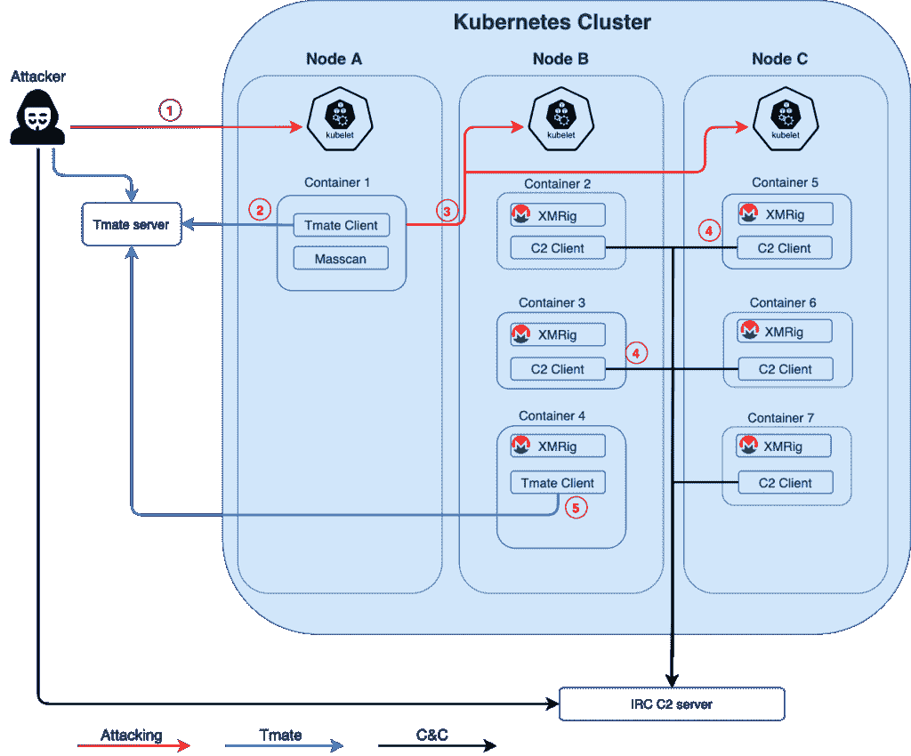

# 臭名昭著的恶意软件 CyberGang 在不安全的 Kubernetes 集群上全押

> 原文：<https://thenewstack.io/notorious-malware-cybergang-goes-all-in-on-unsecured-kubernetes-clusters/>

根据[帕洛阿尔托网络](https://www.paloaltonetworks.com/cloud-security?utm_content=inline-mention)的研究部门 [Unit 42](https://unit42.paloaltonetworks.com/) 的一份新报告，以对云基础设施进行[基于容器的攻击](https://thenewstack.io/untrusted-docker-hub-images-found-with-monero-cryptojacking-malware/)而闻名的网络团伙 TeamTNT 发现 Kubernetes 是其从其他人的服务器上挖掘 Monero 加密货币的有用工具。

在他们自己的四节点“蜜罐”Kubernetes 集群上，研究人员观察到攻击者使用常见的 Linux 和云原生工具发动了一次复杂的攻击，霸占了他们的容器。这些行动是一个更大的僵尸网络的一部分，被称为“希尔德加德”，其规模仍未确定。

“从另一项正在进行的研究中，我们确实知道至少有 2000 个配置错误的 Kubernetes 集群，”Unit 42 高级云研究员[陈颉](https://www.linkedin.com/in/jaychen2015/)指出。通过搜索 [Shodan](https://www.shodan.io/) 物联网搜索引擎，以及安全厂商 [Censys](https://censys.io/) 提供的搜索功能，可以轻松找到这些错误配置的系统。"这些配置不当的库伯内特都是潜在的目标."

被这种僵尸网络感染对最终用户来说可能是昂贵的和毁灭性的。“恶意软件最大的影响是资源劫持和拒绝服务(DoS)。研究人员在他们的[调查报告](https://unit42.paloaltonetworks.com/hildegard-malware-teamtnt/)中写道，密码劫持操作可以迅速耗尽整个系统的资源，并扰乱集群中的每个应用程序。

与开源容器编排引擎的其他合法用途一样，Kubernetes 为攻击者带来了迄今为止无法实现的可伸缩性，因为 Kubernetes 集群可以控制数百甚至数千个容器。攻击者也很快学会了如何利用这种能力。“这种新的 TeamTNT 恶意软件活动是针对 Kubernetes 的最复杂的攻击之一，”研究人员指出。

## 工具

攻击者通过一个不安全的面向互联网的 Kubelet 发现了这个蜜罐，它允许匿名访问，通过它他们锁定了集群中的一个容器并建立了商店，使用 [tmate](https://tmate.io/) 和 IRC 与总部通信，使用 [masscan](https://github.com/robertdavidgraham/masscan) 扫描 Kubernetes 的内部网络。从那里，很容易将软件传播到集群中的其他节点。

恶意进程隐藏在 Linux `bioset`进程名称下，并通过构建在`LD_PRELOAD`上的库注入技术。恶意有效负载被加密并隐藏在二进制文件中，以避免被静态分析检测到。

## 影响

这不是该团伙部署的第一个云原生工具。去年，微软研究人员观察到 TeamTNT 下载并在被破解的容器中运行 [Weave Scope](https://www.weave.works/oss/scope/) ，以获得受害者基础设施的布局，[威胁邮报报道](https://threatpost.com/teamtnt-remote-takeover-cloud-instances/159075/)。去年 8 月，Unit42 的研究人员还[记录了](https://unit42.paloaltonetworks.com/cetus-cryptojacking-worm/)塞特斯，这是一种基于 Docker 的 Docker 密码劫持蠕虫，他们声称是由 TeamTnT 创建的(不要与众所周知的创建《末日》电脑游戏附加剧集的集体实体 [TeamTnT](https://en.wikipedia.org/wiki/TeamTNT) 混淆)。据称，这个影子实体还创建了 Black-T，其目标是亚马逊网络服务上的凭证文件，以及 IRC 机器人 TeamTNT DDoS。

这种新的僵尸网络最近似乎很安静——自从研究人员在 1 月初发现它以来，没有进行任何更新。

研究人员报告说:“自从我们最初的探测以来，没有任何活动，这表明威胁活动可能仍处于侦察和武器化阶段。”尽管如此，这个蜜罐集群上的僵尸网络利用了大约 25.05 千赫/秒的哈希能力，已经收获了 11 XMR(大约 1500 美元)的 Monero 数字货币。

Palo Alto Networks 还想提醒大家，通过软件的运行时保护功能，运行 [Prisma Cloud](https://www.paloaltonetworks.com/prisma/cloud) 的客户可以免受这种威胁。

[报告](https://unit42.paloaltonetworks.com/hildegard-malware-teamtnt/)全面概述了用于渗透集群的技术和工艺，以及这些行动对受感染系统的影响。

Palo Alto Networks 是新堆栈的赞助商。

特征图片:[新老股](https://nos.twnsnd.co/)。

<svg xmlns:xlink="http://www.w3.org/1999/xlink" viewBox="0 0 68 31" version="1.1"><title>Group</title> <desc>Created with Sketch.</desc></svg>