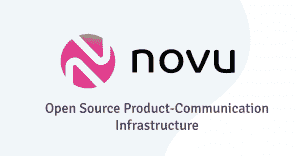

# Novu 处理通知基础设施管理

> 原文：<https://thenewstack.io/novu-tackles-notification-infrastructure-management/>

当初创公司的创始人意识到他们必须改变策略以获得成功时，这是一个“啊哈”的时刻。去年，这种情况发生在 Novu 的创始人身上。他们向产品经理推销一种技术来处理所有渠道的产品沟通，一种工具来处理内容、用户偏好、时区和语言，并且完全开源。

但是他们找错了对象。通常，当产品团队不关心产品沟通需求时，这还为时过早，他们会将 Novu 团队交给工程师。

“创造这个并确保一切正常的是工程团队，他们在管理这个方面有很多困难，当一个产品人员说，‘嘿，伙计们，我们需要像脸书或推特一样建立这个通知中心。’这家总部位于特拉维夫的初创公司的联合创始人兼首席执行官[托马·巴尔内亚](https://www.linkedin.com/in/tomerbarnea/?originalSubdomain=il)说:“他们真的没有团队来做这件事，或者在最佳实践方面如何做的良好规范，以及诸如此类的东西。”。

现在有很多沟通工具——send grid 用于电子邮件，Twilio 用于短信，Slack 用于直接消息传递，等等。它们可以定制，以适应公司和用户的具体需求和目标。但这迫使开发人员跨代码库管理所有这些 API。

“因为创造和正确使用它往往非常复杂，所以工程师拥有它。我们和一家公司谈过，实际上是几家公司，[他们告诉我们]他们的代码库中有 700 多处硬编码的修改。所以这显然是工程师的问题，”巴尼亚说。

“从长远来看，我们决定开始思考如何真正推出我们的产品，并以工程师可以理解的方式包装它。”

然而，潜在客户的工程师告诉他们，他们可以自己开发这项技术。这就是问题所在:像脸书和 Lyft 这样的公司已经在内部建立了这种模式——对于许多公司来说，他们一遍又一遍地建立这种模式。巴尼亚和他的联合创始人马頔·格罗斯曼已经创建了三次，这是他们的第三次创业。

以色列投资公司 eToro 的产品管理总监 Eyal Sheinholtz[告诉他们:“我们花了将近四年的时间在内部构建解决方案，并有一个团队专门负责这个项目。](https://www.linkedin.com/in/eyalsheinholtz/?originalSubdomain=il)

## 专注于基础设施

这个想法是按照 Stripe 处理账单或 OAuth 处理认证的方式，设计一个插入式模块。去年十月，当格罗斯曼发表了一篇关于这项技术的博客文章时，Novu 开始受到关注。在 [GitHub](https://github.com/novuhq/novu) 上，它已经增长到 4500 颗星。

Barnea 说，Novu 和现有通知工具的区别在于，Novu 建立的是通知基础设施，而不是通知交付。它集成了 Twilio、SendGrid、MailChip 和其他交付[提供商](https://github.com/novuhq/novu/tree/main/providers)，负责根据用户的偏好在指定的通道上实际交付通知。

“但归根结底，开发人员仍然要建立许多内部系统，以便建立一个适当的通知系统，既考虑到用户的关切，也考虑到工程部门的需要。这就是通知基础设施解决方案的相关之处，这就是 Novu 正在解决的问题，在小范围内使用我们的无状态库，更完整的解决方案是我们的[自托管] Docker 和[SaaS]无服务器产品，”Barnea 说。

Novu 使用简单的组件和 API 在一个地方管理电子邮件、短信、直接、推送和网络推送通知。

你只要:

*   连接您的提供商
*   创建通知模板
*   发送触发器
*   将通知中心集成到您的应用程序中。

每个提供者都是无状态的，并遵循特定的接口，而 Novu 管理状态并协调所有提供者特定的配置。

模板包括影响特定消息传递的代码规则和过滤器、优先级和其他元数据。

触发器传递呈现通知消息所需的变量和数据。如果缺少某个值，邮件将不会被发送。

通知中心可以嵌入为一个 [React 组件](https://docs.novu.co/docs/notification-center/react-components)或一个 [iFrame](https://docs.novu.co/docs/notification-center/iframe-embed) 。独立的库在 Node.js 中，但是可以在多种语言中使用。它包括社区为多种语言构建的 SDK。

通信 API 负责读取模板的配置，找到相关的通道，定位提供者，并完成发送通知的繁重工作。根据[文档](https://docs.novu.co/docs/overview/architecture)，所有逻辑规则，如优先级、定时、信道选择和其他由引擎管理。

## 早期

当被问及这项技术是否处于测试阶段时，Barnea 笑着说，“我可能会说仍然是 alpha。”

格罗斯曼补充说:“我们基本上是在一个半月前才推出的，实际上是整个系列。我们创建了一个小型概念验证并发布了它，创建了一个博客帖子来谈论我们在这里试图解决的问题的未来。我们看到很多人走上前来，分享他们的经验，并对他们进行了多次采访。”

该公司之前名为 Notifire，最近宣布了由 Crane Ventures 牵头的 660 万美元的种子融资。

它发布了一个基于 Docker 的自托管解决方案和一个云版本，Grossman 解释说“基本上是一个类似的服务，但你只需注册，获得一个 API 密钥，就可以开始工作了。因此，从那时起，我们有了相当不错的增长……但就我们提供的真正完整的系统而言，这肯定还为时尚早。”

他们面临着大量的竞争，至少是来自解决部分相同问题的对手。有专有替代品如 [Courier](https://www.courier.com/) 和[magic bell](https://www.magicbell.com/)；Twilio，集成了 WhatsApp 消息、语音、视频，以及短信和电子邮件；多个开源[推送通知项目](https://medevel.com/15-os-push-notification/)；以及其他开源项目包括 [Notifo](https://squidex.io/post/notifo-is-opensource-now) 和 [Notif.me](https://notifme.github.io/www/) 。

Grossman 表示，他们正在考虑一种开放核心模型，其中开发人员需要的基本功能仍然是开源的，如统一 API 和调试工具，但更多的组织需求，如单点登录和基于角色的访问，可能会有企业版。

它正在开发所谓的“摘要引擎”，为应用程序提供将多个事件聚合到单个通知中的能力，以及“时区意识”，根据地理位置和客户接收消息的最佳时间提供调度。

Barnea 说:“现在，我们面临的最大问题之一，也可能是我们将在一段时间内面临的最大问题，是工程师们不确定我们在 Twilio、SendGrid 和他们的代码之间处于什么位置，因为现在没有真正的产品语言(用于该领域)。”“因此，这将是市场教育……但这仍是一个持续的过程。”

<svg xmlns:xlink="http://www.w3.org/1999/xlink" viewBox="0 0 68 31" version="1.1"><title>Group</title> <desc>Created with Sketch.</desc></svg>