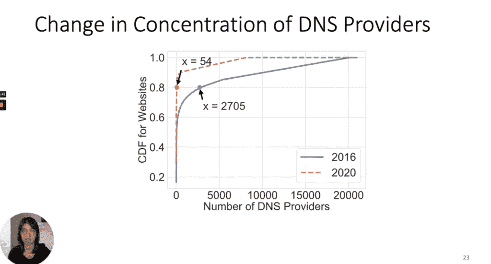

# NS1:避免 DNS 单点故障的陷阱

> 原文：<https://thenewstack.io/ns1-avoid-the-trap-of-dns-single-point-of-failure/>

在过去几年中，第三方 DNS 提供商经历了巨大的整合，导致对维持全球最大网站查询的较小提供商群体的依赖。在发生[分布式拒绝服务(DDoS)](https://www.theregister.com/2019/10/28/amazon_ddos_attack/) 攻击或 DNS 服务中断的情况下，仅依赖少数单一 DNS 提供商中的一家也会增加风险。

根据[卡耐基梅隆大学](https://www.cmu.edu/)研究人员的一项研究，在 Alexa 排名的[前 100，000 个网站中，89.2%依赖于单一提供商的 DNS 服务，而不是使用他们自己的服务和额外的冗余。](https://www.alexa.com/topsites)

这一发现强调了在攻击或中断事件中，拥有最高流量网站的绝大多数组织将如何被中断，因为他们的 DNS 服务缺乏冗余。

此外，其他网站也间接受到了流行的 CDN 和 DNS 提供商的影响——例如，以学术界“edu”结尾的域名，通过 CDN MaxCDN 依赖亚马逊网络服务(AWS)的 DNS 服务，研究人员指出。研究人员表示，2019 年对亚马逊 DNS 服务器的 DDoS 攻击导致亚马逊以及“大量”热门网站的网络中断数小时。此外，自从 2016 年一次 DDoS 攻击中断了 DNS 提供商 Dyn 的服务以来，对单一来源 DNS 提供商的依赖增加了 4.7%。

“DNS 是一个重要的目标，因为它在现代基础设施中扮演着重要的角色。此外，由于 DNS 在协调所有互联网和应用流量方面的核心作用，恶意行为者通过对 DNS 实施攻击所造成的损害相对于其他攻击来说更大，”NS1 架构副总裁 [Shannon Weyrick](https://www.linkedin.com/in/weyrick) 告诉[新堆栈](https://thenewstack.io/)。“尽管长期以来一直被认为是一种最佳实践，但这项研究表明，在 DNS 级别实现冗余仍不普遍。对 DNS 冗余的需求是这篇文章的关键要点。”

卡耐基梅隆大学的 Aqsa Kashaf 讨论了“分析现代 Web 服务中的第三方服务依赖性:我们从 Mirai 未来组合-戴恩事件中学到了什么？”

SREs 和 DevOps 团队的主要收获是，在 DNS 中构建冗余是降低运行全球最大网站的绝大多数组织所面临的 DNS 单点故障问题风险的关键因素。

由于 DevOps 团队从根本上寻求提高他们部署和更新应用程序的节奏，因此 DNS 故障风险代表了一个重大但可避免的中断。

“开发运维团队交付代码的速度是传统应用开发的 40 多倍。重要的是，DNS 是可用的，并能够跟上这一速度，”韦里克说。“同样重要的是，DevOps 团队要确保 DNS 具有弹性，以便能够以最佳效率运营。”

此外，云架构、微服务和基础设施规模往往暴露了 DNS 中未得到满足的需求，例如对灵活流量管理、服务发现、快速传播和全面 API 支持的需求，Weyrick 说。Weyrick 说，在 DevOps 环境中，应用程序团队经常在他们的应用程序中实现网络功能，如负载平衡。

Weyrick 说，DNS 冗余和其他托管 DNS 和 VPN 连接服务可以帮助 DevOps 团队避免与 DNS 中断相关的单点故障风险。例如，对于可靠性工程师(SREs)，DNS 已经成为“一个重要的杠杆工具”，因为它允许他们控制和自动化应用流量，以确保最大的性能和正常运行时间，”Weyrick 说。

“我们与客户合作应用逻辑，以便在实时数据和遥测数据的驱动下，根据业务政策来引导或操纵流量。Weyrick 说:“我们本质上是在‘拉动杠杆’来控制流量，以提高性能、控制成本或解决问题，从而避免停机。”。“为了让 sre 确保其数字服务、站点和应用保持弹性，他们需要消除应用交付堆栈中的单点故障，尤其是 DNS。应用程序开发人员、站点可靠性工程师和负责监管数字应用程序的 IT 领导应该优先考虑 DNS 弹性。”

Weyrick 说，根据卡内基梅隆大学的研究，NS1 客户的冗余率高于许多其他提供商。“这是因为 NS1 提供单独的托管和专用 DNS 服务，这使得客户可以轻松利用两个独立的 DNS 服务，而没有任何跨提供商的技术限制，”Weyrick 说。“NS1 还致力于在应用程序堆栈的每一层向客户宣传冗余的重要性。”

Weyrick 指出，DNS 灵活性的最佳实践包括:

*   **多样化以增加弹性**:使用独立于您的云、CDN 或数据中心的 DNS 解决方案。如果提供商出现故障，您仍然可以使用正常运行的 DNS 将用户定向到您的其他设施，这将为整个应用交付堆栈建立弹性。
*   **实践冗余**:在基础设施的每一层都有冗余是很重要的，包括 DNS 主机。DNS 冗余确保如果一个 DNS 网络受到胁迫，另一个将包含对查询，确保查询不会得不到回应。为其域部署不间断冗余 DNS 网络的组织可以防止中断，并从 DDoS 和其他攻击中更快地恢复。
*   **利用任播网络进行 DNS 解析:**任播是一种高度灵活的路由方法。一旦服务器出现故障、受到 DDoS 的影响或由于全局连接问题(例如，某个互联网网段中的光纤中断或拥塞)而变得不可用，任播就会动态地将 DNS 请求转移到可用区域。
*   **DDoS 超额保护:** DDoS 或其他恶意流量通常会给企业带来来自 DNS 提供商的意外超额费用，有时高达数十万美元。选择 DNS 提供商时，考虑他们是否提供超额保护，以减少或消除与 DNS 超额相关的攻击缓解和解决成本。
*   **自动化 DNS 管理流程:**通过自动化 DNS 管理并在网络基础设施中嵌入智能决策和流量控制功能，减少手动错误并提高灵活性。

亚马逊网络服务(AWS)和 NS1 是这个新堆栈的赞助商。

通过 Pixabay 的特征图像。

<svg xmlns:xlink="http://www.w3.org/1999/xlink" viewBox="0 0 68 31" version="1.1"><title>Group</title> <desc>Created with Sketch.</desc></svg>