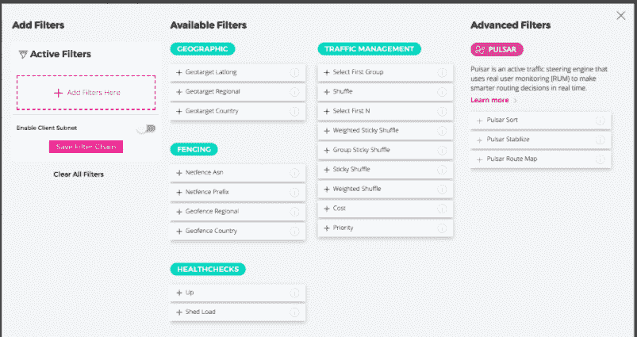

# NS1 展示了 DNS 技术如何加速 VPN 连接

> 原文：<https://thenewstack.io/ns1-shows-how-dns-technology-can-speed-vpn-connections/>

随着新冠肺炎疫情和大量员工从办公中心转移到家庭所在地，对更快、更可靠的 VPN 连接的需求最近肯定会激增。

对于必须依赖 VPN 进行数据传输的开发人员来说，在 git 上加载代码和其他更普通的任务显然会花费更长的时间，这取决于远程位置的网络饱和程度。生产力明显丧失，时间也是如此，而现在时间对很多人来说都是短缺的。

除了远程工作的开发人员之外，托管 DNS 对 VPN 的支持有助于提高 VPN 以及其他网络基础设施的网络数据传输速率和稳定性。

为此，DNS 解决方案提供商 [NS1](https://www.ns1.com/) 扩展了其针对托管 DNS 的 DNS 技术过滤链，允许网络团队为 VPN 配置流量整形算法。NS1 产品管理总监 [Terry Bernstein](https://www.linkedin.com/in/tlbernstein/) 说，基于位置，系统处理资源可用性、现有会话的数量以及许多其他不同的变量。

最终结果是改进的 VPN 连接，通过 DNS 层的负载平衡和控制连接，连接到性能最佳的端点。伯恩斯坦说，NS1 的 VPN DNS 以这种方式允许他们的 IT 组织允许用户通过 VPN 更快地访问和共享数据，因为开发人员需要像在现场一样远程访问数据。

伯恩斯坦说，如果没有托管 DNS，一些组织可能会试图通过投资 VPN 硬件来自己配置连接，但这“需要时间和精力”。伯恩斯坦说:“有了 DNS，它就是一个覆盖层，所以组织可以非常快速地添加这一层，并真正提高它的工作效率，因为现在你可以动态地选择将用户发送到哪个 VPN 端点。”

伯恩斯坦说，在一种情况下，西海岸的开发团队可能试图访问过载的同一台服务器，而具有 DNS 负载平衡的系统可以“动态地将它们转移到东京的服务器上”。伯恩斯坦说:“所以它可能会更远，但服务器将有更多的容量，所以他们可以设置规则，通过更远的距离来真正考虑容量和延迟。”“它可以让组织变得更聪明，知道如何指导人们，以确保您的开发人员始终可以访问，并且他们可以访问性能最佳的 VPN 服务。”

451 Research 的首席分析师 Eric Hanselman 告诉 New Stack 说，通过使用智能 DNS 方向实现负载平衡并不新鲜，但将其用于管理 VPN 流量才是新鲜事。Hanselman 说:“VPN 连接往往是专用的，而像全球 DNS 负载平衡这样的负载管理技术一直专注于 web 属性，而不是 VPN 网关。

事实上，DNS 负载平衡已经存在多年了，而今天在远程工作人员激增的背景下，不同之处在于 VPN 现在在很大程度上需要负载平衡。伯恩斯坦说:“过去，VPN 不太需要它，尽管我曾与一些非常大的组织合作，如跨国金融机构，它们在世界各地有如此多的用户和如此多样化的基础设施，以致于多年来一直使用 DNS 负载平衡。”“我认为这只是因为更多的公司需要它。”

“NS1 的技术不仅仅是将流量导向最近的 VPN 网关——这也是有用的第一步，”Hanselman 说 Hanselman 说:“与固定连接决策相比，了解从最终用户到网关的路径性能和可用网关的当前负载可以显著提高性能。

NS1 是新堆栈的赞助商。

通过 Pixabay 的特征图像。

<svg xmlns:xlink="http://www.w3.org/1999/xlink" viewBox="0 0 68 31" version="1.1"><title>Group</title> <desc>Created with Sketch.</desc></svg>