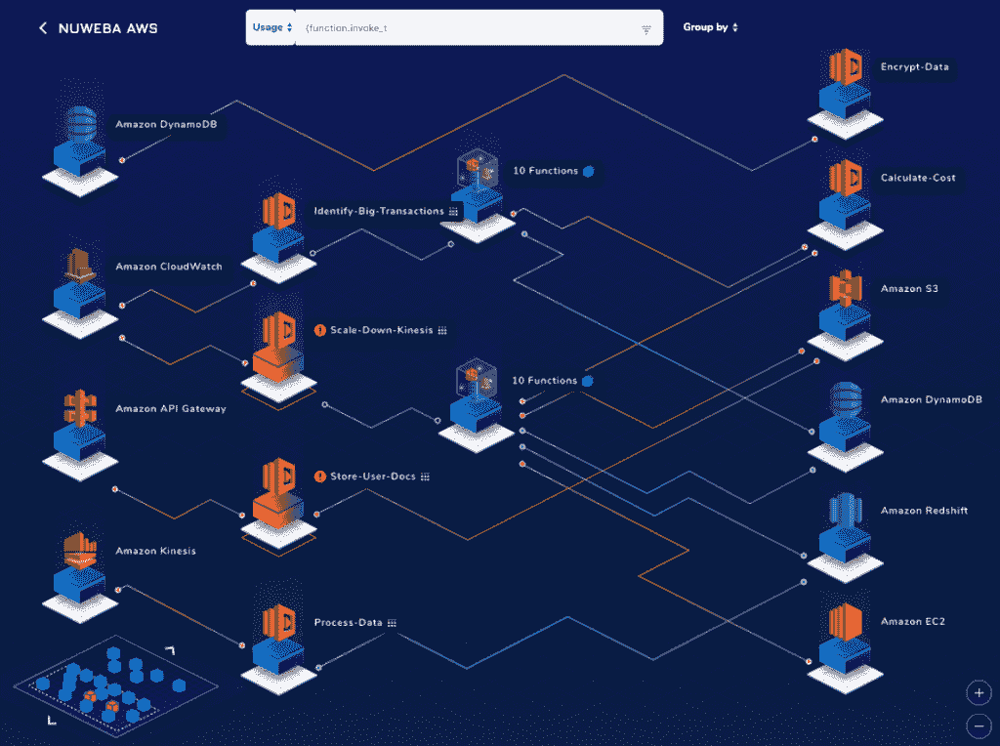

# Nuweba 旨在为无服务器带来速度、安全性和可见性

> 原文：<https://thenewstack.io/nuweba-aims-to-bring-speed-security-and-visibility-to-serverless/>

2017 年，我们写道，无服务器的采用与容器相当。一年后，头条新闻继续呼应这种情绪，称无服务器正在以比预期更快的速度被[采用](https://thenewstack.io/why-serverless-is-being-adopted-at-a-faster-rate-than-expected/)，现在，在 2019 年的前几个月，对未来一年的预测预示着无服务器的持续势头。

据 [Nuweba](https://www.nuweba.com/) 首席执行官 [Ido Neeman](https://il.linkedin.com/in/ido-neeman) 称，然而，有三个关键因素阻碍了无服务器的广泛采用——这三个因素该公司将于本周秘密推出以解决。

尼曼在一份公司声明中说:“我们相信，无服务器可以也应该是几乎任何用例的最佳架构，包括面向用户的、关键任务的或时间敏感的应用程序。”。“当前的无服务器平台速度不够快，不能保护应用层，并且几乎没有可见性。这将导致糟糕的性能，并使您最有价值的资产易受攻击。我们知道我们可以做得更好。这就是我们建造 Nuweba 的原因。”

该公司表示，它已经“从内核重新设计了无服务器，解决了所有三个问题，”尽管尼曼承认，虽然可见性是无服务器成功的核心，但他认为主要的障碍是速度和安全性。

“我感觉性能(速度和规模)是 serverless 最大的问题。不是能见度。可见性总是非常重要，但性能问题阻碍了无服务器成为主流技术和核心功能的首选架构，”Neeman 在一封电子邮件中写道。“今天，由于性能差(调用延迟)和缺乏应用层安全性(运行时保护)，任务关键型和面向用户的应用程序被认为“不太适合”无服务器。想象一下，一家拼车公司需要近乎实时地处理请求，并将结果发送给乘客和司机。当前无服务器平台中的调用延迟不允许它们提供合理的 UX。有了 Nuweba，这个用例可以(也将会)构建成无服务器的。”

随着 Nuweba 的测试版发布，FaaS 平台将提供从 AWS Lambda、Azure Functions、IBM Cloud Functions 和 Google Cloud Functions 的一键式迁移，并声称提供 10 倍的速度提升，调用延迟为 8-40 毫秒，无需容器重用。目前，Nuweba 还提供了对 Node.js、Go、Python、.NET，Ruby 和 Java。

Nuweba 还提供自动配置的监控和自我生成的安全策略，安全是创始团队的固有领域和重点，此前“曾在以色列国防军的精英技术部门工作，领导网络安全行动。”在他的电子邮件中，Neeman 概述了集成到 Nuweba 平台的六个不同的安全层，包括不重用容器，防止内核级的远程代码执行，检查网络流量，在功能容器外的“凭证库”中保持机密，令牌和身份访问管理(IAM)角色，以及用“功能漏洞防火墙”防止 XSS，SQLI，SSRF 和其他攻击尼曼说，第六层仍在生产中，将提供“对整个应用程序流的实时分析”的异常检测

Nuweba 还宣布，它从 stealth 中脱颖而出的同时，还获得了一轮 480 万美元的种子资金，由 Magma Partners 和 T2 的 Target Global 以及其他投资者牵头，Magma Partners 的管理合伙人莫迪·罗森(Modi Rosen)称 Nuweba 是“一个控制无服务器应用程序的解决方案，同时仍然享受抽象的好处”和“一个无与伦比的平台”

<svg xmlns:xlink="http://www.w3.org/1999/xlink" viewBox="0 0 68 31" version="1.1"><title>Group</title> <desc>Created with Sketch.</desc></svg>