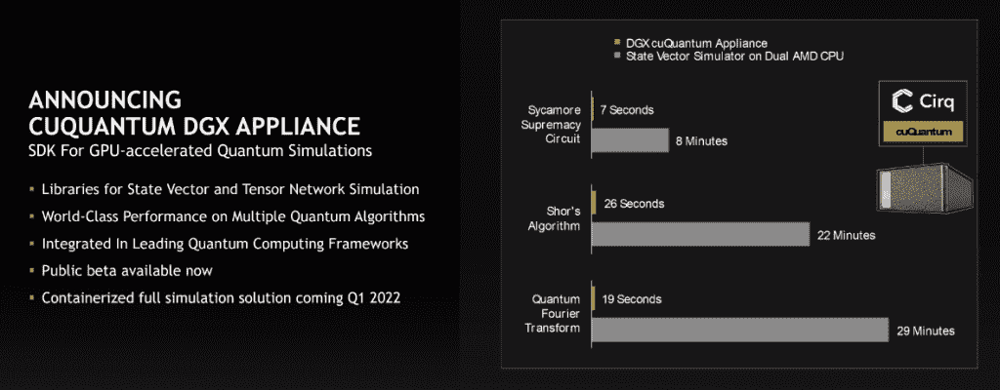
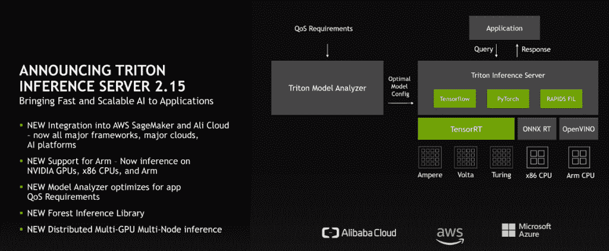

# 英伟达:人工智能可以促进虚拟现实和量子计算中的模拟

> 原文：<https://thenewstack.io/nvidia-ai-can-power-simulation-performance/>

十年前，英伟达首席执行官[黄仁勋](https://www.linkedin.com/in/jenhsunhuang/)表示，该公司正在全力以赴开发[人工智能](https://thenewstack.io/what-is-real-artificial-intelligence/) (AI)，称这项技术将成为未来计算和商业的基础。

从那以后，Nvidia 官员一直在稳步建立一个平台，使人工智能能够在广泛的范围内使用，并使其广泛适用于开发人员和企业。在本周的 [GTC 会议](https://www.nvidia.com/gtc/)上，该公司继续这一稳步前进的步伐，展示其产品将如何使人工智能应用于从[机器人](https://thenewstack.io/robots-learn-faster-with-quantum-technology/)和化身到虚拟世界、[供应链](https://thenewstack.io/sigstore-code-signing-for-software-supply-chain-security/)和新兴领域[量子计算](https://thenewstack.io/algorithm-speeds-monte-carlo-predictions-on-quantum-computers/)的方方面面。

“人工智能是计算科学的新元素，”英伟达特斯拉数据中心业务副总裁兼总经理伊恩·巴克在新闻发布会上说。“我们可以应用人工智能技术，在某些情况下，耦合或替换模拟的某些方面，以实现更高水平的性能，并解决以前由于他们试图解决的规模的计算复杂性而无法解决的问题。”

巴克说[人工智能](https://thenewstack.io/nvidia-vmware-push-ai-out-to-the-enterprise/)和人工智能支持的模拟“在 10 年内实现了百万倍的改善，我们非常兴奋研究社区不仅利用了加速计算——利用了纵向和横向数据中心计算的可能规模——还利用了人工智能来实现模拟性能的百万倍改善。”

## **大型语言模型和物理学**

在人工智能软件领域，英伟达在展会上推出了 ReOpt，这是一种旨在帮助组织更有效地将产品从工厂转移到家庭和企业的产品。ReOpt 将 Nvidia 用于数据科学和分析的 RAPIDS 软件库套件与本地启发式算法和禁忌搜索等元启发式算法相结合。

Nvidia 还推出了 module，这是一个使用数字双胞胎(系统的数字复制)创建物理机器学习模型的框架，以及一个用于数据中心的零信任网络安全平台，该平台汇集了 Nividia 的 Bluefield 数字处理单元(DPUs)、DOCA 软件开发工具包(SDK)和基于人工智能的网络安全框架 Morpheus。该平台利用 GPU 加速计算和深度学习来检测威胁，并将应用程序与基础架构隔离开来。

此外，该公司正在为企业提供开发大型语言模型(LLM)的工具，这些工具可用于创建聊天机器人和个人助理等人工智能应用程序，这些应用程序可以理解语言的细微差别，使他们能够执行翻译语言、总结文档和编写计算机程序等任务。

英伟达的 NeMo 威震天框架旨在训练语言模型，这些模型带有数万亿个参数。威震天 530B 是一个庞大的语言模型，拥有 5300 亿个参数，Nvidia 官员上个月首次概述了这一模型。该框架还利用了英伟达的 Triton 推理服务，该服务现在带有[多 GPU](https://thenewstack.io/tutorial-deploy-the-nvidia-gpu-operator-on-kubernetes-based-on-containerd-runtime/) 和多模式分布式机器学习推理功能，并与英伟达的 DGX 人工智能系统配合使用。

## **增强型 Triton 推理服务器**

Nvidia 的 Triton 推理服务器的新版本 2.15 版支持 Arm 架构，增加了它已经支持的 x86 芯片和 Nvidia GPUs 的列表。它还与[亚马逊 Web 服务](https://aws.amazon.com/?utm_content=inline-mention) ' (AWS) [SageMaker](https://thenewstack.io/train-and-deploy-machine-models-with-amazon-sagemaker-autopilot/) 机器学习平台集成，并包括新的模型分析器、新的森林推理库以及对多 GPU 和多节点推理工作负载的支持。

“随着这些模型呈指数级增长，特别是在新的用例中，它们通常变得太大，以至于无法在单个 CPU 甚至单个服务器上运行，”Buck 说。“然而，这些大型模型的需求和机会需要实时交付。…新版本的 Triton 实际上支持分布式推理。我们采用该模型，并将其拆分到多个 GPU 和多个服务器上，以优化计算，为这些难以置信的大型模型提供尽可能最快的性能。”

NeMo Megatron、Modulus 和 Morpheus 是 65 个更新和新的 SDK 之一，其中包括库、代码样本和指南，开发人员和数据科学家使用这些 SDK 来解决各种人工智能驱动的计算工作。

## **关注量子**

在新的 SDK 中有 cuQuantum，这是 Nvidia 宣布的在蓬勃发展的[量子计算空间](https://thenewstack.io/a-quantum-challenge-building-a-skilled-workforce/)中利用人工智能的一系列举措之一。CuQuantum 旨在实现加速量子模拟，是 Nvidia 进入量子计算领域的一系列步骤之一。英伟达的巴克说，将量子空间的物理学应用于计算机算法是一个复杂的问题。

他说，研究人员“基本上是试图将传统的计算机科学映射到量子空间的波动方程，这样正确的答案会加强这些波动，错误的答案会抵消它们”。“我们看到，来自世界各地研究小组的量子位(量子位)每年都在翻倍，这些研究小组正在构建这些物理系统。我们预计，为了建造一台可以解决实际问题的可用量子计算机，我们将需要大约 100 万到 1000 万量子位来建造一台容错量子计算机。”

巴克说，这将在未来十年内实现，并补充说，“与此同时，英伟达可以发挥作用，帮助世界上的研究人员找出如何使用这些新的量子计算机，并提出新的算法，将波动方程映射到计算机科学。”

## **库进入测试版**

cuQuantum 中的第一个库是 cuStateVec，这是一个用于状态向量模拟方法的加速器，可以扩展到几十个量子位，现在处于公开测试阶段。下一个库 cuTensorNet 是另一个使用张量网络方法的加速器，可以在近期算法上处理多达数千个量子位。下个月将进入测试阶段。

Nvidia 还推出了 DGX 量子计算设备，这是一个 DGX A100 系统，预装了 cuQuantum 和其他框架，以帮助组织确定如何将量子计算应用到他们的工作中。

在英伟达 DGX SuperPod 上运行 cuQuantum 一种针对[人工智能和高性能计算(HPC)工作负载的数据中心解决方案](https://thenewstack.io/nvidia-gpus-nudge-hpe-supercomputer-into-the-exascale/)——该公司创建了一种用于解决 MaxCut 问题的量子算法的大规模模拟，这是一种当前计算机无法有效解决的优化挑战。MaxCut 算法用于设计大型计算机网络，在量子空间中，它可以用来展示使用量子计算机的优势。

使用英伟达塞勒涅内部超级计算机上的 cuTensorNet 库，并利用 GPU 模拟 1688 个量子位来解决 MaxCut 问题，英伟达能够绘制 3375 个顶点，这比之前最大的量子模拟多了 8 倍。据该公司称，它也很准确，击中了 96%的最著名的答案。

<svg xmlns:xlink="http://www.w3.org/1999/xlink" viewBox="0 0 68 31" version="1.1"><title>Group</title> <desc>Created with Sketch.</desc></svg>