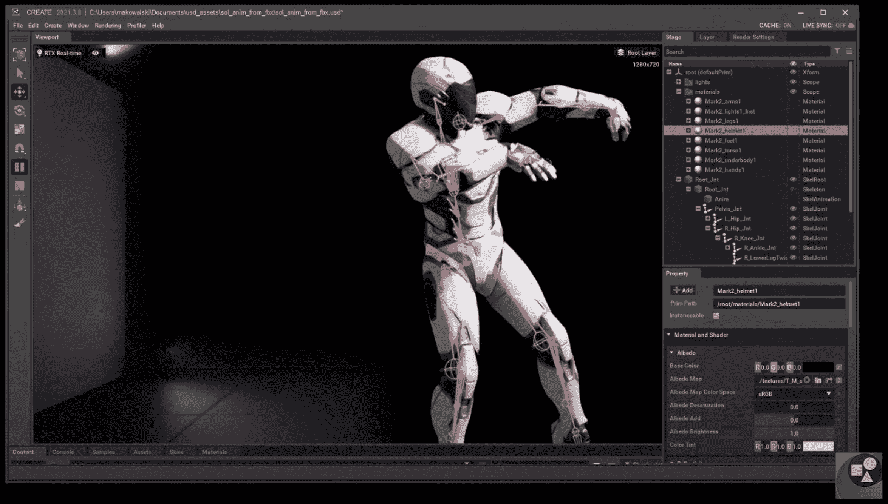
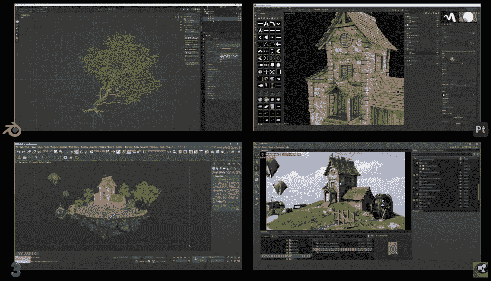

# 英伟达宣布将 Omniverse 扩展到消费者互联网

> 原文：<https://thenewstack.io/nvidia-announces-expansion-of-omniverse-to-consumer-internet/>

在上周的 CES 上，Nvidia 宣布其元宇宙平台 Omniverse 已经结束测试，将对个人免费开放。当我去年八月写关于 Omniverse 的文章时，它被定位为一个帮助设计和制造公司创造“数字双胞胎”的企业工具。但是当脸书在 10 月下旬转向元宇宙(并将其名称改为 Meta)时，Nvidia[迅速调整了其对 Omniverse 的定位](https://blogs.nvidia.com/blog/2021/11/09/expanded-omniverse-ecosystem/)，并暗示它将很快成为一个消费者平台。

好吧，现在这是一个现实。Omniverse 已经正式成为消费者互联网上虚拟世界的内容创建平台。英伟达正在欢迎“数百万个人创造者和艺术家”加入其平台，为下一代互联网而努力。(企业用例并没有消失，但是在这次发布中它们是非常重要的背景。)

## 别提那个 M 字

 [理查德·麦克马努斯

Richard 是 New Stack 的高级编辑，每周撰写一篇关于 web 和应用程序开发趋势的专栏文章。此前，他在 2003 年创立了读写网，并将其发展成为世界上最有影响力的博客之一。在 Twitter @ricmac 上关注他。](https://twitter.com/ricmac) 

基于脸书早期支点的引力，Nvidia 几乎肯定已经将 Omniverse 转变为一个消费者平台，但这并不意味着 Nvidia 完全接受 Meta 的一套可互操作的竞争虚拟世界的愿景。在一次媒体预发布会上，[英伟达 Omniverse 开发平台副总裁理查德·蔡秋凤](https://twitter.com/richardkerris)故意避免使用“元宇宙”这个词——他得到的最接近的说法是害羞地提到围绕“M”这个词的议论

也许英伟达不想把下一代互联网的命名权拱手让给 Meta。不管怎样，显而易见，Nvidia 正在把它的马车拴在几乎与未来网络相同的愿景上；一个由一组可互操作的虚拟世界组成。但是，尽管 Meta 将自己视为未来虚拟世界之一——它无疑有成为最大虚拟世界的雄心——Nvidia 正在寻求成为虚拟世界创造者的主要开发平台之一。

关于这些即将到来的虚拟世界将如何构建，Nvidia 和 Meta 之间有着明显的哲学差异。在 CES 公告中，Nvidia 将新兴的 3D 世界比作万维网——互联网的主要开放平台。这与 Meta 的方法不同，Meta 认为“元宇宙”是移动互联网的下一个版本。这是一个微妙但重要的区别，因为移动互联网不是一个单一的开放平台；相反，它是 iOS 和 Android 的双头垄断(其中一个是专有平台，另一个基本上由谷歌控制)。

在宣布公开发布的博客文章[中，蔡秋凤写道，创作者“是将使用 Omniverse 的工具来构建和协作下一代网络所需的大量内容的人。”在一次媒体吹风会上，蔡秋凤证实，他所说的“下一代网络”指的是互联的虚拟世界。](https://blogs.nvidia.com/blog/2022/01/04/omniverse-available-free-to-creators/)

“就像互联网让位于万维网一样，”他说，“一个相互连接的、一致的环境，人们可以在这个环境中做生意、交流、娱乐等。——所有这些都是因为底层管道通过 HTML 变得一致——我们相信，同样的事情也会发生在这些互联的虚拟世界中。”

Omniverse Create，一个 3D 场景合成工具。

## 美元作为虚拟世界的 HTML

在英伟达看来，虚拟世界的一个关键部分将是美元。不，我不是指美国政府的货币。Omniverse 的所有内容都是建立在皮克斯的开源[通用场景描述](https://graphics.pixar.com/usd/release/intro.html)(美元)之上的，Nvidia 称之为“3D 世界的 HTML”实际上，该公司将 USD 描述为一种文件格式和“具有 API 的强大场景表示”

CES 公告的一部分是增加了对 Omniverse 生态系统的第三方支持，“由领先的 3D 市场和数字资产库提供。”例子包括 Shutterstock、CGTrader、Sketchfab 和 Twinbru 的 TurboSquid 所有这些公司都发布了基于 USD 格式的“数以千计的为创作者准备的 Omniverse 资产”。

这个想法是，创作者将能够在这些外部供应商的资产的帮助下拼凑 3D“场景”。蔡秋凤将此与音乐产业的运作方式相提并论，抽样如今已成为现代流行歌曲中的一种常见做法。

蔡秋凤还解释说，将现实世界的场景扫描到虚拟世界变得越来越容易，这在很大程度上要归功于苹果在其最新的[设备](https://developer.apple.com/documentation/realitykit)中添加了对美元扫描的内置支持。

“所以我们已经看到许多艺术家只是用它(苹果设备)来扫描环境，”他说，“创造美元，把它放入 Omniverse 并用它做事情。”

他补充说，英伟达将支持一系列不同的 3D 内容创作工具。

“我们一直在使用几乎所有主要的创造性 3D 工具——我们现在已经有了 Blender 支持，还有其他工具即将推出。”

四种不同的 3D 内容创建工具(Blender 位于左上角)。

根据蔡秋凤的说法，基于其对美元的支持，Omniverse 将成为“所有这些东西(3D 内容)将被存储的共同基础”他认为虚拟世界的内容会随着时间的推移而增长，“就像互联网一样”

应该注意的是，并不是虚拟世界行业的每个人都相信 USD 将是 HTML 的 3D 等价物。在 Register 的一份报告中，Epic Games 的高级产品经理肖恩·邓恩(Shawn Dunn)说，“美元有希望，但元宇宙是否会围绕这种格式建立数据足迹还有待观察。”另一位行业专家，来自西门子的 Mohsen Rezaya 说，USD 需要一个 JavaScript 库来使 web 应用程序变得可行。

## 巧妙的支点

我们正处于虚拟世界的早期，用 Meta 的行话来说就是“元宇宙”。我们甚至不知道虚拟版的脸书会是什么样子，也不知道 Meta 计划如何建造它。Nvidia 显然也有一些工作要做，以说服其他公司支持其作为虚拟世界 HTML 的 USD 愿景。新生的元宇宙产业还有许多其他开放平台可供选择。

尽管如此，向个人创作者开放 Omniverse 是 Nvidia 的一个明智之举。如果网络要变成元宇宙，那么人们需要工具来帮助他们为它创造内容。通过这一声明，Nvidia 很好地将自己定位为虚拟世界开发生态系统的早期领导者。

<svg xmlns:xlink="http://www.w3.org/1999/xlink" viewBox="0 0 68 31" version="1.1"><title>Group</title> <desc>Created with Sketch.</desc></svg>