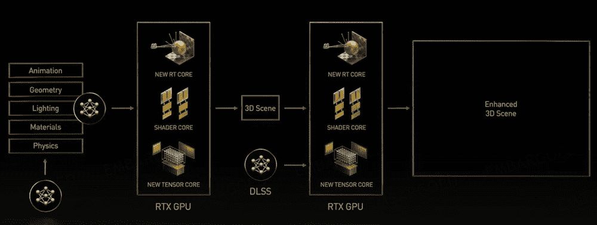
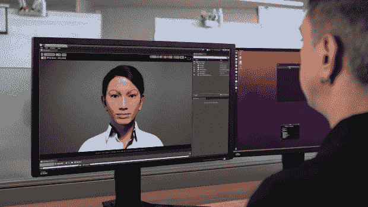

# 英伟达在 SIGGRAPH 发布新的人工智能元宇宙工具

> 原文：<https://thenewstack.io/nvidia-announces-new-ai-powered-metaverse-tools-at-siggraph/>

英伟达正在元宇宙上全力以赴。在今年的计算机图形年度会议 [SIGGRAPH](https://s2022.siggraph.org/) 上，Nvidia 宣布了一系列新的元宇宙计划。其中包括推出 Omniverse Avatar 云引擎(ACE)，这是一套“云原生人工智能模型和服务”，用于构建 3D 化身；新的神经图形 SDK，比如 NeuralVDB 计划发展通用场景描述(USD)，一种用于 3D 场景表示的开源文件格式；以及对其 [Omniverse 平台](https://thenewstack.io/nvidia-announces-expansion-of-omniverse-to-consumer-internet/)的各种其他更新。

Omniverse 和模拟技术副总裁 [Rev Lebaredian](https://www.linkedin.com/in/revlebaredian/) 在新闻发布会上说，今年的 SIGGRAPH“可能会被载入史册”。他认为 2022 年将是自 1993 年电影《侏罗纪公园》问世以来计算机图形行业最大的拐点。他补充说，万维网和英伟达都是在 1993 年推出的。

“我们所看到的是互联网新时代的开始，”勒巴里迪安继续说道。“通常被称为‘元宇宙’这是现有互联网的 3D 叠加——现有的二维网络——事实证明，推动这个互联网新时代所必需的基础技术是 SIGGRAPH 的人们几十年来一直在努力的事情。"

是的，的确，1993 年是计算和数字图形的一个巨大的转折点。但是元宇宙——在 2022 年还只是一个概念——能与网络的影响力相媲美吗？这很难说，因为到目前为止，我们只看到了“基础技术”(比如美元)的出现。目前还没有真正的“元宇宙”——只是有很多关于建造它的谈论。

Lebaredian 后来在简报中承认，Nvidia 是一家“工具公司”，因此开发元宇宙所需的工作将由其他人来完成。也就是说，它宣布的工具看起来很有前途。

## 神经图形

英伟达主要以其图形处理器(GPU)闻名，但支撑今天元宇宙大多数公告的是人工智能，或该公司称为“神经图形”

人工智能研究副总裁 Sanja Fidler 在简报中说,“图形确实在用人工智能重塑自己，导致了该领域的重大进步。

英伟达将神经图形定义为“一个将人工智能和图形交织在一起的新领域，以创建一个从数据中学习的加速图形管道。”下图显示了管道，Fidler 说它将用于“模拟和渲染动态虚拟世界”

Nvidia 神经图形管道(点击全屏图像)

开发人员可以通过各种神经图形 SDK 来访问这一功能，包括新发布的 NeuralVDB(行业标准 OpenVDB 的更新)和 Kaolin Wisp(旨在成为神经领域研究框架的 Pytorch 库)。

Fidler 解释说，3D 内容创作将是用户采用元宇宙的关键部分。“我们需要把东西放进虚拟世界，”她说，“我们将会有很多很多虚拟世界。也许我们每个人都想创建自己的虚拟世界，我们想让它们成为有趣、多样、现实的内容——或者甚至可能不那么现实，但却是有趣的内容。”

因此，这个想法是，神经图形将指导内容创作者为元宇宙创建“有趣的内容”。

“我们相信人工智能对于 3d 内容创作来说是存在的，特别是对元宇宙来说，”Fidler 说。“我们只是没有足够的专家来填充元宇宙所需的所有内容。”

一个示例应用程序是将扫描的 2D 摄影带入虚拟现实。虽然这已经成为可能，但 Fidler 说“对艺术家来说有点麻烦——他们必须使用许多不同的工具，而且速度相当慢。”她说，英伟达新的“神经重建”过程将它变成了“一个单一的统一框架”她提到了一个名为 [Instant NeRF](https://blogs.nvidia.com/blog/2022/03/25/instant-nerf-research-3d-ai/) 的工具，它正是这样做的(NeRF 代表“神经辐射场”)。

Fidler 甚至暗示，神经图形将使社交媒体用户(不仅仅是艺术家)更容易基于照片创建 3D 内容。当然，如果元宇宙像网络在 21 世纪初那样起飞，那么普通用户将需要“写”和“读”3D 内容的能力。

## 阿凡达云引擎

也许最有趣的工具是 [Omniverse Avatar 云引擎](https://developer.nvidia.com/nvidia-omniverse-platform/avatar) (ACE)，这是一种新的人工智能辅助的 3D 头像生成器，将于“明年年初”推出，包括“所有主要的云服务”

如果普通人打算像今天使用网络一样使用元宇宙，他们将需要简单的方法来创建个性化的头像。不仅如此，英伟达声称 ACE 将能够创造自主的“虚拟助手和数字人类”。

“ACE 结合了许多复杂的人工智能技术，允许开发人员创建能够通过图灵测试的数字助理，”Lebaredian 说。

头像云引擎(ACE)

ACE 建立在英伟达的[统一计算框架](https://developer.nvidia.com/ucf)之上，该框架将于“2022 年末”向开发者开放

勒巴里迪安补充说，ACE 是“图形引擎不可知的”，这意味着它可以“连接到几乎任何你选择的引擎来代表化身。”

## 元宇宙的现代工具

除了神经图形和 ACE，Nividia 还在 SIGGRAPH 发布了新版本的 Omniverse，首席执行官黄仁勋将其描述为“一个美元平台，一个构建元宇宙应用程序的工具包，以及一个运行虚拟世界的计算引擎。”

有多少 3D 艺术家和开发者——更不用说消费者了——使用英伟达最新的 3D 图形和人工智能工具系列还有待观察。但是正如网络需要图形工具公司(如 Adobe 和 Macromedia)在 20 世纪 90 年代崛起一样，元宇宙也需要工具供应商。英伟达正试图接过这个衣钵。

<svg xmlns:xlink="http://www.w3.org/1999/xlink" viewBox="0 0 68 31" version="1.1"><title>Group</title> <desc>Created with Sketch.</desc></svg>