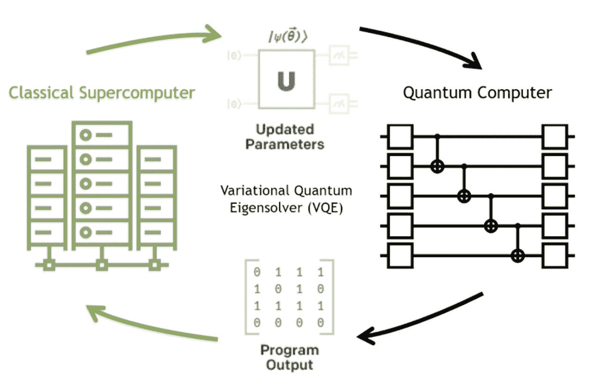
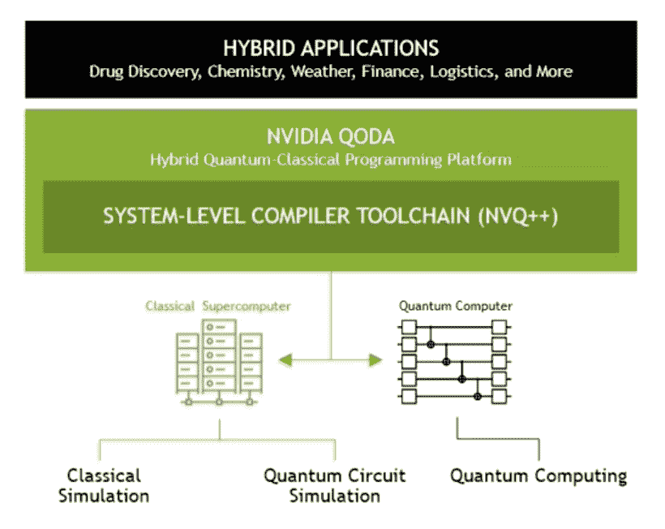
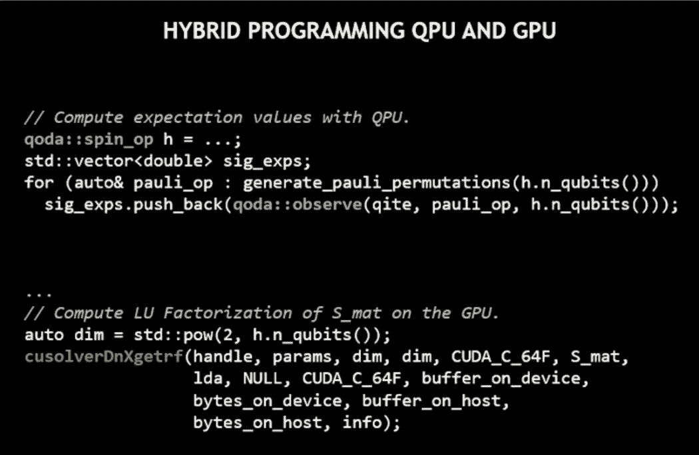

# Nvidia 宣布推出混合量子应用平台 QODA

> 原文：<https://thenewstack.io/nvidia-announces-qoda-a-platform-for-hybrid-quantum-apps/>

Nvidia 今天宣布了一项名为*量子优化设备架构*，或 [QODA](https://developer.nvidia.com/qoda) 的新服务。Nvidia 声称它是“世界上第一个混合量子经典计算平台。”为了了解更多信息，我采访了英伟达高性能计算和量子计算产品总监[蒂姆·科斯塔](https://www.linkedin.com/in/timothy-costa-808aa476/)。

与大多数领先的互联网公司一样，英伟达已经在新兴的量子计算领域站稳了脚跟。去年它发布了 [cuQuantum](https://developer.nvidia.com/cuquantum-sdk) ，这是一个软件开发包(SDK)，用于加速 GPU 上的量子作业。SDK 集成了现有的量子电路仿真框架，如 IBM 的 Qiskit 和 Google 的 Cirq。

QODA 本质上是量子计算机的高级语言。Nvidia 本身并不制造量子计算硬件，所以 QODA“就像一个软件桥梁”，根据 Costa 的博客文章。“通过函数调用，开发人员可以选择在 GPU 或量子处理器上运行他们的量子作业，”他写道。

除了 QODA，Nvidia 还发布了一个编译器(NVQ++ ),将作为开源软件提供。

英伟达对混合量子计算的看法。

## 混合应用

如上所述，Nvidia 声称 QODA 是“世界上第一个混合量子经典计算平台。”然而，混合解决方案——将经典计算与量子计算相结合——已经成为量子计算行业的标准。所以我问 Costa QODA 和现有的框架有什么不同，比如 IBM 的 Qiskit 或者 Amazon Bracket？

“从量子计算机需要由经典资源运行的意义上来说，所有的质量控制工作都是混合的，”他回答道。“我们在这里宣布的是一个能够开发真正混合应用的平台，这意味着应用可以利用最好的经典资源和最好的量子计算资源来完成它们最适合的任务。这种类型的开发需要量子计算之外的科学开发人员熟悉的编程环境，并与当今常用的编程模型和软件堆栈互操作。”

在一次媒体吹风会上，科斯塔更具体地提到了英伟达的 GPU。他说，混合应用程序将“利用经典 GPU 加速的超级计算来处理大部分应用程序，而关键内核则由量子资源加速。”

英伟达量子计算堆栈。

但是这和其他量子计算框架有什么不同呢？举个突出的例子， [Qiskit](https://qiskit.org/) 是一个“在脉冲、电路和应用模块层面”与量子计算机协同工作的 SDK(引自其主页)。所以是纯量子的。科斯塔的建议是，QODA 使开发人员能够选择应用程序的哪些部分在经典计算机上运行，哪些部分在外部量子计算机上运行。

我问 Costa，可以使用 QODA 构建什么样的应用程序？

“我们设想算法和应用程序能够从 GPU 和 QPU 处理中受益，”他回答道。这里的“QPU”指的是量子处理单元，指的是量子计算机中的 CPU。虽然 Nvidia 本身没有自己的 qpu，但 QODA 将支持所有外部 qpu。正如 Costa 在简报中指出的，QODA 是“QPU 不可知论者”

“QODA 将实现这些计算加速器的高效互操作性，”科斯塔告诉我。“可能需要经典并行处理和量子协同处理的领域包括机器学习、金融投资组合优化以及新型量子化学算法和框架。

## cuQuantum 及其与 QODA 的拟合

我问 Costa，目前使用 cuQuantum 的开发者现在会选择 QODA 作为他们的 SDK，还是会坚持使用 Qiskit 和 PennyLane 这样的现有 SDK？

“cuQuantum 是一个 SDK，用于任何 QC 框架中的加速量子电路模拟，包括 Cirq、Qiskit 和 PennyLane，”他说。“[但是]当 QODA 用于 Nvidia GPUs 的模拟量子资源时，cuQuantum 也可以作为 QODA 的后端。”

他接着说，QODA 解决了一个不同于 Cirq、Qiskit 和 PennyLane 等框架的问题，“通过让科学开发人员直接将量子计算加速集成到他们现有的应用程序中。”因此，这里的关键区别是 Nvidia 通过其 GPU 处理器而闻名的“加速”。根据 Nvidia 的说法，这就是为什么开发人员可能会选择 QODA。

“像 Cirq、Qiskit 和 PennyLane 这样的框架对于量子算法的发展仍然至关重要，”Costa 补充道。

使用 QODA 编码的例子。

## 结论

QODA 将在今年剩下的时间里进行 beta 测试，目的是在明年年初开放 SDK 供公众使用。

显然，Nvidia 的目标是通过 QODA 将其 GPU 应用加速策略带入量子计算领域。然而，我不确定它对混合量子经典计算的定义是否是与生态系统中其他大玩家(如 IBM 和谷歌)不同的*。无论如何，QODA 是[对量子计算产业的又一次推动——特别是帮助开发者使用这项技术。](https://thenewstack.io/classiq-brings-abstraction-layer-to-quantum-software-stack/)*

<svg xmlns:xlink="http://www.w3.org/1999/xlink" viewBox="0 0 68 31" version="1.1"><title>Group</title> <desc>Created with Sketch.</desc></svg>