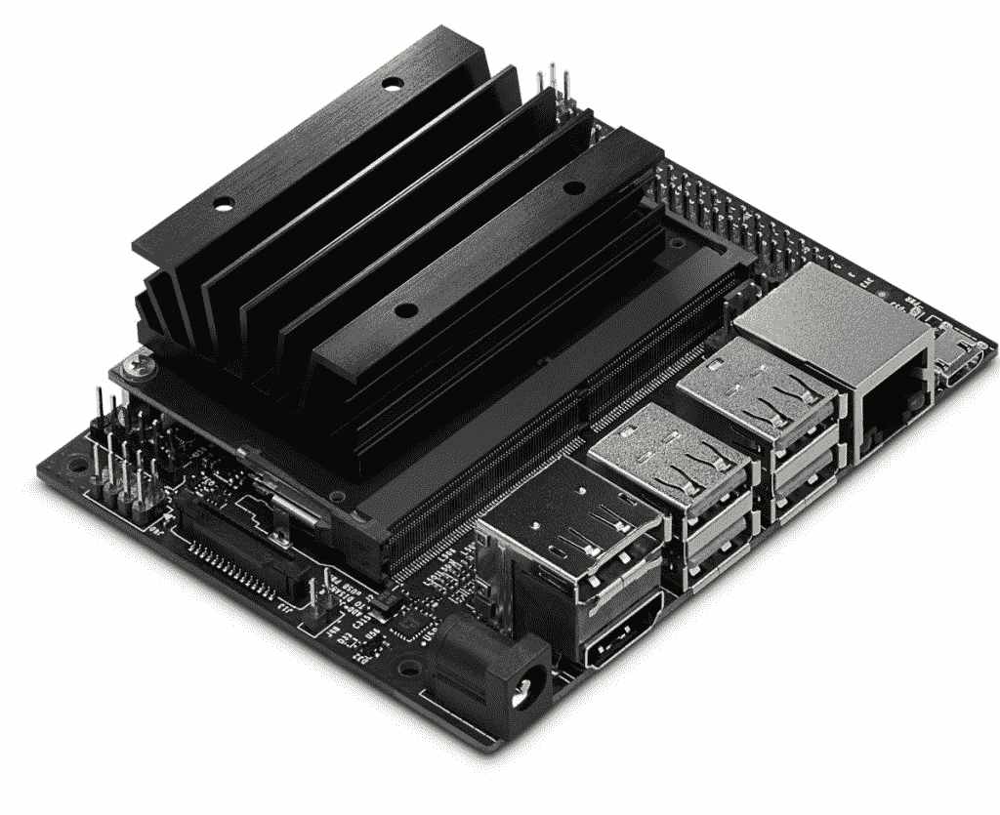
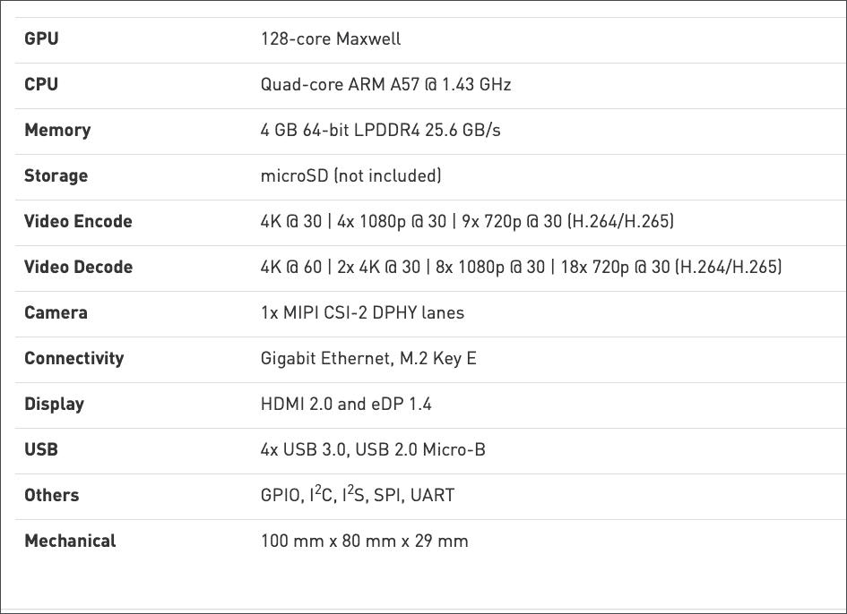

# NVIDIA 通过 Jetson Nano 将经济实惠的 GPU 推向边缘

> 原文：<https://thenewstack.io/nvidia-brings-affordable-gpu-to-the-edge-with-jetson-nano/>

Jetson Nano 是 NVIDIA Jetson 开发套件组合的最新成员。由 Jetson Nano 模块驱动的价值 99 美元的开发套件,该模块功能强大。它配备了 Maxwell GPU、四核 ARM 处理器和 4GB RAM。

说到机器学习加速器，英伟达是细分市场的领导者。几乎每个公共云提供商都提供由 NVIDIA Tesla K80、P100 和 T4 GPU 支持的虚拟机(VM)基础设施。这些虚拟机带有预配置的软件，如 NVIDIA 驱动程序、CUDA 工具包、cuDNN 库和支持 GPU 的深度学习框架。开发人员和数据科学家提供这些虚拟机来训练复杂的神经网络。

【T2

Jetson Nano developer kit 的独特之处在于它提供了与数据中心同类产品兼容的 NVIDIA GPU。这是一个基于 AArch64 架构的功能较弱的平台，而大多数服务器和虚拟机都基于 X86。

Jetson Nano 旨在部署在边缘，运行充分训练的深度学习模型，利用本地 GPU 加速。工作流包括使用公共云来训练模型，在 NVIDIA GPU 上优化模型以进行推理，并在边缘部署它。

NVIDIA 的推理引擎基于[tensort](https://docs.nvidia.com/deeplearning/sdk/tensorrt-developer-guide/index.html)，这是一种针对前向传播进行优化的运行时，前向传播是一种用于加速推理的技术。TensorFlow、PyTorch 和 Caffe2 模型可以转换为 TensorRT，以利用 GPU 的推理能力。

Jetson Nano developer kit 使在边缘开发、测试、调试和部署 TensorRT 模块变得容易。它作为载板对 GPU 模块进行编程。为该套件提供动力的 Jetson 模块可以轻松拆卸并部署到生产环境中。

该开发套件为社区带来了物联网和人工智能开发的最佳成果。它具有兼容 Raspberry Pi 的 GPIO 引脚排列，可以支持 Pi 生态系统中的各种屏蔽和帽子。大部分与 Raspberry Pi GPIO 对话的 Python 和 Node.js 程序都可以很容易地移植到 Jetson Nano 上。

Jetson Nano 通过相机串行接口(CSI)支持标准 USB 相机以及 Raspberry Pi 相机模块。

让我们仔细看看杰特森纳米的硬件规格。

操作系统和软件被打包成一个镜像，可以下载并闪存到 SD 卡中，就像 Raspbian 操作系统一样。NVIDIA 将这个平台称为 [JetPack SDK](https://docs.nvidia.com/jetson/jetpack/introduction/index.html) ，它包括一种 Ubuntu 风格、驱动程序、运行时、工具和框架，用于开发和部署神经网络模型。

JetPack SDK 的最新版本是 4.2，其中包括 LTS 内核 4.9 支持，新的 Jetson。GPIO Python 库，TRT Python API 支持，以及 GStreamer 框架的一个新的加速渲染器插件。开发人员只要用 JetPack 4.2 映像启动开发工具包就可以开始使用了。

JetPack SDK 4.2 构建在 Ubuntu 18.04 之上，内核有所修改。它包括 TensorRT，这是一个高性能的深度学习推理运行时，用于图像分类，分割和对象检测神经网络。TensorRT 加速了深度学习推理，并减少了卷积和去卷积神经网络的运行时内存占用。

它还包括 [CUDA 工具包](https://developer.nvidia.com/cuda-toolkit)，为构建 GPU 加速应用的 C 和 C++开发人员提供了一个全面的开发环境。该工具包附带了用于 NVIDIA GPUs 的编译器、数学库以及用于调试和优化应用性能的工具。CUDA 深度神经网络， [cuDNN](https://developer.nvidia.com/cudnn) ，构建于 CUDA 之上的库，为深度学习框架提供高性能原语。它包括对卷积、激活函数和张量变换的支持。

JetPack 还配有 Docker 引擎。但遗憾的是，它不支持 [NVIDIA-Docker](/primer-nvidia-docker-containers-meet-gpus/) ，Docker 的一个分支，感知 GPU。但是 JetPack 上的 Docker 能够运行基于 AArch64 架构为 ARM 构建的映像。通过一些调整和附加参数，容器将能够与底层 GPU 对话。这种变通方法使得运行主流边缘计算平台成为可能。AWS 物联网 Greengrass 官方支持 Jetson 系列产品，而微软尚未将 Azure 物联网 Edge 扩展到 ARM64 和 AArch64。

开始使用 Jetson Nano 最简单的方法是用 [NVIDIA DIGITS](https://thenewstack.io/nvidia-digits-an-easy-way-to-get-started-with-deep-learning/) 训练模型，将模型转换为 TensorRT，并在边缘部署它们。关于使用 NVIDIA DIGITS 设置、配置和训练模型的详细演练，请参考我以前的[教程](/train-a-convolutional-neural-network-with-nvidia-digits-and-caffe/)。

边缘计算市场正在快速增长。随着英伟达、英特尔、谷歌、高通投资定制人工智能硬件加速器，部署深度学习模型进行推理已经成为边缘计算的关键驱动力。这一趋势与 AWS、微软、谷歌以及 FogHorn、IoTium 和 Swim 等初创公司的软件平台相结合，边缘计算正在转变为一个价值数百万美元的机会。

在我即将发布的一个教程中，我将演示如何在 Jetson Nano 上优化和部署在公共云中训练的深度学习模型。敬请关注。

*贾纳基拉姆·MSV 的网络研讨会系列“机器智能和现代基础设施(MI2)”提供了涵盖前沿技术的信息丰富、见解深刻的会议。请在 [http://mi2.live](http://mi2.live) 注册参加即将举行的 MI2 网络研讨会。*

<svg xmlns:xlink="http://www.w3.org/1999/xlink" viewBox="0 0 68 31" version="1.1"><title>Group</title> <desc>Created with Sketch.</desc></svg>