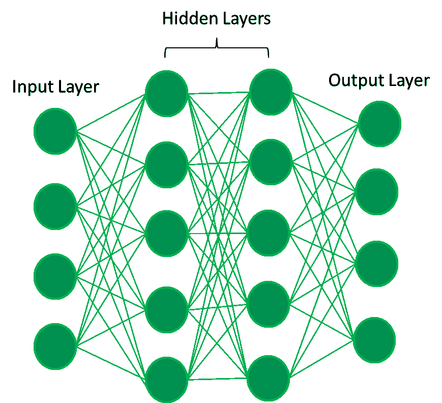
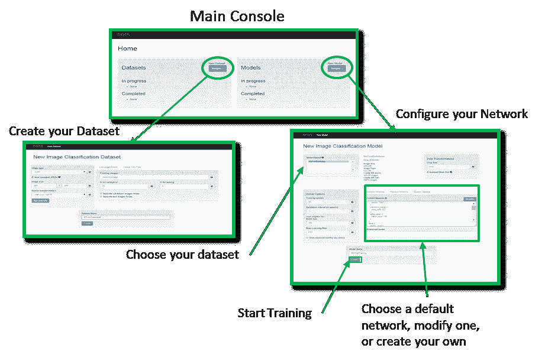
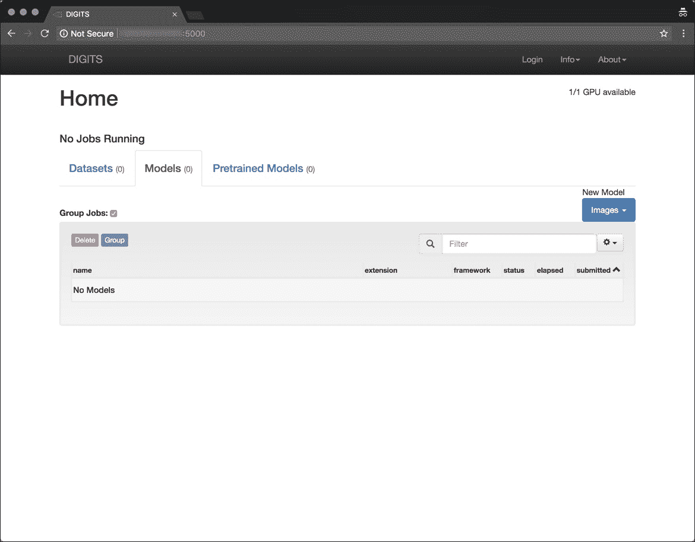

# Nvidia DIGITS -深度学习的简单入门方式

> 原文：<https://thenewstack.io/nvidia-digits-an-easy-way-to-get-started-with-deep-learning/>

深度神经网络(DNN)是机器学习的一个高级分支。与传统的机器学习不同，神经网络是围绕生物神经元建模的。每个神经网络都有多层神经元，它们协同工作来执行一项任务。



深度学习不同于传统的机器学习技术，它们可以从图像、视频或文本等数据中自动学习表示，而不需要引入手工编码的规则或人类领域知识。它们高度灵活的架构可以直接从原始数据中学习，当提供更多数据时，可以提高它们的预测准确性。

为自动驾驶汽车、癌症检测、智能语音助手和金融领域的欺诈检测提供动力的现代人工智能是由神经网络提供动力的。

尽管 DNNs 比传统的机器学习算法强大得多，但它们很难学习和实现。由神经元执行的复杂计算被委托给图形处理单元(GPU ),在 GPU 中利用多个内核来并行化计算。这种架构使得调试神经网络极其困难。

TensorFlow、Microsoft Cognitive Toolkit (CNTK)、Apache MXNet 和 PyTorch 等多个框架用于构建 DNNs。这些框架旨在利用底层 GPU 基础设施来执行更快的计算。

由于陡峭的学习曲线，开发人员经常发现很难开始使用 DNNs。在 DNNs 中，有不同的方法来处理图像、视频、语音、文本和时间序列数据。例如，卷积神经网络(CNN)用于分类图像。人脸检测、人脸识别、物体检测和视频分析采用了先进的 CNN 技术。自然语言处理(NLP)依靠递归神经网络(RNN)来执行高级文本分析。长短期记忆(LSTM)算法用于时间序列数据的预测分析。

不同的深度学习工具包是处理不同场景的首选。神经网络的复杂性与工具包的碎片化相结合，使得实现 DNNs 极其困难。

## NVIDIA DIGITS——深度学习框架的向导式前端

早在 2015 年，英伟达就推出了[深度学习 GPU 训练系统](https://developer.nvidia.com/digits) (DIGITS)，这是一款开发、训练和可视化深度神经网络的工具。它通过直观的基于浏览器的界面带来了深度学习的力量，使数据科学家和研究人员能够使用实时网络行为可视化为他们的数据设计 dnn。DIGITS 是一个在 [GitHub](https://github.com/NVIDIA/DIGITS) 上可用的开源软件。

目前，在版本 6 中，DIGITS 已经有了很大的进步。它现在可以使用 TensorFlow 交互式训练模型，并使用 TensorBoard 可视化架构。开发人员可以创建自定义插件来导入特殊的数据格式，如医学成像中使用的 DICOM。该平台带有基于 AlexNet、LeNet 和 GoogLeNet 的流行神经网络架构。最新版本具有预训练的 UNET 模型，用于医学图像的图像分割。

DIGITS 旨在通过抽象建立模型所涉及的各种步骤来简化深度学习任务。它也是 TensorFlow、Caffe 和 Torch 等流行框架的抽象。它利用 GPU 来并行化训练作业。你不能在没有 GPU 的机器上运行 Nvidia DIGITS。



来源:英伟达

DIGITS 界面包括用于 DNN 优化的工具。从导入数据集到拆分数据集进行训练和测试，以及训练模型，开发人员可以使用数字来构建端到端的神经网络。主控台列出了机器上现有的数据库和以前训练过的网络模型，以及正在进行的训练活动。用户可以跟踪对网络配置所做的调整，并通过改变参数(如偏差、神经激活函数、池窗口和层)来最大限度地提高准确性。

DIGITS 的一个优点是可以在同一个数据集上并行训练多个网络，或者在多个数据集上并行训练同一个网络。通过 GPU 选择选项，您可以选择用于训练每个数据集的 GPU，从而更容易使用您的硬件进行多任务处理。

还可以通过交互式仪表板来监控进度。当损失最小化，准确度达到合理水平时，你可以停止训练。DIGITS 保存每个时期的模型和超参数。训练完成后，您可以下载模型和权重来运行它进行推理。

### 安装和配置 Nvidia DIGITS

有三种方法可以开始使用 DIGITS——从源代码构建，启动基于云的 VM，或者运行 Docker 容器。

为了试验数字，你可以启动一个 EC2 实例、Azure VM 或由英伟达特斯拉 P100 或 K80 GPUs 支持的 GCE 实例。在 [AWS](https://aws.amazon.com/marketplace/pp/B076DHKCZJ) 和 [Azure](https://azure.microsoft.com/en-us/services/virtual-machines/data-science-virtual-machines/) marketplace 上都有预配置的虚拟机模板。你也可以在 [Paperspace](https://www.paperspace.com/) 发布一个 GPU Linux 盒子。

将数字作为容器运行是最简单、最便宜的选择。但是请记住，您只能在由 GPU 驱动的机器上运行。该映像运行在完全配置的 Ubuntu 机器上，该机器具有最新的 Nvidia GPU 驱动程序、CUDA 软件、cuDNN 工具包和 Nvidia-Docker 运行时。

最新的容器镜像可以从 [Nvidia GPU Cloud](https://www.nvidia.com/en-us/gpu-cloud/) (NGC)注册表中获取。以下一行命令将在您的机器上运行 DIGITS 容器。

```
$  nvidia-docker run  --name digits  -d  -p  5000:5000  nvcr.io/nvidia/digits

```


如果您想在容器中挂载一个主机目录，您可以添加一个卷

```
$  nvidia-docker run  --name digits  -d  -p  8888:5000  -v  data:/data:ro  -v  jobs:/workspace/jobs nvcr.io/nvidia/digits

```

一旦容器运行，您就可以访问端口 5000 上的 web 界面。



在下一篇文章中，我将向您介绍训练 CNN 并在只有 CPU 的本地机器上运行它进行推理的所有步骤。它包括从获取数据到执行预测的所有关键概念。敬请期待！

<svg xmlns:xlink="http://www.w3.org/1999/xlink" viewBox="0 0 68 31" version="1.1"><title>Group</title> <desc>Created with Sketch.</desc></svg>