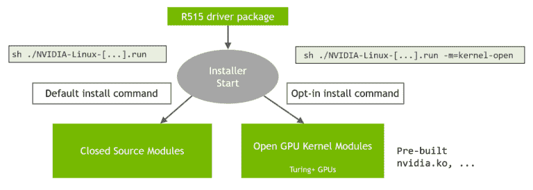

# Nvidia 做了意想不到的事情:开源 Linux 驱动程序

> 原文：<https://thenewstack.io/nvidia-does-the-unexpected-open-sources-gpu-drivers-for-linux/>

芯片制造商英伟达(Nvidia)在多年忽视开源操作系统的用户后，终于采取措施提高其 GPU 与 Linux 的兼容性。

Nvidia 已经为 Linux 开源了 GPU 内核模块，因此编码人员可以编写应用程序，以便在[公司的 GPU](https://github.com/NVIDIA/open-gpu-kernel-modules)上更有效地执行。

“Canonical 和 SUSE 可以立即将开放内核模块与 Ubuntu 和 SUSE Linux 企业发行版打包在一起，”Nvidia [在博客文章](https://developer.nvidia.com/blog/nvidia-releases-open-source-gpu-kernel-modules/)中说。

此次发布是 Nvidia 吸引开源社区的最新尝试。该公司还参与将跨 CPU、GPU 和 AI 加速器的代码并行执行的原生支持引入 C++ 23，这将接替当前的 C++ 20 标准。

## 开放源码

Nvidia 因没有使其 GPU 对 Linux 友好而面临许多批评。今年早些时候，来自 [Lapsus$](https://www.fbi.gov/wanted/seeking-info/lapsus) 的黑客入侵了英伟达的系统，该组织的要求之一是为 Linux 操作系统开源其 GPU 驱动程序。

软件开发人员也将能够利用开源驱动程序将驱动程序集成到定制的 Linux 版本中。Nvidia 也欢迎来自 Linux 社区的贡献，以改善驱动程序，该公司将审查。Nvidia 的目标是最终将驱动程序推向上游。

GPU 内核模块是开源的，拥有 GPL/MIT 双重许可。R515 版本驱动程序是一个 alpha 版本，将支持一些最近的 Nvidia GPUs，其中包括基于 2018 年发布的图灵架构的消费硬件，以及 2020 年发布的面向消费和专业 GPU 的 Ampere 架构。但这些驱动程序不适用于其基于 Hopper 架构的最新 GPU，这些 GPU 进行了专门的修改，包括针对较小数据集的低级浮点执行。

Nvidia GPUs 最初在游戏玩家中很有名，为企业[采用 AI 铺平了道路](https://thenewstack.io/category/machine-learning/)。该驱动程序包面向希望部署神经网络的企业，但也面向需要信息可视化的工程师和科学计算。

## 驱动程序包

驱动程序包还支持基于 OpenGL 和 Vulkan 的游戏特性，这些是为 Linux 操作系统编写大多数游戏的标准。英伟达的 GPU 仍然能够最好地处理 Windows 上的游戏，但驱动程序集将允许英伟达 GPU 更好地处理 Linux 游戏。驱动程序集支持 Vulkan 的多显示器和光线跟踪规范。

开源驱动程序可能是推动 CUDA 采用的一种方式，CUDA 是 Nvidia 的并行编程框架。Nvidia 的竞争对手 AMD 和 Intel 多年来一直在游戏和并行编程框架中向开源社区发布开源 GPU 驱动程序。但是英伟达主导了超级计算和人工智能硬件领域，而英特尔的 OneAPI 和 AMD 的 ROCm 并行编程框架还没有被广泛采用。

Nvidia 还给出一些暗示，未来版本的开源驱动程序将包括一些功能的挂钩，如片上功能，以保护其最新 Hopper GPUs 上的数据。

英伟达上个月聘请开源倡导者[盖·马丁](https://www.linkedin.com/in/guywmartin/)担任开源和标准总监，领导公司的开源工作。他之前是 OASIS 的执行董事，OASIS 是一个游说在公共和私人领域使用开源的组织。

<svg xmlns:xlink="http://www.w3.org/1999/xlink" viewBox="0 0 68 31" version="1.1"><title>Group</title> <desc>Created with Sketch.</desc></svg>