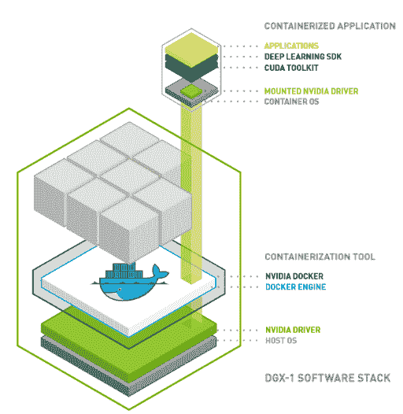
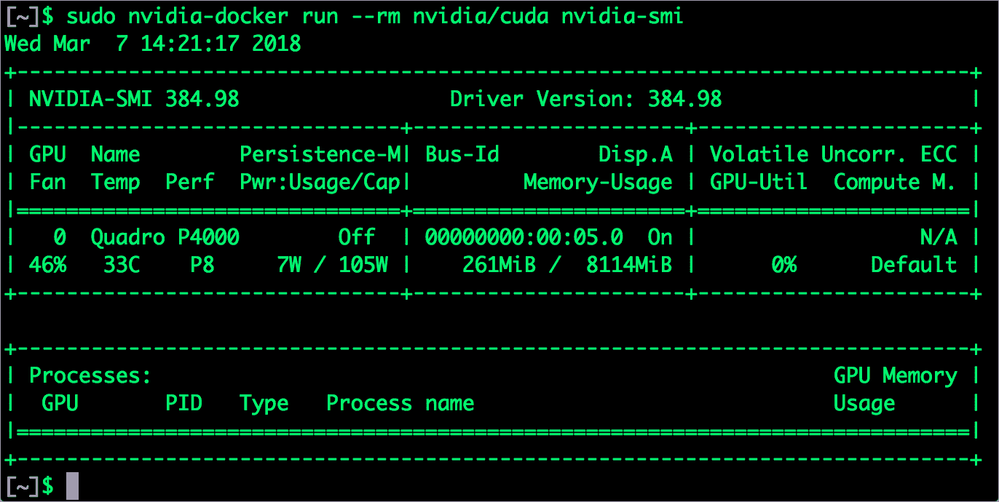
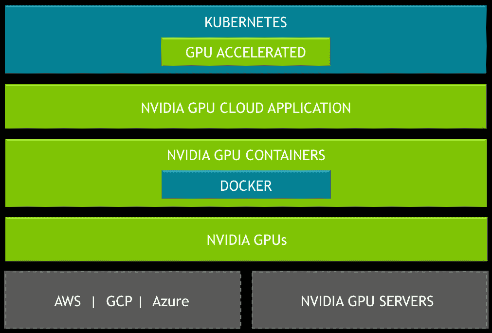
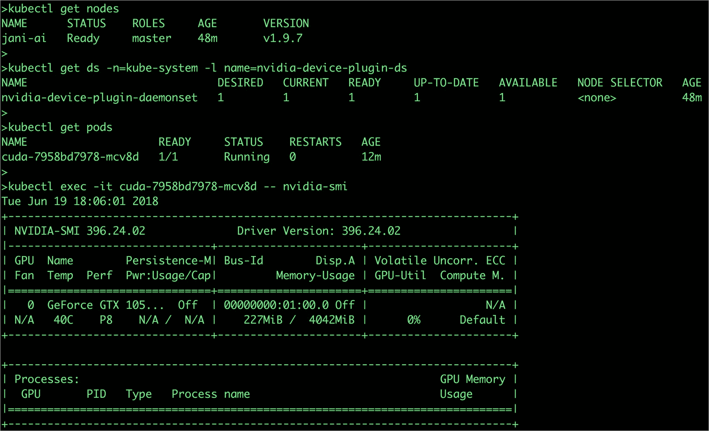
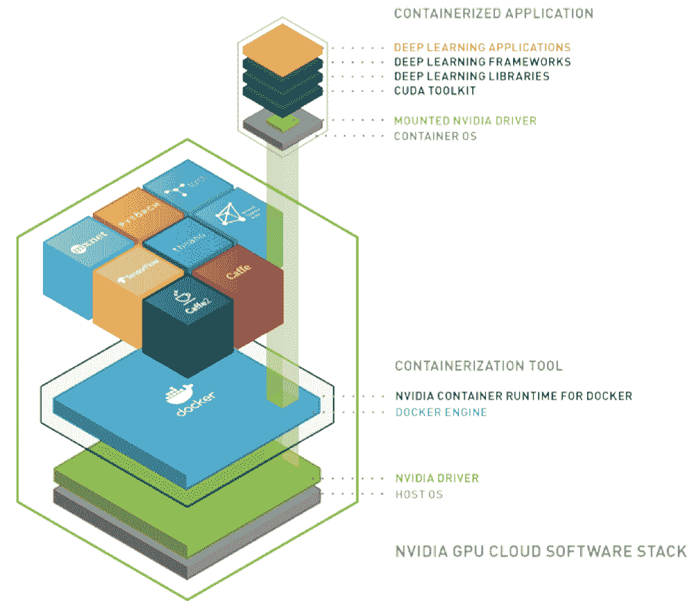
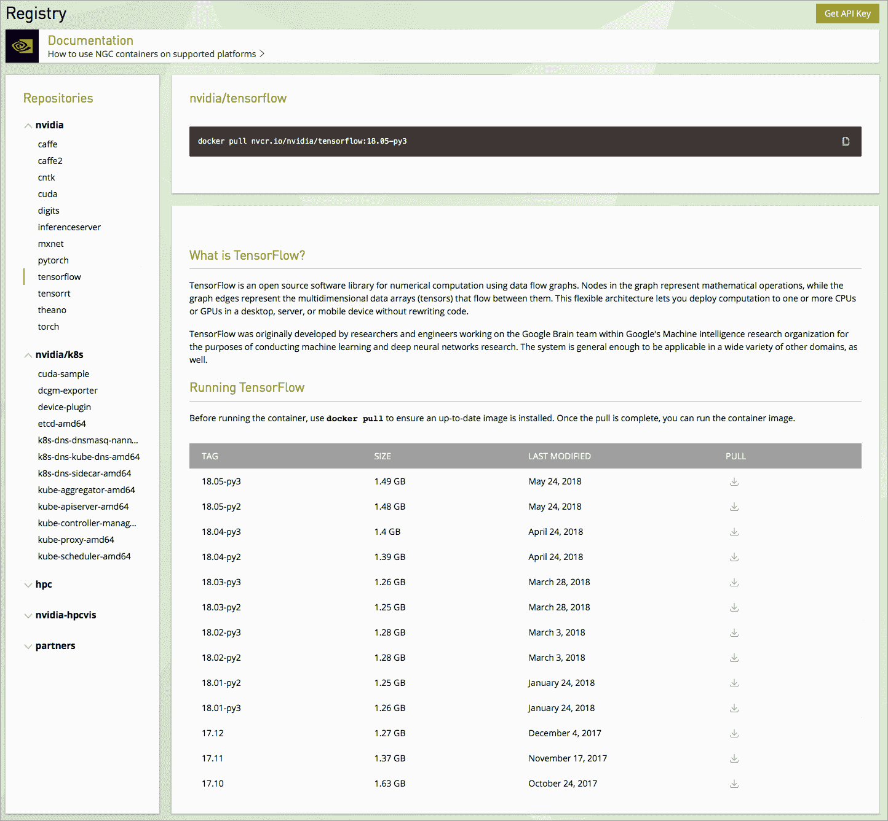

# 英伟达开放 GPU 用于人工智能容器工作

> 原文：<https://thenewstack.io/nvidia-opens-gpus-for-ai-work-with-containers-kubernetes/>

机器学习和人工智能的兴起让[英伟达如日中天](https://thenewstack.io/nvidia-embraces-kubernetes-for-scalable-deep-learning/)。随着 GPU 变得比以往更加重要，[芯片制造商](http://www.nvidia.com)正全力以赴。学术机构、大型云提供商和企业都依赖英伟达的 GPU 来运行 ML 和 [HPC 工作负载](https://thenewstack.io/roadmap-containers-for-high-performance-computing/)。

尽管 GPU 很受欢迎和有需求，但安装、配置和集成一个端到端的 Nvidia GPU 堆栈并不容易。这一切都从安装 CUDA 和 cuDNN 驱动程序开始。

CUDA 作为编程 GPU 的中介。对于深度学习工作，开发人员需要 cuDNN 工具包 CUDA 上深度神经网络库的抽象——将神经网络的数学计算部分委托给 GPU。安装配置体验不是很流畅。这些层中任何一个微小的版本差异都会破坏配置。再加上深度学习框架的版本不兼容性和依赖性，事情就变得一团糟了。

为了简化这个过程，Nvidia 转向了容器。它已经将特定于 GPU 的运行时与 Docker 集成在一起。Nvidia-Docker 将底层 GPU 基础设施暴露给容器。凭借在容器运行时打下的坚实基础，Nvidia 将其平台扩展到了 Kubernetes。可以从 Kubernetes Pods 访问 CUDA 和 cuDNN，以大规模运行训练和推理。最后，Nvidia 还建立了自己的容器注册表，其中包含主流深度学习框架的官方图像。开发人员可以扩展这些容器映像来构建他们自己的映像。

让我们仔细看看英伟达的这些投资:

## Nvidia Docker

之前讨论过 Nvidia-Docker 的[架构](https://thenewstack.io/primer-nvidia-docker-containers-meet-gpus/)和[安装](https://thenewstack.io/getting-started-with-gpus-in-google-kubernetes-engine/)。如前所述，这是 Nvidia 投资容器的基础。最近，Nvidia 更新了运行时，支持最新版本的 Docker。Nvidia-Docker 运行时可以轻松安装在任何配备 GPU 和 Docker 引擎的 Linux 机器上。

配置完成后，容器化的工作负载可以访问底层 GPU。下面是一个容器访问 Nvidia Quadro P4000 GPU 的截图。

## Nvidia 和 Kubernetes

在 GPU 上运行容器的能力是很好的第一步。这种集成的真正价值是通过运行在 Kubernetes 上的可扩展 ML 工作负载实现的。

在最近的[计算机视觉和模式识别](http://cvpr2018.thecvf.com/) (CVPR)大会上，Nvidia 发布了新软件，[Kubernetes on Nvidia GPU 发布候选](https://news.developer.nvidia.com/kubernetes-on-nvidia-gpus-release-candidate-now-available/)。据该公司称，Nvidia GPUs 上的 Kubernetes 允许开发人员和 DevOps 工程师在多云 GPU 集群上大规模构建和部署 GPU 加速的深度学习训练或推理应用。它支持 GPU 加速应用容器的部署、维护、调度和操作的自动化。

Nvidia GPUs 上有两种不同风格的 Kubernetes 一种用于云服务提供商，另一种用于服务器和台式机。

我有机会在 Ubuntu 16.04 机器上建立了一个 Kubernetes 集群，该机器由一个不起眼的 Nvidia GeForce GTX 1050Ti 驱动。最初的印象非常好，令人鼓舞。除去安装驱动程序和工具包所花费的时间，我在不到 10 分钟的时间内就建立并运行了一个单节点集群。

安装和配置 Kubernetes 集群的整个过程没有太大的不同。Nvidia 修改了 kubeadm、kubelet 和 kubectl 二进制文件以支持 GPU。显然，参与集群的每个节点都应该连接一个 GPU。我将在另一篇文章中分享我在这方面的经验和收获。

下面是 Nvidia GPUs 上的 Kubernetes 在运行中的截图。

## 英伟达 GPU 云

当我第一次听说同样于上周发布的 Nvidia GPU Cloud 时，我认为 Nvidia 正在通过推出自己的公共云来加入这场游戏。但对于 GPU 云，Nvidia 实际上意味着一个精心策划和维护良好的深度学习框架图像的 Docker 注册表。

据英伟达称，GPU 云是一个完全集成和优化的深度学习软件容器的目录，可以在英伟达 GPU 上运行。这些容器交付后即可运行，包括所有必要的依赖项，如 Nvidia CUDA Toolkit、Nvidia 深度学习库和操作系统。

注册中心拥有 Caffe、TensorFlow、CNTK 和 MXNet 等流行深度学习框架的最新图像。开发者和数据科学家可以在 [Nvidia](https://ngc.nvidia.com) 注册，获得一个 API 密钥来提取容器图像。

包括 AWS、Azure 和 GCP 在内的主要云平台都有预配置的深度学习图像，可以作为 GPU 实例启动。实例只需几分钟就可以使用了。一旦 Nvidia-Docker 安装在虚拟机中，用户就可以从 Nvidia GPU 云中提取适当的容器映像。可以将扩展 Nvidia 图像的自定义图像推送到 GPU 云中。

从容器运行时到注册表到编排引擎，Nvidia 正在采取正确的措施，让开发人员可以访问 GPU 软件。

<svg xmlns:xlink="http://www.w3.org/1999/xlink" viewBox="0 0 68 31" version="1.1"><title>Group</title> <desc>Created with Sketch.</desc></svg>