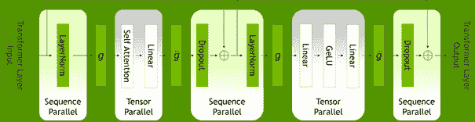

# 英伟达削减高达 30%的大型语言模型训练时间

> 原文：<https://thenewstack.io/nvidia-shaves-up-to-30-off-large-language-model-training-times/>

Nvidia 今天宣布，其 [NeMo Megatron](https://developer.nvidia.com/nvidia-nemo) 产品——一种用于开发和管理大型语言模型(LLM)的开源全栈框架——将进行多项改进，以减少 LLM 培训时间。由于 LLM 的规模非常庞大——通常有数千亿甚至约为*万亿*个可调参数——即使很小的改进也会产生巨大影响。但这些改进并不小；英伟达表示，他们可以将训练时间缩短多达 30%。

LLM 是一种特定类型的深度学习/神经网络模型，用于各种自然语言用例，包括内容生成、文本摘要、聊天机器人和其他对话式人工智能应用。LLM 也非常通用，预训练模型通常适用于许多任务，而不是像其他类型的神经网络模型那样为特定任务定制设计。LLMs 的复杂性带来了很大的好处，但这只是对大量工作的回报。

## 主要成分

新的堆栈与 Nvidia 深度学习软件副总裁 [Ujval Kapasi](https://www.linkedin.com/in/ujval-kapasi/) 进行了交谈，他说“过去几年我们在 Nvidia 做的大量工作是构建优化的硬件和软件，以加速这些神经网络的训练、推理和部署。”

这似乎是这些尼莫威震天改进的信条，归结为:

*   训练 LLM 的两种新方法:选择性激活重计算和序列并行。
*   一个新的超参数工具，根据所需的模型大小和可用的基础设施资源优化训练。

卡帕西用令人耳目一新的简单英语解释了每一项技术进步。通俗地说，他们都是为了更聪明地工作，而不是更努力地工作。我将尝试传达每个尼莫威震天的改进是如何做到这一点的。

## 回去再做一次

一般来说，训练深度学习模型，特别是 LLMs，涉及一个迭代改进的过程。卡帕西解释说，首先，一个模型产生天真的预测:“基本方法是…它从完全随机的数据开始…神经网络做出完全错误的预测。”但是，当这些预测与它们的真实值进行比较时，权重可以调整，结果会越来越好。

当生成预测的正向传递完成时，可能需要大量存储器来保存反向传递的参数值，其中权重被调整。为了避免内存不足，可以重新计算这些值，但这会增加所需的计算资源。这两个选择似乎都不令人愉快，但简单地重新计算一切已经成为常态。

事实证明，有更好的方法。选择性激活重新计算(SAR)提供了一种折衷方案。它优先重新计算占用大量内存且计算需求相对较小的值。这就留下了更多的内存，*可以使用*来缓存参数值，这将涉及更多的资源密集型重新计算。

## 并行和启发式

LLM 培训的另一个方面涉及模型的 transformer 层中的并行化。虽然许多任务可以跨多个 GPU 进行张量并行化，但其他任务只是在每个 GPU 上复制。但是 NeMo Megatron 中的新序列并行(SP)技术也沿着序列维度并行化这些任务，进一步降低了计算资源需求，加快了训练过程。

变压器层内的并行模式。鸣谢:英伟达

最后，还有一个问题是移动过去的参数，而不是调整超参数，这决定了所采用的训练方法。NeMo Megatron 的超参数工具(HP tool)不是通过强力循环一系列值，而是根据计算环境和要求来设置这些值，例如，GPU 的数量 GPU 集群的大小以及模型的预期大小。虽然仍然涉及一些范围测试，但已经少得多，这加快了超参数调整过程并优化了训练策略，从而也加快了更广泛的训练过程。

## 结果

同样，根据 Nvidia 的说法，这三项进步一起提供了高达 30%的训练速度。该公司表示，现在可以在 24 天内使用 1024 个[英伟达 A100 GPU](https://www.nvidia.com/en-us/data-center/a100/)对 1750 亿个参数模型进行训练。这听起来可能仍然很大，但这意味着时间减少了 10 天，相当于在没有 SAR、SP 和 HP 工具的情况下构建此类模型时节省了大约 250，000 小时的 GPU 计算时间。将 250，000 这个数字乘以你的云提供商每小时的 GPU 计算成本，很快就能算出真正的钱(向参议员德克森道歉)。

虽然非数据科学家可能会觉得所有这些有点深奥，但下游的好处应该是显而易见的:更多更大更精确的 LLM 将更快地出现，供主流开发人员在自己的应用程序中使用。这一切都归结于效率、并行化和更好的培训策略。

Nvidia 表示，新的 NeMo Megatron 功能可供早期用户在 Nvidia DGX SuperPODs 和 T2 Nvidia DGX Foundry 以及微软 Azure 云上运行。它们也可以在 [Nvidia LaunchPad](https://docs.nvidia.com/launchpad/ai/nemo-bc-overview.html) 上获得，这是一个免费的动手实验平台。

<svg xmlns:xlink="http://www.w3.org/1999/xlink" viewBox="0 0 68 31" version="1.1"><title>Group</title> <desc>Created with Sketch.</desc></svg>