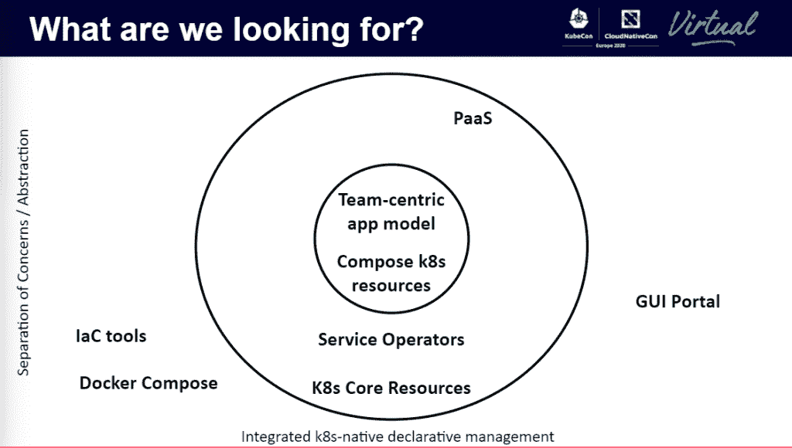

# OAM，连接开发和部署的 Kubernetes 应用程序模型

> 原文：<https://thenewstack.io/oam-the-kubernetes-application-model-bridging-development-and-deployment/>

为什么 Kubernetes 需要统一的应用模型？云服务提供商 [Upbound](https://upbound.io/) 的首席产品经理 [Phil Prasek](https://www.linkedin.com/in/philprasek2/) 在[kube con+CloudNativeCon Europe](https://events.linuxfoundation.org/kubecon-cloudnativecon-europe/)的分组会议上断言，这将是运行无缝部署模型所需的最后一块，将开发者与生产连接起来。

Prasek 说，有了可靠的应用模型，开发人员最终可以在笔记本电脑上构建云原生应用，并在生产环境中无缝工作，无需修改。没有一个可靠的应用模型，[应用部署](https://thenewstack.io/deployment-strategies/)工作流程会很快陷入复杂的泥沼，从而减慢速度。

新成立的[云本地计算基金会](https://www.cncf.io)的 [sig-app-delivery](https://github.com/cncf/sig-app-delivery) 特别兴趣小组的任务是提供一种标准的方式来定义跨 Kubernetes 运行的应用程序的操作要求。

微软和阿里巴巴的[开放应用模型](https://oam.dev/)(OAM)就是这样一个[模型](https://thenewstack.io/what-does-the-open-application-model-oam-and-rudr-mean-for-kubernetes-developers/)。根据 OAM 贡献者[张晨磊](https://thenewstack.io/open-application-model-build-the-next-generation-of-cloud-native-applications/)的说法，OAM 有两个目标:

*   为任何微服务平台提供标准应用环境。
*   定义一个以团队为中心的模型，支持开发人员和操作人员之间关注点的清晰分离。

## AppDef

Kubernetes 应用程序定义应该收集运行云原生应用程序所需的所有变量和配置设置。Prasek 表示，进入规则、所需的服务和依赖关系、安全设置、自动扩展、健康监控、日志记录:app def 应该捕获所有这些内容，以便可以轻松地自动转发到运营端。

Helm 可以用于通过 YAML 模板化许多这些设置，然后可以打包成一个[容器本地应用捆绑包](https://thenewstack.io/what-is-cnab-and-why-it-is-important-for-cloud-native-computing/) (CNAB)，进而允许开发人员通过 [GitOps](https://thenewstack.io/gitops-git-push-all-the-things/) 运行部署流程来调度应用，这可能是由 [HashiCorp Terraform](https://www.terraform.io/) 或 [AWS CloudFormation](https://aws.amazon.com/blogs/aws/cloudformation-create-your-aws-stack-from-a-recipe/) 执行的。

即使有了这样的工作流程，考虑到不同工具协同工作的复杂性，要让一个复杂的 Kubernetes 应用程序稳定运行仍然需要一个月的时间。

正如 Prasek 所指出的，“将这些东西粘在一起，会导致“多种管理模式和多种状态表示”。通常，这些在不同的环境中是不一致的。因此，掌握所有这些工具之间的交互和故障模式变得越来越困难。这通常会导致部署容易出错，并且很难理解正在发生的事情。”

Prasek 说:“这无疑是一个巨大的时间浪费，没有达到应有的效率。”

Prasek 认为，kubernetes[customresourceditions](https://kubernetes.io/docs/tasks/extend-kubernetes/custom-resources/custom-resource-definitions/)(以及相关的服务操作者)解决了这个自动化配置的问题，尽管关注点的分离(在开发人员和操作人员之间)仍然太窄。Prasek 建议，下一步是将运营商打包，作为平台工程师服务菜单的一部分。服务本身将以容器集的形式发布，开发者可以将它们组装成应用的主干。因此，它将这种精确的配置传递到生产中。

“这些都是 Kubernetes 的 API 资源，”Prasek 说。“所以我可以得到版本控制，我可以用它来停止。我得到了能够使用与内核一起工作的工具的所有好处。”

## 交叉平面

微软项目经理 [Sudhanva Huruli](https://www.linkedin.com/in/sudhanva-huruli-8705025a/) 在会议中提供了一个基于 OAM 如何工作的例子，他在 [Azure Container Compute](https://azure.microsoft.com/en-us/product-categories/containers/) 团队工作，并帮助维护 [Rudr 库](https://thenewstack.io/tutorial-deploy-microservices-on-kubernetes-through-rudr/)。

他使用了[cross plane](https://crossplane.io/docs/v0.12/)——一个开源的基于 Kubernetes 的控制平面，通过 Kubernetes APIs 在 kubectl 上运行——将一个应用部署到一个集群中。

在本演示中，Crossplane 为平台运营商管理基础设施。它保持与后端 Azure 云的连接，并向开发人员公开可用的资源。OAM 位于交叉平面之上。这个示例部署是一个基于微服务的应用程序，由 PostgreSQL 提供支持。Huruli 说，开发人员可以在他们的应用程序中声明 PostgreSQL 实例，Crossplane 将确保一切都已准备就绪。

完整的演讲可以在这里欣赏:

[https://www.youtube.com/embed/JbhtR6VaVCM?feature=oembed](https://www.youtube.com/embed/JbhtR6VaVCM?feature=oembed)

视频

云原生计算基金会和 KubeCon+CloudNativeCon 是新堆栈的赞助商。

Pixabay 的 skeeze 的专题图片。

<svg xmlns:xlink="http://www.w3.org/1999/xlink" viewBox="0 0 68 31" version="1.1"><title>Group</title> <desc>Created with Sketch.</desc></svg>