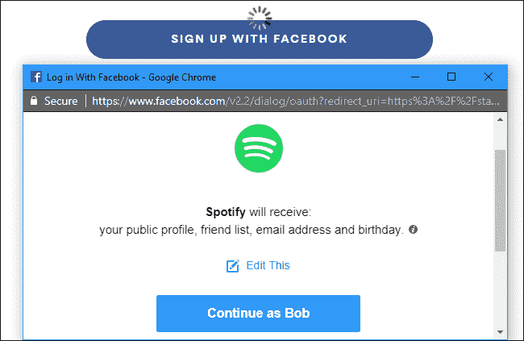
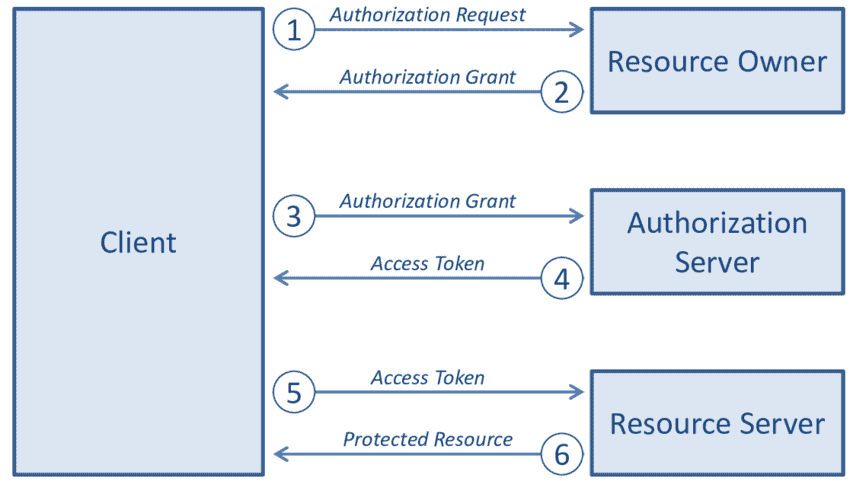

# OAuth 2.0，但请保留行话

> 原文：<https://thenewstack.io/oauth-2-0-but-hold-the-jargon-please/>

 [维拉格莫迪

维拉格于 2020 年 1 月加入 gravity，此前他与人联合创办了一家以太坊应用软件代码审计公司。加入 quality 后，Virag 继续学习趋势技术，并制作高质量的文字和视频内容。闲暇时，维拉格喜欢攀岩、电子游戏和遛狗。](https://twitter.com/Mad_Eye_Mody) 

你可能在几十个应用程序上有包含个人信息的配置文件。这些应用程序最初是孤立的，现在变得越来越相互关联。Discord 在脸书搜索推荐好友，吉拉用 Github 档案创建用户账户，等等。这种应用程序代表你相互对话的趋势被称为“委托访问”，已经成为我们在线生活中不可或缺的一部分。

然而，由于这些应用程序保护其数据的方式，开发人员遇到了一个挑战:*我们如何*委派访问？几乎每个应用程序都受到基本用户名/密码模式的保护。要让应用程序 A 从应用程序 B 获得它需要的数据，就需要代表应用程序 A 不断登录到应用程序 B——多么不实用啊！解决方法是为应用程序 A 提供登录应用程序 B 的用户名和密码凭据，这是有问题的，原因如下:

*   应用程序 A 以明文形式存储凭证
*   应用程序 A 被给予对应用程序 B 的广泛的、不受限制的访问
*   用户不能轻易地撤销对应用程序 A 的访问
*   受损的应用程序 A 将应用程序 B 置于风险之中

OAuth 是针对这种“第 22 条军规”情况的解决方案:如何在不危及最终用户数据的情况下提供授权访问。

## OAuth 协议流程

考虑到特斯拉有一个“代客模式”，你需要一个代客钥匙卡。该钥匙卡通知车辆它将在有限的功能下操作，限制最大速度和加速度并锁定行李箱。这种技术在概念上与 OAuth 的操作方式相同。特斯拉车主允许代客有限地使用他/她的特斯拉，而无需提供主车钥匙。

OAuth 在社交媒体应用中相当受欢迎。您可能熟悉这样的请求:

图 1:使用 OAuth，Spotify(客户端)能够代表 Bob(资源所有者)访问脸书(资源服务器),而无需凭证

当收到这样的弹出窗口时，OAuth 协议在后台运行如下:

图 2:委托 Spotify 访问脸书数据

1.  Spotify 向 Bob 发送一条消息，请求访问其公共档案、好友列表、电子邮件和生日的权限。
2.  Bob 向 Spotify 提供了一笔赠款来收集上述数据。
3.  Spotify 将补助金发给脸书的一个 API。
4.  脸书 API 验证授权，并为 Spotify 发送一个访问令牌来访问受保护的资源。
5.  Spotify 将访问令牌发送给另一个脸书 API
6.  脸书 API 将请求的数据发送给 Spotify。

通过使用授权和代币(我们将在下面讨论), Spotify 获得了鲍勃脸书账户的代客卡。

## 在引擎盖下偷窥

### 范围和令牌

范围和令牌是 OAuth 实现主观访问控制的方式。它们一起代表“允许做某事”令牌是“许可”部分，范围定义了“做某事”是什么。想象一张电影票:范围是你被授权观看的电影的名字，而票本身就是代币，只有影院员工才能验证它的真实性。从我们的 Tesla 示例来看，范围是当用代客钥匙启动时启用哪些车辆功能。访问令牌是代客钥匙本身，只有当钥匙由特斯拉经销商发放时，特斯拉车辆才能识别。

回到我们的 Spotify 示例:在步骤 4 中，Spotify 收到一个访问令牌，以成功查询脸书的服务器。这个令牌对 Spotify 来说毫无意义，但脸书能够解码它，并验证 Spotify 确实获得了鲍勃的许可。令牌中包含一个“范围”字段，让脸书知道 Spotify 可以做什么。在这种情况下，读取 Bob 的公开资料、电子邮件、朋友列表和生日。

### 赠款和流量

授权决定了 Spotify 获取访问令牌的操作顺序。这些独特的排序被称为流。回到我们的电影院类比，有两种方式被授予门票:(1)在电影院购买(2)在线购买。你所选择的方法决定了你将如何获得入场券。在剧院购买可能看起来像:

1.  导航到剧院位置
2.  进入剧院
3.  走到前台
4.  选择放映时间
5.  向剧院员工提供信用卡
6.  签署收据
7.  获取实物票

而网上购物可以遵循以下步骤:

1.  导航到剧院网页
2.  选择放映时间
3.  结账推车
4.  输入付款信息
5.  通过电子邮件获取数字门票

如你所见，与代币不同，赠款不是物质，相反，它们告知脸书在与 Spotify 沟通时应该使用哪个流程。不同的授权针对特定的用例进行了优化，并将影响应用哪些安全措施。

OAuth 作为一种互联网协议，在 HTTPS 上工作。脸书、Spotify 和鲍勃之间的所有交流都是通过你浏览器中的 URIs 进行的。这些 URIs 是参数包含在字符串中的查询。包含在这些参数中的是脸书需要的信息，以了解遵循哪个流程。

知道使用五种授权类型中的哪一种对于设置正确的 OAuth 流是至关重要的。

## 结论

尽管 OAuth 提供了一种经常被忽视的便利，但它是一种复杂的协议，有数百种不同的实现方式。在一头扎进深水区，淹没在所有的术语和概念中之前，理解基本的概念结构会使踩水变得容易得多。

<svg xmlns:xlink="http://www.w3.org/1999/xlink" viewBox="0 0 68 31" version="1.1"><title>Group</title> <desc>Created with Sketch.</desc></svg>