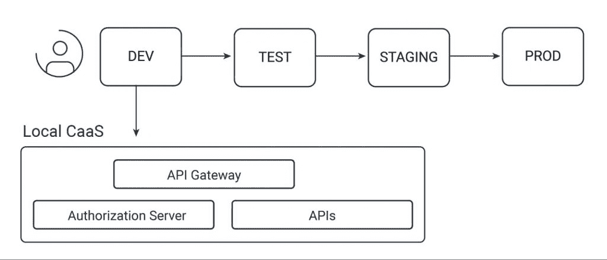

# 云环境中的 OAuth 安全性

> 原文：<https://thenewstack.io/oauth-security-in-a-cloud-native-world/>

如今，大多数软件公司使用具有现代托管功能的云部署，这使得从开发人员到 DevOps 和 InfoSec 员工的每个人都可以高效工作。

 [加里·阿彻

加里是 Curity 公司的产品营销工程师。20 年来，他一直担任首席开发人员和解决方案架构师。](https://www.linkedin.com/in/gary-archer-6b3613153/) 

然而，并非所有的云部署都是相同的，您仍然需要做出合理的选择来满足您的架构需求。

在本文中，我将解释在使用各种云部署类型并将安全性集成到多种应用程序之后，我的想法是如何发展的。

我将首先讨论 API，然后重点介绍关键的支持安全组件。其中最重要的是您的身份和访问管理(IAM)系统。

## OAuth 框架

如今，大多数应用级组件都使用 [OAuth 系列规范](https://datatracker.ietf.org/doc/html/rfc6749)来实现安全性，这为 web 应用、移动应用和 API 提供了现代化的安全功能。这为公司提供了最先进的选项，用于使用一个或多个身份证明来验证用户，并根据业务规则保护 API 中的数据。

OAuth 规范中定义的授权服务器处理认证、令牌发放和用户管理。它使许多安全解决方案或“流程”能够随着时间的推移而构建。它是任何现代 IAM 系统的核心。

## 平台即服务(PaaS)

当我第一次开始使用云部署时，像许多人一样，我被不必托管任何后端服务器而使用云基础设施作为黑匣子的想法所吸引。对于一个[单页面应用](https://curity.io/resources/learn/spa-best-practices/)，这可能会导致以下后端组件使用 PaaS:

像[无服务器](https://www.serverless.com/)这样的技术使您能够开发使用 PaaS 托管的 API。对于小型创业公司或开发人员托管自己的解决方案来说，这可能是一个经济高效的解决方案。同时，开发人员可以在开始 OAuth 集成时使用云提供商的内置授权服务器。这有时被称为身份即服务(IdaaS)。

## 蜜蜂

你的 API 或者微服务就是你的核心知识产权(IP)，大部分公司都是用主流编程语言实现的，比如 Java 或者 C#。这样，组织将希望不受限制地充分利用这些技术。此外，代码应该保持可移植性，以防将来要使用多个云提供商。这可以让您将您的数字解决方案扩展到新兴市场，在这些市场中，某些云提供商可能会被阻止。

将 PaaS 用于 API 的一个缺点是，您可能会遇到限制，导致供应商锁定，使得将来将 API 迁移到另一台主机的成本很高。一些基于计算的 API 托管也可能有其他限制。例如，如果系统必须为每个请求建立一个新的 API 实例，内存存储可能是不可能的。这些问题会增加复杂性，不利于您的技术架构。

您还必须控制哪些 API 端点暴露于互联网，并以您喜欢的方式保护边界。对于 API 之间的连接，推荐使用[零信任](https://curity.io/resources/learn/zero-trust-overview/)方法，因为它可以加强基础设施和用户级的安全性。最后，API 连接到敏感的数据源，因此作为托管的最佳实践，它们应该被托管在反向代理或 API 网关之后。这使得攻击者更难访问这些数据。

## 容器即服务(CaaS)

这些需求导致许多公司使用不同的云构建块来托管 API。虽然虚拟机曾经更常见，但像 Kubernetes 这样的容器编排平台现在提供了最好的 API 托管特性。这为 API 创建了一个更新的部署图，它们托管在“集群内部”,而您继续将 PaaS 用于其他一些组件:

一旦 API 托管更新为使用基于容器的部署，代码执行就没有任何限制，您就有了一个可以在云之间迁移的可移植后端。您的技术人员还将学习如何使用现代模式，以最佳方式处理部署和可用性。然后，您需要更多地考虑支持您的 API 的其他关键组件。

## 云本地授权服务器

当您将 OAuth 集成到您的应用程序和 API 中时，您将意识到您所选择的授权服务器是您的体系结构的一个关键部分，它支持您的安全用例的解决方案。使用[最新的安全标准](https://curity.io/product/conformance/)将使您的应用与安全最佳实践保持一致。这些标准中的许多都对应于公司用例，其中一些在某些行业领域是必不可少的。

API 必须[在每个请求上验证 JWT 访问令牌](https://curity.io/resources/learn/jwt-best-practices/)，并根据[范围](https://curity.io/resources/learn/scope-best-practices/)和[声明](https://curity.io/resources/learn/claims-best-practices/)授权它们。这是一种机制，可以扩展到任意复杂的业务规则，并跨越集群中的多个 API。同样，你必须能够为 [web](https://curity.io/resources/learn/spa-best-practices/) 和[移动](https://curity.io/resources/learn/oauth-for-mobile-apps-best-practices/)应用实现最佳实践，并使用[多重认证因素](https://curity.io/product/authentication-service/)。

OAuth 框架为您提供了构建模块，而不是现成的解决方案。因此，可扩展性对于 API 正确处理身份数据至关重要。一个关键领域是从您的业务数据中添加[自定义声明](https://curity.io/resources/learn/implementing-claims-best-practices/)来访问令牌的能力。另一个是能够[可靠地链接账户](https://curity.io/resources/learn/account-linking-with-facebook/)，这样如果用户以新的方式进行身份验证，比如使用 [WebAuthn](https://curity.io/resources/learn/webauthn-overview/) 密钥时，您的 API 就不会复制用户。

所有这些都导致了使用专家云原生授权服务器的首选。这样效率更高，因为授权服务器就在您的 API 旁边。它还为您提供了对安全性的最佳控制，限制了向 internet 公开哪些授权服务器端点。

## API 网关

除了托管入口点，API 网关(或反向代理)也是一个至关重要的架构组件。API 网关可以在 API 接收请求之前执行高级路由和安全相关任务，如令牌转换。通过将安全管道外部化，您的 API 代码变得更加简单，并且更加以业务为中心。

建议使用[幻影令牌模式](https://curity.io/resources/learn/phantom-token-pattern/)，以便互联网客户端仅接收不透明的访问令牌。与易于阅读的 JSON Web 令牌(jwt)不同，幻影令牌不能透露任何可能泄露个人身份信息的私人细节(PII)。当客户端调用 API 时，网关可以执行自检，将不透明访问令牌转换为 JWT 访问令牌。这个流程如下图所示。

还有许多其他的[网关用例](https://curity.io/resources/guides/apigateway/)，但是一个关键的功能是运行插件，这些插件可以将 HTTP 转换和路由作为一个单独的工作单元来执行。你可以在插件中编写的代码应该没有限制。这是云原生解决方案可能比云提供商的通用解决方案提供更好功能的另一个领域。

## 同类最佳组件

授权服务器和 API 网关是关键的安全组件，一些公司还使用[授权管理系统](https://curity.io/resources/learn/what-is-neosecurity/#the-entitlement-management-system)进行业务授权。同时，需要额外的专门组件来支持您的 API。这些也必须根据提供商的能力和您的需求进行明智的选择。

每个公司必须决定他们需要哪些第三方组件。例如，常见的是将用于监控、日志管理和基于事件的数据流的单个组件与 API 放在一起。可能的设置如下所示:

但是，对于某些组件角色来说，PaaS 仍然是一个很好的选择，这些天我遵循一种“混合搭配”的方法。作为 API 架构重要组成部分的组件应该托管在集群内部。对于其他组件，如果更容易管理，我通常更喜欢无服务器的方法。

PaaS 比 CaaS 工作得更好的典型例子是向浏览器交付静态 web 内容。内容交付网络(CDN)可以以较低的成本将内容推送至多个位置，从而实现全球同等的网络性能。这比在所有这些位置托管 CaaS 集群更有效。参见[令牌处理模式](https://curity.io/resources/learn/token-handler-overview/)了解使用这种方法的更多细节，同时也遵循[当前浏览器安全最佳实践](https://datatracker.ietf.org/doc/html/draft-ietf-oauth-browser-based-apps)。

## 部署和操作

当公司开始使用 OAuth 时，通常会担心授权服务器变得不可用，从而导致面向用户的应用程序停机。这种担心仍然有效，但是当使用云原生 API 时，您已经承担了这种风险，并且您应该能够遵循第三方组件的相同模式。当使用云原生授权服务器时，检查它的[部署](https://curity.io/resources/learn/concepts-deployment/)和[可用性](https://curity.io/resources/learn/concepts-availability/)行为是否提供了您需要的东西。

此外，还要考虑人员层面的需求。InfoSec 的利益相关者需要一个对身份事件进行良好审计的系统。如今，DevOps 人员应该能够执行授权服务器的零停机升级，或者使用 canary 部署，在该部署中新旧版本同时运行。该系统还应具备现代的[日志](https://curity.io/resources/learn/logging-best-practices/)和[监控](https://curity.io/product/monitoring-and-metrics/)功能，以便技术支持人员在出现配置或连接问题时能够有效地进行故障排除。

## 本地计算机设置

公司需要把他们的软件推进管道，尽早发现问题可以大大节省成本。高效开发人员设置的好处经常被忽视，但这是原生云提供一些引人注目的优势的领域。

开发人员、架构师或 DevOps 人员可以在本地计算机上运行大多数云原生组件。这可能是首先测试云原生授权服务器和 API 网关并设计端到端应用程序流的好方法。

然后，可以使用本地集群尽早验证升级等操作行为。一旦系统按照期望的行为工作，您可以简单地更新您的基于 Docker 的部署，管道的其余部分也将以同样的方式工作。

## 结论

云原生架构为托管和管理您的 API 提供了最具可移植性和最强大的平台，但请关注重要的安全需求。这将引导您选择同类最佳的支持组件，并在您的集群中托管所有这些组件。根据您需要的安全特性选择授权服务器，并从操作角度对其进行审查。

在 Curity，我们提供了一个强大的身份和访问管理系统，该系统从一开始就是云原生的。它还与现代云原生平台相集成。除了对标准的丰富支持之外，该系统还基于关注点分离的理念，并可扩展为客户提供他们需要的行为。还有一个[免费社区版](https://curity.io/product/community/)，使用 [Docker 容器](https://curity.io/resources/learn/run-curity-docker/)升级一个初始系统是微不足道的。

最后一点，您的云原生集群中的安全组件将支持许多强大的设计模式。然而，在构建云原生安全解决方案时，良好的架构指导也是一个关键因素。我们的[资源文章](https://curity.io/resources/articles/)、[指南](https://curity.io/resources/guides/)和[代码示例](https://github.com/curityio)提供了许多端到端的云原生流来帮助您。

<svg xmlns:xlink="http://www.w3.org/1999/xlink" viewBox="0 0 68 31" version="1.1"><title>Group</title> <desc>Created with Sketch.</desc></svg>