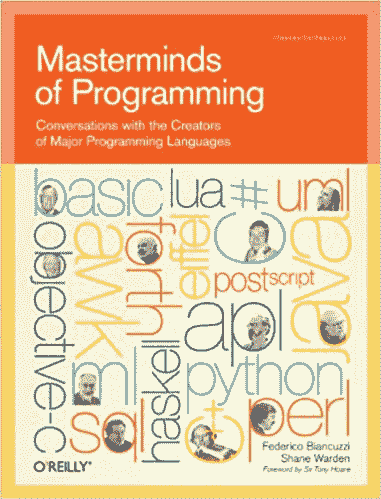

# 目标-C 的根源在布拉德·考克斯的生活中

> 原文：<https://thenewstack.io/objective-cs-roots-in-the-life-of-brad-cox/>

是什么让某人共同创造了世界上最有影响力的编程语言之一？这是布拉德·考克斯的一生提出的一个问题，他于本月去世，享年 76 岁。“布拉德在南卡罗莱纳州的家庭奶牛场长大，”Legacy.com 大学的纪念页上写道，“但他发现自己对科学最感兴趣。”因此，虽然今天 Cox 因与他的商业伙伴 Tom Love 一起创建了 Objective-C 编程语言而被人们铭记，但很容易怀疑他对面向对象编程的兴趣是否来自对自然结构复杂性的深刻了解。

考克斯“花了我的青春去挤牛奶，打理农场，在树林里散步，收集蛇，”他在[2016 年接受计算机历史博物馆](http://archive.computerhistory.org/resources/access/text/2017/07/102717175-05-01-acc.pdf)采访时回忆道。"我因收藏蛇而远近闻名。"考克斯描述了直到九年级都在一个有三个房间的校舍里学习的情景，“在遥远的穷乡僻壤……每个人都在夏天赤脚去上学。”但由于对科学的兴趣，考克斯继续在南卡罗来纳州的弗曼大学获得了有机化学和数学学士学位。

[https://www.youtube.com/embed/1xrL2d5omuA?feature=oembed](https://www.youtube.com/embed/1xrL2d5omuA?feature=oembed)

视频

这所学校也给了他早期的成长经历。“第一次接触电脑是在弗曼大学化学系的手摇计算器。我很喜欢那件事，并且练习了很多。”后来在芝加哥大学获得数学生物学博士学位时，“我选择了物理系，量子力学，因为有传言说他们在校园里有最大的计算机预算……那是我第一次接触计算机是在穿孔卡上编写分子轨道计算的 IBM 7094 程序。”

有趣的巧合是，在研究生院的某个时候，考克斯遇到了阿黛尔·戈德堡，她后来成为开发面向对象编程语言 Smalltalk 团队的一员。(Goldberg 在同一所大学获得了信息科学硕士学位和博士学位[。)Cox 记得，当他在学校的时候，学校已经开设了一个新的计算机科学系，“她和其他几个人，基本上在我的雷达屏幕上，”尽管他们不是特别亲密的朋友，这早于她对面向对象编程的兴趣。当被问及是否与该部门有过接触时，考克斯说“非正式的”。主要是围绕着打孔机……记住，那时候一切都是打孔机，你通常就是这样在打孔机周围认识人的。”](https://ethw.org/Oral-History:Adele_Goldberg)

当时，他唯一熟悉的编程语言是汇编语言——尽管“我努力使用 Fortran 进行一些分子轨道计算，但没有成功，”他回忆道。1971 年，考克斯为 PDP-8/I 计算机编写了一个程序，在他所谓的“功能神经网络”中模拟了 64 个神经元。

考克斯写道“整个系统调查有机体及其大脑在与环境互动中的行为”。但是他告诉计算机历史博物馆，由于有限的计算能力，这个项目“没有希望”，而且“我知道这是没有希望的。”尽管他惊叹于在 21 世纪的今天，同样的研究现在似乎获得了新的兴趣。在另一篇描述巨型鱿鱼轴突放电的数学模型的论文之后，伍兹霍尔海洋研究所的博士后(关于真正的鱿鱼)。但这一切让他意识到一个重要的事实。

“博士后之后，我环顾了一下我喜欢做的事情和我花时间做的事情，最终意识到我喜欢整个过程的是计算机方面，而不是科学方面。”

## 对专有语言感到恼火

历史记得，Objective-C 是汤姆·洛夫(Tom Love)共同创建的，他决定招募考克斯在 ITT(国际电话电报公司)任职。考克斯成为研究部门为数不多的几个人之一，他最早的一个项目是为电话交换机中基于 UNIX 的计算机调试程序。考克斯告诉计算机历史博物馆，ITT“迈出了远离老式电话交换机的第一步。回想起来，它就像一个面向对象的系统。”

但不幸的是，他是一个致力于提高生产率的团队的一员，而且“我不喜欢用 C 作为生产率的基础。正在寻找任何可能有帮助的东西。”然后在 1982 年，他偶然发现了《字节》杂志关于早期面向对象编程语言 Smalltalk 的特刊。这让考克斯开始思考“我有一大堆东西——我隐约觉得可能会有帮助。”例如，封装(将数据及其方法一起封装在受保护对象中的思想)，因为“C 在这方面太差了…”

“c #中没有对象，本质上一切都是公共的。没有——你知道，它只是变成了汤……而那种痛苦正是我试图逃避的。”

但除此之外，“我刚刚对专有语言变得非常恼火，”他说。例如，Fortran 供应商会添加额外的功能，试图将客户锁定在他们的特定版本上。

因此，大约在这个时候，他创建了第一个面向对象的预编译器，基本上是在 c 之上“分层”Smalltalk。“我们在那里考虑我们的角色的方式是试图让面向对象编程走出研究实验室……所以我们必须将它嵌入到我们在工厂车间可以找到的东西中，比如 c。”他记得，早期的尝试有点原始。"其中很大一部分最初是一堆 UNIX shell 脚本."

但后来它成为他和汤姆·洛夫成立的一家公司的产品基础。

当 Love 搬到 Schlumberger-DollResearch Labs(也在康涅狄格州)时，Cox 最终在几个月后和他一起去了，支持 Schlumberger 对 UNIX 的兴趣，直到他们一起离开，创办了一家名为 Productivity Products International 的公司(利用 Philips 的一个联系人，他希望他们将面向对象的原则应用到他们的硬件模拟中)。

考克斯记得，他们在销售生产力，“具体来说，一个具体的例子是更有生产力的编程语言……第二个例子是组件软件，软件组件。”所以语言是这些组件的一种烙铁。

“我 100%埋头研究问题的语言方面，而不是跟踪咨询方面……”考克斯在采访中回忆道。

“我没有语言设计的背景，所以我必须训练自己如何去做。第一次尝试并不愉快。我们只是重复这个问题，直到我们拿出一个非常好的工具。最终，当我们获得投资时，我们引入了一些真正有语言设计背景的人，他们知道自己在做什么。”投资者被组件的想法所吸引(尽管他们把公司的名字改成了 Stepstone)。

在 2016 年的采访中，他抱怨说 Objective-C 对象的“粒度”并没有被整个行业所追求——但他承认“现在对组件非常突出的面向服务的架构有了更多的兴趣。”

他的妻子埃塔·格伦(也曾学习过计算机信息系统)也在这家公司工作，她记得接过史蒂夫·乔布斯的电话。乔布斯的后苹果公司 NeXT 许可了 Objective-C，将其并入其操作系统，当苹果收购 NeXT 时，Objective-C 最终得到了苹果 Mac OS X 操作系统的支持，很快成为编写 Mac 和后来的 iPhone 软件的首选语言。

考克斯告诉计算机历史博物馆，“我从未成功地为这些组件找到一种商业模式。“我的意思是它们是由比特组成的，明白吗？它们可以在纳秒内被复制。所以你不能像买卖沙丁鱼罐头一样买卖它们。但苹果可以，因为他们可以将所有这些软件都固定在一个有形的硬件上，并围绕它建立一项业务。”

## 还在跑

考克斯在他的博客上把自己描述为一个“自从上帝创造了泥土，就努力使软件成为真正的工程学科”的人，并补充道“我一直在坚持。”(他博客上的最后一篇文章写于 2013 年，当时 Cox 69 岁，标题是“[大数据的常识方法](https://bradjcox.blogspot.com/2013/09/a-common-sense-approach-to-big-data.html)”)其他帖子显示他仍然过着先驱计算机程序员的生活。(“我最近一直在试验[使用 GPU 加速 Java 代码](https://bradjcox.blogspot.com/2012/12/gpu-maven-plugin.html)，并最终编写了一个 maven 插件，使构建过程易于管理。”)2011 年，他开始了一个[开源项目](https://github.com/bradjcox/no-xacml)，用他自己开发的[替代访问控制语言 XACML](https://github.com/bradjcox/no-xacml) (他抱怨 XACML 的语义是“包裹在可视的铁丝网里；一个基于 XML 的语法，可怕到让你的眼睛流血。”)

在 2009 年的一篇博客文章中，Cox 回顾了他对 O ' Reilly ' s Masterminds of Programming 一书的采访，写道“我的兴趣更多的是语言产生的组件，而不是语言本身。”

但是不管是什么让他开始用 Objective-C 工作，最终结果都是值得的。MacTech 杂志 2011 年的一次采访指出，Objective-C 已经出现在苹果售出的 3000 多万台 iPods 和 iPhones 中，并问考克斯“让 Objective-C 在这么多人的手中运行感觉如何？”

他的回应？他笑着说:“是啊，挺好看的。”

* * *

# WebReduce

<svg xmlns:xlink="http://www.w3.org/1999/xlink" viewBox="0 0 68 31" version="1.1"><title>Group</title> <desc>Created with Sketch.</desc></svg>