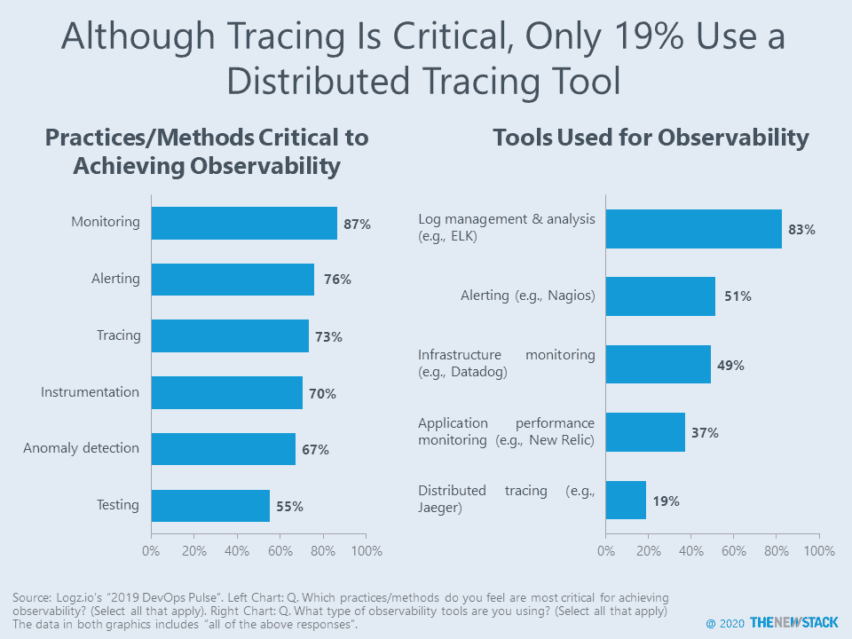
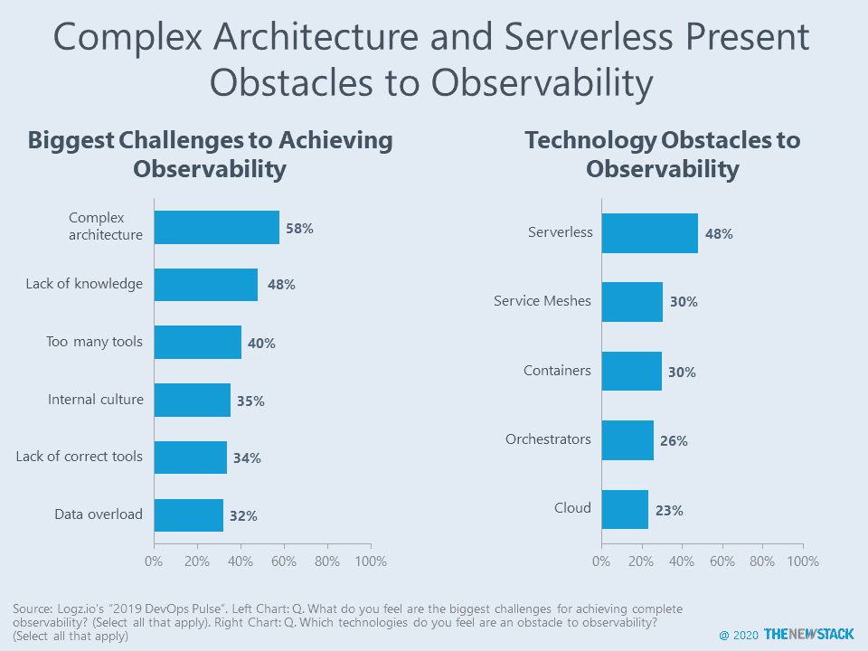

# 解决无服务器和跟踪是成功观察的关键

> 原文：<https://thenewstack.io/observability-and-elk/>

根据 Logz.io 的年度 [DevOps Pulse 研究](https://logz.io/devops-pulse-2019)的近 1000 名受访者中 83%的人的说法，综合使用日志、指标和跟踪是“可观察性”定义的一部分。由于调查问题有“全选”的选项，另一个发现是，三分之二的人表示可观察性是从输出数据中推断系统状态的一种衡量标准。后一个定义是可观察性先锋[慈善专业](https://twitter.com/mipsytipsy)在她的“[可观察性——三年回顾](https://thenewstack.io/observability-a-3-year-retrospective/)”帖子中更喜欢的一个。最终用户对这些术语含义的印象对 Logz.io 非常重要，因为该公司本身就是一个构建在 [ELK 堆栈](https://logz.io/learn/complete-guide-elk-stack/)之上的云可观测性平台。

模糊术语“[监控](https://thenewstack.io/category/monitoring/)”被认为是实现可观测性的关键，但警报、跟踪、仪器和异常检测也是如此。尽管这些实践是先决条件，但是公司在采用特定的工具方面进展缓慢。值得注意的是，只有 19%的人使用分布式追踪工具，比如 Jaeger。这是否是“正确的工具”是一个悬而未决的问题，但对于超过三分之一的研究来说，为工作找到正确的工具是一个可观察性挑战。

更大的挑战是复杂的架构，58%的人提到了这一点，这可能与[微服务](/category/microservices/)和[无服务器](/category/serverless/)趋势有关。事实上，在另一个问题中，无服务器被认为是实现可观察性的障碍，其重要性超过了服务网格、容器和编排器。

新堆栈的读者可能记得，在 2018 年我们的“[无服务器技术指南](https://thenewstack.io/ebooks/serverless/guide-to-serverless-technologies)”中，我们报告了 60%使用无服务器架构的人说调试和跟踪是最大的监控痛点。调查还发现，在那些尚未开始使用无服务器的人中，调试(50%)和监控(35%)预计将是部署和管理无服务器架构时的最大挑战。隐藏在 Logz.io 报告中，我们发现应用逻辑对无服务器的采用实际上从 2018 年的 43%下降到 2019 年的 42%。也许这是无服务器增长的暂时缓解，但也可能是一个警告信号。

* * *

我们计划在未来挖掘 2019 DevOps Pulse 的其他部分。同时，这是我们对另一张图表的看法:

## 您使用什么架构来构建您的应用程序？

## 

只有 19%的研究仅使用单片架构，但这一数字今年降至 7%。仅使用微服务架构的人的比例每年都在上升，现在占研究的 37%。由于复杂的架构是实现可观测性的最大挑战，这可能解释了为什么开发者在 2019 年开始回避整体/微服务混合。

通过 Pixabay 的特征图像。

<svg xmlns:xlink="http://www.w3.org/1999/xlink" viewBox="0 0 68 31" version="1.1"><title>Group</title> <desc>Created with Sketch.</desc></svg>