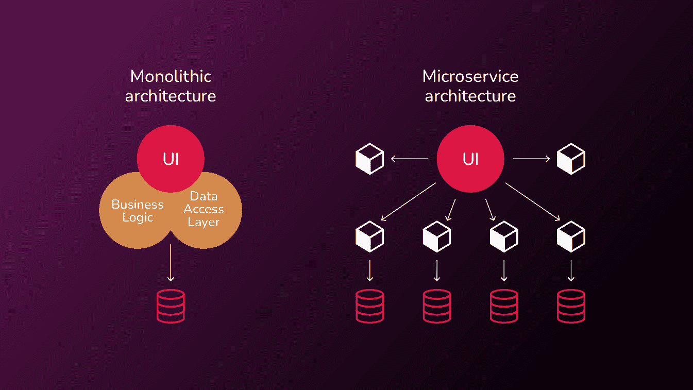
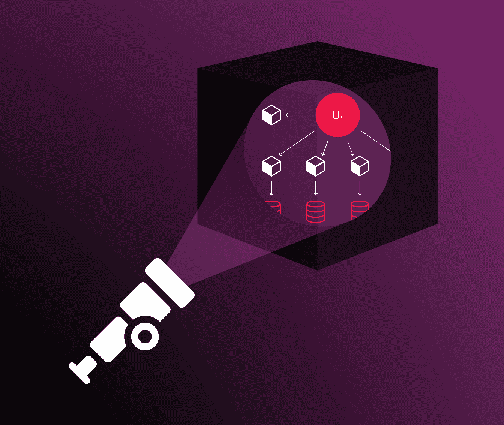
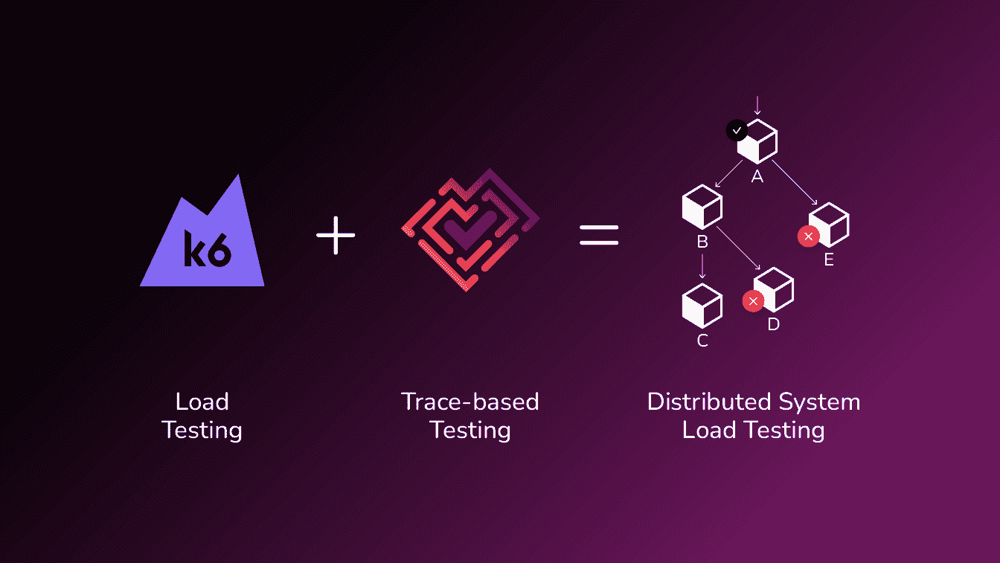

# 可观察性——将您的负载测试从黑盒中解放出来

> 原文：<https://thenewstack.io/observability-freeing-your-load-tests-from-the-black-box/>

向云原生架构的转变从根本上改变了监控、故障排除和优化分布式应用和基础架构性能所需的工具。我们已经从拥有一个具有简单日志记录的整体，发展到跨多个服务使用聚合日志，再到现在依靠分布式跟踪工具提供的深度可见性，以便我们可以可视化和了解我们复杂的微服务。故障排除工具不断发展！

但是性能测试呢？有更新、更好的工具，但是从 2000 年代后期开始的相同的黑盒测试方法仍然被用于检查响应吗？这对今天的分解服务来说足够了吗？让我们检查一下这个空间。

## 云原生架构改变了世界

不可否认，现在的世界是云原生的和分布式的。我们曾经有过大型的、位于中心的团队，他们编写具有单个数据存储、应用层和前端应用程序的整体应用程序。现在，我们构建基于微服务的应用程序，这些应用程序由在不同地点工作的众多团队开发。应用程序依靠消息总线与使用不同数据存储的多种语言编写的多个服务进行异步通信。

迁移到基于微服务的应用程序有许多证据确凿的优势:

*   团队可以在小组中独立工作和承诺。
*   速度不会因为必须在一个巨大的代码库上进行协调而受到限制。
*   服务可以与编程语言和技术决策无关。

然而，测试这些分布式应用程序存在挑战。没有比负载测试更容易看到挑战的地方了。

## 为什么黑盒测试不适用于分布式应用的负载测试

使用 monoliths，大多数针对后端的 API 调用都是同步的。您调用 API，它处理请求，从中央数据库写入或检索数据，如果成功，返回状态代码 200。要进行负载测试，您需要用几千个调用来访问 API 表面，并查看它何时崩溃。您可以针对您的代码库使用分析工具来判断问题在哪里，或者分析数据库的慢速查询日志来确定 SQL 查询是否是瓶颈。

与分布式系统形成对比。当你在 Amazon.com 下订单时，你会立即收到确认订单已提交的回复，尽管在下订单的过程中还会有一系列其他流程。当您告诉 GitHub 创建一个构建时，它会立即返回一个响应，并且工作异步开始。如果我们尝试对这些异步流程进行负载测试，会发生什么？

我们可以使用传统的负载测试工具，将数百个调用排队，然后在 API 上启动它们。如果分布式系统使用消息队列，API 表面很可能只是将消息放在消息队列中，并返回 200 状态代码。负载测试将验证 API 请求处理程序是否能够吸收负载，并且可能验证消息队列是否能够以给定的速率对请求进行排队，但是它不会验证或检查任何下游流程。如果从队列中提取请求的微服务无法扩展、存在瓶颈或在负载下遇到错误，这个问题将无法识别和解决。给你错误信心的糟糕测试比根本没有测试更糟糕。

用黑盒负载测试技术测试这些分布式系统还有其他问题。即使负载测试突出了调用的同步部分的问题，您如何知道流程中涉及的少数(或者可能几十个)底层微服务中的哪一个导致了失败或者减慢了整个过程？

正如我的一个好朋友曾经说过的，“发现问题得 1 分，找到解决方案得 10 分。”使用当前的工具，如果不进行手动调查，您就不知道是哪个微服务出了问题。您可以将问题“抛给”开发团队，但是如果不清楚涉及到哪个微服务，他们就不知道谁或者哪个团队应该关注这个问题。这令人沮丧，导致修复问题的时间变慢，并在员工和团队之间引起摩擦，因为指责游戏来回传递球。

总而言之，使用当前的黑盒负载测试方法对基于微服务的架构进行负载测试会导致:

*   仅验证事务的同步处理部分而非完整流程的浅层测试。
*   当测试失败时，不会指出为什么或谁应该解决问题。
*   最糟糕的是，当底层系统在负载下实际崩溃或降级时，负载测试显示为通过的误报。

## 对分布式系统进行负载测试的解决方案是什么？

太好了！我们已经发现了问题。给自己一分吧！现在让我们找到一个解决方案，这样我们就可以得到额外的 10！

针对基于微服务的分布式应用进行负载测试的根本问题是什么？能见度。或者更确切地说，导致缺乏可见性。测试系统看不到潜在的过程，更不用说断言这些单独过程的结果了。

在过去，将被测试的系统视为一个黑盒，用大量的请求撞击它并验证输出是一种非常合理和有效的技术。它现在无法查看由测试触发的事务的完整生命周期中出现的各种重要子流程。如果分布式跟踪支持的可见性也可以用于提供负载测试工具所需的可见性，那不是很棒吗？如果您能够基于这些跟踪数据来构建断言并测试整个分布式系统呢？许多公司已经在他们的系统中安装了分布式跟踪功能，以便在遇到操作问题时实现可见性。为什么不把它也用于测试呢？

## 分布式跟踪的可观察性提供了答案

现在你可以了！由于引入了一种称为基于跟踪的测试的测试方法，并且集成了两种开源工具，从而允许在负载测试场景中使用基于跟踪的测试。这两个工具是 Tracetest 和 k6。

[基于跟踪的测试](https://thenewstack.io/trace-based-testing-the-next-step-in-observability/)利用可观察性来允许对分布式系统运行测试。它收集测试运行生成的响应和跟踪。通过由响应和跟踪中的数据提供的完整流程的完全可见性，可以创建断言来验证流程的关键部分。您可以验证三个进程应该将消息从消息队列中取出，并断言每个进程都在一定的毫秒数内发生。您可以验证是否写入了特定的数据库，以及写入的持续时间是否在特定的范围内。通过创建多个测试规范，整个过程中的任何信息都可以被一个单一的测试所覆盖。

[Tracetest](https://tracetest.io/) 是一个开源的云计算基础项目，[支持基于跟踪的测试](https://thenewstack.io/trace-based-testing-for-a-distributed-world/)。它允许您通过定义如何触发被测系统来创建测试。然后，它允许您指定完整响应的确切部分，无论它是实际的响应还是跟踪中的特定流程，都可以应用断言。测试规范有两个部分:选择器，它使用类似于 CSS 选择器的选择器语言来定位您想要测试的一个或多个服务；断言，它是针对选择器选择的每个服务运行的一个或多个检查。在 Tracetest 中创建的测试可以图形化地创建，使用捕获的跟踪来轻松地构建测试规范，或者可以直接以 YAML 格式编写。有一个 CLI 允许测试作为自动化测试过程的一部分运行。

[k6](https://k6.io/) 是一个现代的负载测试框架，允许用 JavaScript 编写测试，但它们实际上是由 Go 代码解释和执行的，这使得负载测试非常高效。k6 测试可以使用比传统负载测试工具少得多的硬件扩展到数千个并发请求。可以创建扩展来扩展 k6 的功能。这种扩展功能使基于跟踪的测试能够用于负载测试。

2022 年 11 月，k6 和 Tracetest 团队开始讨论将基于跟踪的测试技术应用于 k6 生成的负载测试的可能性。k6 的团队最近通过[xk6-分布式跟踪](https://github.com/grafana/xk6-distributed-tracing)扩展在负载测试中返回了跟踪 id。有了将每个测试运行作为负载测试的一部分与相应的分布式跟踪相关联的能力，k6 团队增加了可视化失败测试和检查问题所在的能力。

Tracetest 只有几个与被测系统的接口点:

*   它需要能够触发针对底层系统的测试来启动测试。作为其中的一部分，Tracetest 生成父跟踪 ID，这样它就知道什么跟踪与测试相关联。
*   它需要能够从 Grafana Tempo 或 Jaeger 等底层跟踪系统中检索跟踪。

在寻找与 k6 的接口时，Tracetest 团队意识到 k6 应该触发测试，并且所有结果跟踪的任何处理应该在负载测试完成后异步发生。我们不希望 Tracetest 成为“系统负载测试”的一部分并影响结果。

Tracetest 一直有多个触发器类型的概念，因为您可以用 REST 调用定义测试，导入一个 Postman 集合，使用一个 gRPC 调用，等等。为了让外部解决方案(如 k6)触发流程，并让 Tracetest 对结果应用基于跟踪的测试，我们提出了“基于 traceID 的测试”的概念，其中跟踪 ID 被传递给 Tracetest，Tracetest 收集跟踪并根据跟踪处理测试。

有了所有的元素，构建一个扩展使两个工具一起工作是最后一个主要步骤。xk6-tracetest 扩展被创建。这个扩展允许您像平常一样构建 k6 负载测试，只需添加几行代码就可以包含 xk6-tracetest 扩展，指定 tracetest 服务器的路径，指向要运行的 Tracetest 测试，以及一个可选区域来增强失败的 Tracetest 测试如何显示为运行的一部分。您可以看到一个完整的 k6 测试示例，在我们的示例中包含了[的 Tracetest 测试。](https://docs.tracetest.io/tools-and-integrations/k6/#full-script-example)

我们还有一个简短的视频，强调了作为负载测试的一部分，针对每次运行运行基于跟踪的测试的好处。在这个视频中，软件工程师[奥斯卡·雷耶斯](https://github.com/xoscar)展示了如何停止整个微服务，并且基于黑盒的负载测试不会返回任何故障。一旦他将 Tracetest 添加到测试中，流程中更深层的问题被识别为问题，并且[测试失败](https://www.loom.com/share/5c5e1261bb0b4fefa30081294378908c)。

我们也有机会花一个小时与 k6 团队展示整合。你可以在这里观看:

[https://www.youtube.com/embed/Dog70D7aVyg?feature=oembed](https://www.youtube.com/embed/Dog70D7aVyg?feature=oembed)

视频

## 开始全面负载测试您的分布式应用程序

Tracetest 和 k6 之间的这种新集成为负载测试提供了深入的可见性，这是捕获分布式应用中的负载和性能问题所必需的。准备好在您的环境中尝试 k6 和 Tracetest 了吗？

您可以按照[入门](https://k6.io/docs/#get-started)文档开始使用 k6。

对于 Tracetest，从查看我们的[简易下载](https://tracetest.io/download)开始。然后将 Tracetest 配置为连接到现有的跟踪数据存储，并创建一两个测试。

一旦你分别使用了 k6 和 Tracetest，[去看看我们的说明](https://docs.tracetest.io/tools-and-integrations/k6/)，详细说明如何编写一个结合两者的测试。

任何[的问题都可以在 GitHub 中提出，](https://github.com/kubeshop/tracetest/issues/new/choose)你可以[直接与不和谐的团队](https://discord.com/channels/884464549347074049/963470167327772703)交流。Tracetest 等开源项目依赖于社区的投入和支持，欢迎您的投入和想法。如果你喜欢我们的方向和你从 Tracetest 看到的东西，请在 GitHub 上给我们一颗星吧！

<svg xmlns:xlink="http://www.w3.org/1999/xlink" viewBox="0 0 68 31" version="1.1"><title>Group</title> <desc>Created with Sketch.</desc></svg>