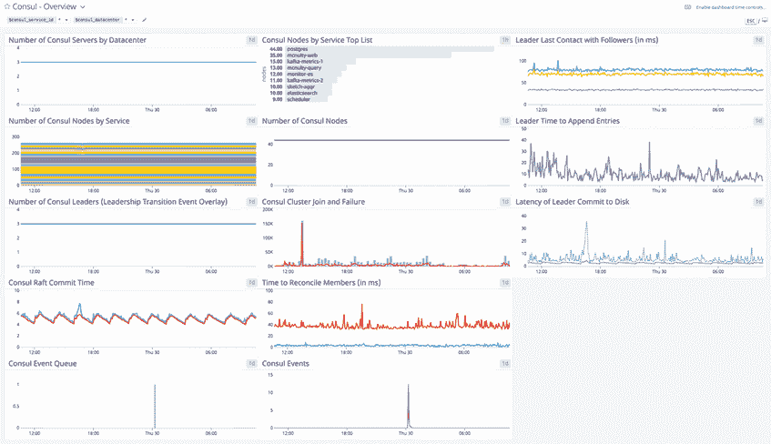

# 可观测性:从服务发现到服务网格

> 原文：<https://thenewstack.io/observability-from-service-discovery-to-service-mesh/>

 [彼得·麦卡隆

彼得是位于加州三藩市的哈希公司的高级产品营销经理。如果他没有研究发现和管理微服务的最佳方式或谈论基于云的网络，你可能会发现他在户外发现了真正的云。](https://www.linkedin.com/in/petercmccarron/) 

微服务为组织提供了一个独特的机会，有望缩短部署时间并降低管理成本。当与服务网格配对时，微服务能够在它们自己和其他服务之间自动联网。

服务网格的所有故事都提供了在云原生环境中应该如何部署应用程序的宏伟愿景，但旅程通常要复杂得多。

我们从用户那里听到的最大挑战之一是从他们的微服务中获取指标和数据有多困难。如果您不知道正在运行的数百个服务中的哪一个服务导致了故障，那么修复一个坏的连接点就要困难得多。这就是为什么大多数处于采用微服务的“评估”阶段的组织不确定他们何时能够使用这种类型的架构部署生产应用程序。

服务网格解决方案试图通过提供内置的可观察性功能来解决这一挑战，但如果您需要包含驻留在网格之外的服务，或者如果您不确定捕获这一数据的适当配置，这将于事无补。如果在部署服务网格解决方案后，您没有尝试添加可观察性，而是先处理这些功能，会怎么样？

## 拆包可观察性

在深入研究服务网格的可观测性之前，让我们为我们在 HashiCorp 讨论可观测性时所指的东西设定一个基线。我们遵循的定义是，术语“可观测性”来自控制理论，它描述了从外部输出的知识中推断系统内部状态的程度。基本上，您能根据解决方案产生的输出来衡量它的健康和性能吗？

如果你只看这个定义，它可以广泛地应用于任何工作流程。正如我们的[道](https://www.hashicorp.com/tao-of-hashicorp)中所写的，我们关注的是工作流而不是技术。在实施任何新工具时，我们认为您应该问问自己是否能够衡量它的有效性。如果没有，有没有办法实现？当我们在本帖中解开适用于[服务发现](https://thenewstack.io/how-does-service-discovery-work-in-kubernetes/)和服务网格的可观察性时，请记住这个假设。

## 建立一个可观察的基础

无论您使用哪种服务网格或服务发现工具，该工具都可能捕获某种遥测指标。这些指标的示例包括您的环境的变化、工具本身的状态，或者当前运行的服务的一般健康指标。

为了防止内存中断或存储耗尽，大量数据会在短时间内被清除。例如，我们的服务网格工具[consult](https://www.consul.io/)，默认保留遥测数据一分钟。这对于希望实时了解集群性能的用户来说很好，但是如果问题发生在非工作时间呢？

幸运的是，这是有解决办法的。许多应用性能监控(APM)解决方案，如 Datadog、SignalFX 或 AppDynamics，在与 Prometheus 或 Grafana 等图表工具结合使用时，能够从“statsite”或“statsd”等指标聚合服务器读取遥测数据。只需添加几行代码，您就可以指示您的服务网格工具将其遥测数据分发到这些服务器，并通过仪表板主动监控其健康状况和性能。这些仪表板中有许多都包含警报功能，让您知道服务是否中断，这对减少停机至关重要。

图 1:data dog 仪表板监控咨询

此时，您可能会问自己，“这与服务网格有什么关系？”要回答这个问题，让我们记住使用工具进行服务发现的好处是什么。

## 服务网格的服务发现

通过自动化您发现和记住新的/现有的服务的过程，您现在能够管理更大规模的服务。虽然解决了一个瓶颈，但新的问题开始出现。首先，我可以快速发现和定位服务，但我仍然必须手动管理它们之间的连接。如果我使用基于票证的系统来打开端口连接和白名单 IP 地址，我只会增加接收请求的团队的请求量；我没有改进他们的工作流程。

最重要的是，微服务引入了一个新问题:服务可能不需要 IP 地址。这意味着我增加了网络请求的数量，并引入了传统方法无法解决的新挑战。这就是服务网格的用武之地。服务应该能够发现彼此——通过 IP 地址或服务名称——并自动建立安全连接，而不是依赖于手动连接服务。这就是自动服务发现如何演变为服务网格，以及随之而来的新挑战和可观察性能力。

## 服务网格世界中的可观测性

如果您选择利用相同的控制平面进行服务发现，并作为服务网格提供商，它现在配置为在第 0 天向您的指标收集器和仪表板平台发送可观察性数据。从根本上说，这确保了用户能够洞察集群的健康状况，但也为更高级的[可观察性概念](https://thenewstack.io/monitoring-and-observability-whats-the-difference-and-why-does-it-matter/)如分布式跟踪做好了准备。

使用相同的遥测服务器地址，并使您的服务网格工具能够将 gRPC 范围发送到您的 APM 仪表板，您可以收集更精细的服务级别数据，并在请求级别查明故障。

还记得之前我们讨论过在微服务环境中识别连接故障的挑战吗？利用分布式跟踪有助于减轻其中的一些困难，因为它让您从请求的源头一直跟踪到最终失败。

## 开始使用您自己的可观察网格

这篇文章掩盖了这些解决方案的复杂性，但我试图说明的要点是，让您的组织为向服务网格的飞跃做好准备是从在服务发现级别实现可观察性开始的。您的环境可能已经在利用 Consul 这样的工具进行服务发现。启用遥测功能进行收集可能有助于降低中断的风险，并为跳转到服务网格做好准备。

这中间有许多步骤，如果你想了解更多关于如何监控领事遥测数据，请遵循这个[学习指南](https://learn.hashicorp.com/consul?track=day-2-operations#day-2-operations)。如果你有兴趣学习更多关于 Consul 分布式追踪的知识，请查看我们博客上的[这篇文章](https://www.hashicorp.com/blog/enabling-distributed-tracing-with-hashicorp-consul)。它包含一个链接，提供了几个使用 Consul、Datadog 和 Jaeger 设置追踪的演示。

<svg xmlns:xlink="http://www.w3.org/1999/xlink" viewBox="0 0 68 31" version="1.1"><title>Group</title> <desc>Created with Sketch.</desc></svg>