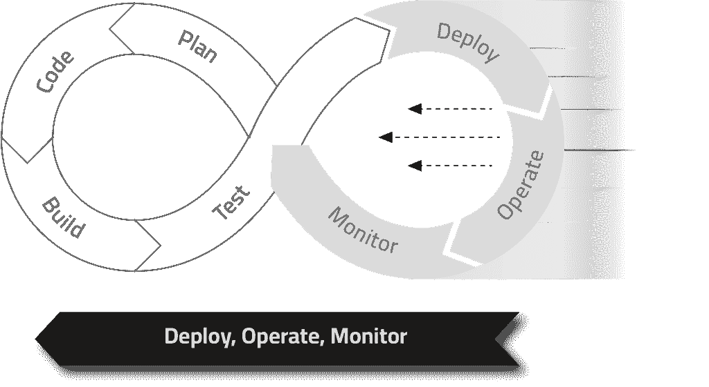
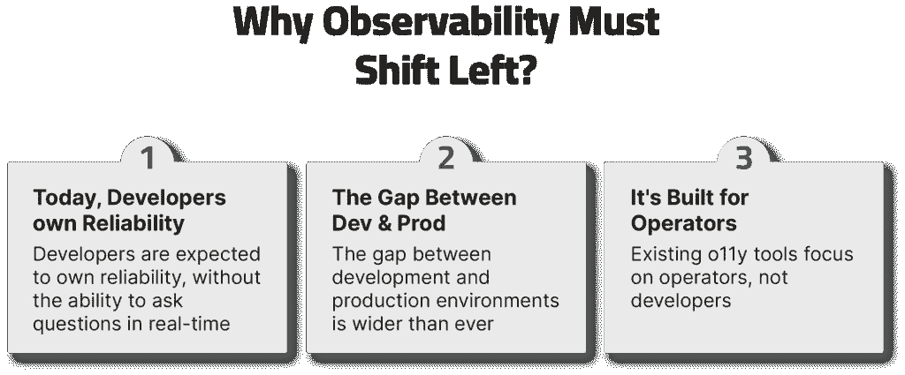

# 可观察性正在左移，紧随安全和运营之后

> 原文：<https://thenewstack.io/observability-is-shifting-left-following-security-and-ops/>

这是“左移可观察性”三部分系列的第二部分阅读

[*Part 1 here.*](https://thenewstack.io/wp-admin/post.php?post=22679194&action=edit)

席卷我们行业的一个主要趋势是使常见的实践更加“开发人员友好”，主要是通过尝试在开发人员所在的地方与他们见面，并将这些实践集成到现有的开发人员工具中。

这种趋势通常被称为“左移”——指的是将软件开发生命周期(SDLC)的步骤从右侧“推”到左侧的行为:

在过去的几年里，我们已经看到至少有几个玩家采用了根深蒂固的行业最佳实践，并将它们向左移动:

 [伊兰·皮莱格

Ilan 担任 Lightrun 的首席执行官，是该公司的联合创始人之一。他拥有独特的技术和领导背景，包括在 FireGlass(已被赛门铁克收购)和 LivePerson 担任开发角色。](https://www.linkedin.com/in/ilan-peleg-5a31396b/?originalSubdomain=il) 

1.  **左移安全** —在应用安全领域， [Snyk](https://snyk.io/) 通过持续分析、检测各种第三方库漏洞并提供自动修复，彻底改变了其处理供应链安全的方式。通过在过程中更早地集成安全检查，并让开发人员在他们已经使用的工具中参与到所述过程中(特别是 [Snyk 开源](https://snyk.io/product/open-source-security-management/)和 [Snyk 代码](https://snyk.io/product/snyk-code/))，开发人员能够参与到安全过程中，而不是仅仅在 CISO 电子邮件爆炸后碰撞依赖关系。
2.  **向左移动基础设施** —在应用基础设施领域， [HashiCorp](https://www.hashicorp.com/?utm_content=inline-mention) 通过提供声明性的、编码的基础设施定义，彻底改变了 DevOps 工程师管理资源的方式，从而简化了云基础设施部署的规划、版本控制和应用。

很明显，在 SDLC 的各个部分给予开发人员更多的权力会给开发人员和他们工作的公司带来巨大的好处，现在是时候让我们看看为什么向左移动[可观察性](https://thenewstack.io/observability/)是有意义的了:

1.  随着 DevOps 成为工程文化的主要部分，开发人员被期望拥有可靠性。然而，在来自运行系统的信息可用性方面有一个很大的差距，因为[可观察性工具](https://thenewstack.io/conversations-im-sick-of-having-about-observability/)现在主要关注于观察从开发期间由开发人员使用的日志和度量生成的静态数据。在实践中，生产环境中出现的许多应用程序问题并不简单，需要在无尽的仪表盘中寻找线索。目前，没有简单的方法来查询新信息——一种不依赖于工程组织的日志实践或随机开发人员对好日志的热情的方法。鉴于这种信息的缺乏，开发人员很难拥有可靠性。如果一个人不能主动提出问题，并从您所信任的应用程序那里获得即时的答案，您又怎么能指望他拥有可靠性呢？
2.  随着应用程序完全云化，生产环境变得越来越分散和复杂，开发和生产之间的差距显著扩大。这意味着提前预测问题比过去困难得多，并且由于涉及的部分数量，在本地重现这些问题要困难得多。这也是为什么你会看到越来越多的团队转向一种曾经令人皱眉的方法——在生产中进行[测试](https://lightrun.com/blog/testing-in-production-recommended-tools/)——来了解当出现问题时他们的应用程序在生产中实际上是如何表现的，因为很难预先预测所有未知的未知情况。
3.  现有的 [o11y](https://lightrun.com/observability/observability-vs-monitoring/) 工具主要关注于操作者，而不是开发人员，并且只有一小部分[当今世界上大约 2700 万开发人员](https://www.developernation.net/developer-reports/dn21)在日常基础上实践可观测性，这正在成为一个真正的问题。对于一个经验丰富的操作员来说，查看负载平衡器的配置或检查 CPU 使用率的峰值是第二天性——模式从屏幕上“弹出”,就像一个设计糟糕的 if 语句或编写糟糕的数据结构可能会警告一个经验丰富的开发人员一样。指示特定部署问题的仪表板和 YAML 文件对于开发人员来说通常是陌生的，这使得他们在试图解决涉及他们自己代码的生产事件时一无所知。他们对 it 当前部署状态的了解和认识之间存在很大差距。

在下一篇文章中，我们将介绍如何在实践中改变左可观测性，特别是如何在整个 SDLC 中应用它。

阅读本系列的第三篇文章。

<svg xmlns:xlink="http://www.w3.org/1999/xlink" viewBox="0 0 68 31" version="1.1"><title>Group</title> <desc>Created with Sketch.</desc></svg>