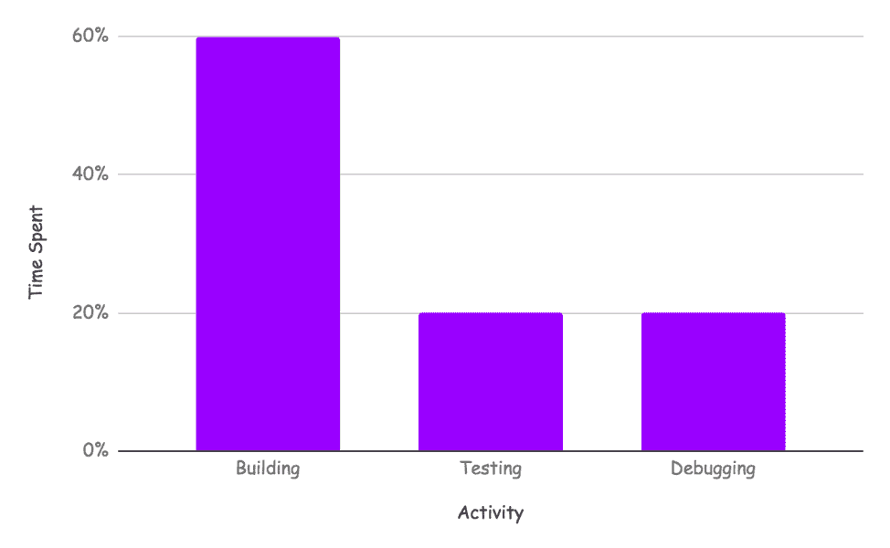
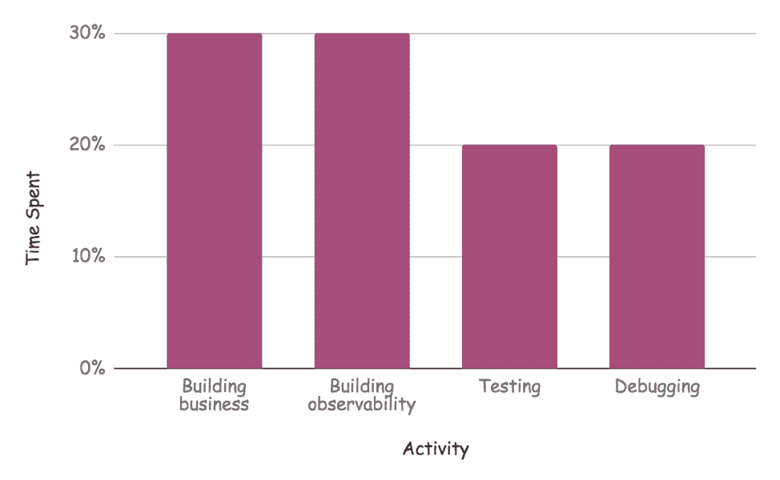
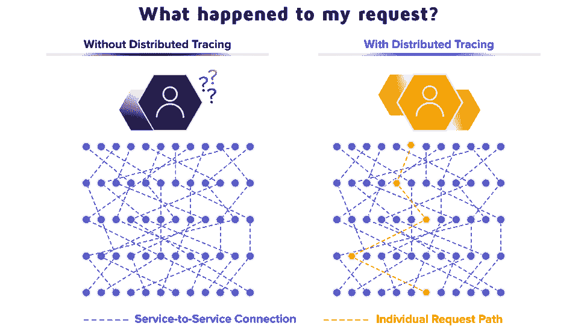
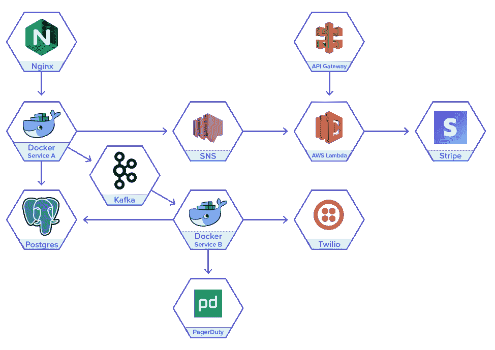

# 可观察性花费了开发人员太多的时间，所以将其自动化

> 原文：<https://thenewstack.io/observability-takes-too-much-developer-time-so-automate-it/>

[Epsagon](https://epsagon.com/) 赞助本帖。

 [尼赞·沙皮拉

Nitzan 是 Epsagon 的首席执行官和联合创始人。他是一名软件工程师，在编程、机器学习、网络安全和逆向工程领域拥有超过 13 年的经验。他还喜欢弹钢琴，是一个旅游爱好者，一个经验丰富的棋手，并沉迷于运动。](https://epsagon.com/) 

当采用云技术时，大多数组织都会考虑两件事:基础设施成本和运营速度**。**

在考虑运行速度时，组织需要更快地构建、部署和运行他们的软件。如今在云中流行的方法，如微服务、API、托管服务和无服务器，都是为了提高这种速度——这被称为开发速度。

因此，如果这个速度对业务如此重要和基本，团队应该尽可能地提高开发速度。虽然现代微服务和尖端技术(如 AWS Lambda 和 Fargate)有助于显著提高这一速度，但监控和故障排除方面的低效率(有时并不明显)可能会使速度下降。

## 工程师如何打发时间？

爱普生的一个客户， [Onceit](https://www.onceit.co.nz/) ， [描述了他们的开发者](https://epsagon.com/case-studies/onceit/) 一天的时间:60%搭建，20%测试，20%调试。

*测试*分布式应用程序本身是一项复杂的任务，因此我们应该期望它随着架构的发展而保持稳定。但是*调试*呢？现代监控和故障排除工具有助于将调试时间减少 90%至 95%。这不仅提高了开发人员的生产力，当然也改善了客户体验，防止了生产力的损失。

显然，我们希望*建筑*时间尽可能的高。那么，建筑呢？

随着应用程序复杂性的增加，开发人员的*构建*时间被用于构建业务应用程序和支持可观察性的代码。如今，使用日志记录、跟踪框架和其他工具来手动实现可观测性。

根据 Epsagon 对使用现代云技术的公司的调查结果，工程师花费 30%到 50%的构建时间来实现可观察性工具。这是对生产力和资源的巨大消耗，可惜经常被忽视。

如果我们举一个极端的例子，开发人员 50%的时间花在实现应用程序的可观察性上，那么总时间中只有 30%的时间实际上花在构建应用程序上。

## 自动化可观察性

虽然有些人鼓吹“在构建时考虑可观测性”，但在 Epsagon，我们不敢苟同:如果云技术和现代开发方法已经发展到能够实现更快的开发，那么监控和故障排除工具应该跟上。

自动化你的可观察性:意味着什么？

如上所述，开发人员应该将大部分时间集中在构建业务应用程序上。这意味着他们不应该花费 50%的时间来实现手动跟踪框架。

这可以通过使用为这些类型的应用而构建的适当工具来实现。对工程师或架构师说“工具做起来太复杂了，所以你必须自己做”不是一个可以接受的答案。因为有编写软件的标准方法，所以也有跟踪、监控和故障排除的标准方法。

## 现代云时代对监控工具的要求

需要三样东西:

1.  极快的设置
2.  极低的维护成本
3.  简单易用。

实现极快的设置和低维护取决于一件事:自动化。监控和故障排除工具应该为开发人员工作，而不是期望他们做“工具的工作”

## 如何实现自动化？

与那些声称现在的应用程序太复杂的人相反，我们在市场上看到了不同的趋势。如今，工程师比以往任何时候都更多地使用标准框架和服务。采用云优先的方法意味着你倾向于使用更多的托管服务和 API。构建微服务是使用常见的容器技术(例如 Docker)和编排服务(Kubernetes: managed/self-hosted、Fargate 等)来完成的。).服务之间的通信是以标准的方式完成的，可以是同步的也可以是异步的。

## 现代应用的一个例子

让我们来看一个分布式应用程序。它使用以下标准服务:

*   Web 访问:Nginx 和 API 网关。这些是应用程序的入口点
*   微服务:Docker 容器和 AWS Lambda。Docker 可以是自托管的，也可以由一个编排服务来管理，比如 ECS、AKS(在 Azure 上)或其他服务
*   异步通信服务:Kafka ad SNS
*   数据库服务:Postgres(例如一个 RDS 数据库)
*   外部 API:Stripe、Twilio、page duty——用于不同的目的。

这是一个设计良好，外观漂亮的应用程序。应用程序的每一部分都是标准的，它是一个托管服务，或者使用标准的通信 API。跟踪该应用程序可以完全自动完成——根据运行时在每个服务中插入 SDK。

您的应用程序是否使用标准服务？如果没有，为什么没有？

## 标准化提高了开发速度

使用现代、标准的云软件开发方法可以提高您的构建速度，并减少可观测性的设置和维护——因为它将由相应的现代工具自动化。

我们 [将于 2019 年 5 月 21 日星期二举办](https://epsagon.com/webinars/modernizing-applications-with-serverless-on-aws/) 网络研讨会，主题是使用无服务器进行软件现代化，主讲人:

*   AWS 首席解决方案架构师 Mike Deck
*   Nikody Keating，enum law Mutual 的云架构师
*   爱普生首席技术官 Ran Ribenzaft。

[在这里注册](https://epsagon.com/webinars/modernizing-applications-with-serverless-on-aws/) 。

通过 Pixabay 的特征图像。

<svg xmlns:xlink="http://www.w3.org/1999/xlink" viewBox="0 0 68 31" version="1.1"><title>Group</title> <desc>Created with Sketch.</desc></svg>